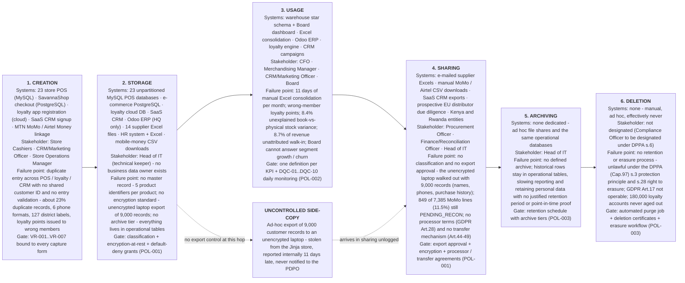

# A1 — Data Lifecycle Map: Customer Data

**Client:** Savanna Retail Group (SRG) · **Prepared by:** Enterprise Data Management Consultant
**Date:** Month 1 of the 18-month EDM programme · **Classification:** Confidential
**Companion to:** `A1_edm_diagnostic_memo.md` (Task A1 executive briefing)

---

## Task A1 — The EDM Diagnostic (C1)

### (i) Customer data lifecycle — creation to deletion, with system, stakeholder and failure point at every stage

Reading note: every failure point above is a *control* that does not exist, not a *tool* that is missing — which is why the same defects recur after each clean-up exercise (see `A1_edm_diagnostic_memo.md`, section (b)).

### (ii) DAMA-DMBOK knowledge-area mapping for SRG

| # | DAMA-DMBOK knowledge area | Status at SRG | Evidence (current state) | Function SRG lacks entirely |
|---|---|---|---|---|
| 1 | **Data Governance** | Absent | No charter, no council, no data owners, no decision rights; reporting takes 11 days with nobody accountable for definitions | Policy issuance, governance council, RACI decision rights, funding of data work |
| 2 | **Data Architecture** | Absent | 8 siloed source systems (23 MySQL POS, e-commerce, loyalty, CRM, Odoo, HR/Excel, supplier Excel, MoMo CSV); no target architecture, no integration layer, no data flow design | Enterprise architecture blueprint, integration/consolidation layer, architecture standards |
| 3 | **Data Modeling & Design** | Partial | Warehouse star schema DDL with SCD2 dimensions and a 25-attribute data dictionary exist; operational models diverge (5 product identifiers, no canonical customer entity) | A single canonical/enterprise model and naming standard applied to POS, e-commerce and ERP — not just to the warehouse |
| 4 | **Data Storage & Operations** | Partial | UPS-backed POS keeps capturing; databases run, but 23 unpartitioned MySQL DBs, no archive tier, backups untested, connectivity outages force local-only records | Lifecycle-tiered storage, documented backup/restore and DR objectives, capacity and patch standards |
| 5 | **Data Security** | Partial (emerging) | RBAC with 5 roles, default-deny, column grants, row-level security and masking functions (`+256-XXX-XX9332`, `S*** W**`) built and tested; yet an unencrypted laptop left with 9,000 records | Classification policy, endpoint and export controls, access recertification, access/audit-log review |
| 6 | **Data Integration & Interoperability** | Partial (emerging) | Repaired ETL with schema contracts, quarantine, idempotency and a single-writer lock (self-test 3/3 PASS, 10,000 rows, control total UGX 252,382,814.16); but supplier data still arrives as 14 Excels and payments as manual CSVs | Scheduled integration of supplier/HR/CRM sources, data contracts enforced *at the source*, API/event standards |
| 7 | **Documents & Content** | Absent | 14 supplier Excel files e-mailed between procurement officers; no document management, no version control, no records retention, no data-loss prevention | Content/records management, versioning and retention, DLP over e-mail and endpoints |
| 8 | **Reference & Master Data** | Partial (emerging) | Cleansing produced golden records (5,000 → 3,858) and a stewardship queue (110 held, 365 homonym pairs rejected); but no MDM system, no survivorship policy signed off, no product master | Named master-data owners, approved survivorship rules, authoritative hierarchy (product → category) maintained in Odoo |
| 9 | **Metadata** | Partial | Data dictionary of 25 classified attributes plus domain/sensitivity/quality tags; one KPI lineage traced by hand | An operational catalog with automated lineage, metadata standards in source systems, metadata review cadence |
| 10 | **Data Warehousing & BI** | Partial | Star schema loaded (10,000 lines; UGX 252,382,814 over Jul–Dec) and a Board dashboard exists; monthly management reporting still takes 11 days in Excel | Approved KPI definitions, self-service reporting, dashboard publication approval, single reporting layer |
| 11 | **Data Quality** | Present (emerging) | Profiling and cleansing executed (duplicates 22.84% → 0.00%), 12 validation rules VR-001..VR-012, 10 monitoring checks DQC-01..DQC-10 specified | Binding those rules at the point of capture, a stewardship loop with SLAs, and a monthly scorecard to the Council |

### (iii) Areas SRG lacks entirely, and the three most consequential gaps

**Entirely absent:** Data Governance, Data Architecture, Documents & Content, and — in ownership terms rather than tooling terms — Reference & Master Data. Data Quality and Data Security are *emerging* only because artifacts now exist in the repository; they are not yet operating in production, which is the difference between a capability and a control.

**Three most consequential gaps:**

1. **No governance decision rights (DAMA area 1).** Every other gap is a symptom: quality rules exist but are not bound at entry because no domain owner may compel the stores; classification exists in the data dictionary but is not enforced because no one approves access. This is the multiplier — and the cheapest to close (Charter, Month 2).
2. **No architecture or integration layer (area 2).** This is the direct cause of the 11-day reporting cycle, the five product identifiers and the 23% duplicates: meaning cannot be reconciled across systems that were never designed to exchange it. It is also why every Board question requires an Excel project.
3. **No lifecycle end — archiving and deletion (areas 4 and 7, DPPA s.3 and s.28).** SRG cannot demonstrate how long it holds customer data, cannot honour erasure, and cannot answer a PDPO auditor within the 12-month window. Every additional export (like the Jinja copy) compounds an already unlawful retention position.

### Think-deeper answer

*Why do the same symptoms keep returning after every clean-up, and what does by-product versus managed asset mean on this map?*

The lifecycle makes the mechanism visible: clean-up exercises intervened **only in stage 3 (usage)** — a one-off fix to the reporting copy — while every defect was being manufactured in **stage 1 (creation)** and multiplied in **stage 2 (storage)** and **stage 4 (sharing)**. Stages 1, 4 and 6 had no control at all: no entry validation (VR-001..VR-012 absent), no export approval (the laptop), no retention or erasure (DPPA s.3, s.28). Re-cleansing is therefore guaranteed to fail: the map shows an unclosed loop, not a dirty dataset.

Treated as a **by-product**, customer data is exhaust from selling — created by whoever typed it, stored wherever it landed, shared by e-mail, archived by inertia, deleted never. That single assumption produces all six failure points on the diagram without any individual behaving badly. Treated as a **managed asset**, each stage acquires an owner, an enforced gate and a measurable standard: identity resolved at creation, classified and encrypted at storage, defined and monitored at usage, approved and contracted at sharing, tiered at archiving, and destroyed on schedule with a certificate.

The map also shows why this is cheap for SRG: the gates are mostly *technical* (form masks, quarantine, GRANTs, scheduled purge), not headcount. With a four-person IT team, control must live in the flow of work, not in a policy binder — which is precisely the operating assumption of the Charter and the three policies in Task A2.
