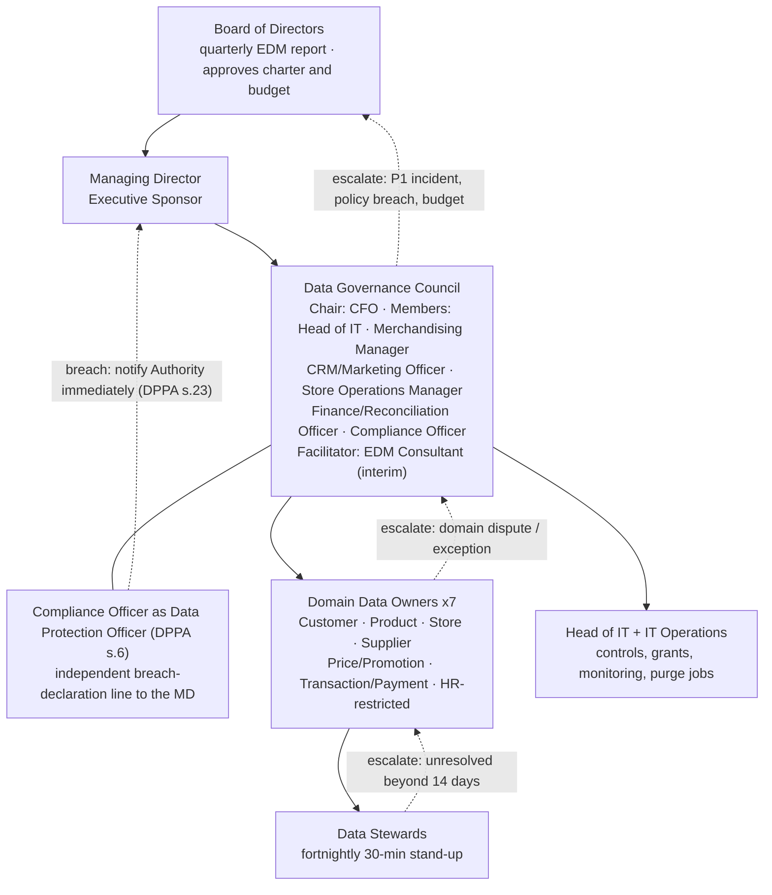

# A2 — Data Governance Charter

**Client:** Savanna Retail Group (SRG) · **Prepared by:** Enterprise Data Management Consultant (interim facilitator)
**Date:** Month 1 of the 18-month EDM programme · **Proposed effective:** Month 2 (on Board resolution) · **Classification:** Confidential
**Companions:** `A2_policies.md` (POL-001..POL-003) · `A2_compliance_register.md` · `A2_cfo_memo.md`

---

## Task A2 — Governance Framework & Compliance Register (C2)

### (i) Vision and principles

**Vision.** *SRG's data is owned by named people, defined once, validated at entry, protected by default and retired on schedule — so that any Board question can be answered from one trusted source within a day rather than eleven.*

Eight principles, sized for a four-person IT team and a ~200-staff retailer:

| # | Principle | What it means at SRG |
|---|---|---|
| P1 | **Data is a managed asset, not a by-product** | Every domain has an owner; data work is budgeted, measured and reported like inventory |
| P2 | **Enforce technically, not by poster** | If a rule can be a constraint, a dropdown, a mask or a quarantine, it must be; documentation is the fallback, not the control |
| P3 | **One definition per KPI, one master per entity** | "Revenue", "active customer", "stock on hand" defined once and signed by the Council; Odoo is product master, golden record is customer master |
| P4 | **Quality is built at entry, never cleaned after** | VR-001..VR-012 bind at the form and the ETL gate; cleansing is remediation for defects, not the operating model |
| P5 | **Minimum viable documentation** | Document only what code cannot enforce — decisions, owners, definitions; a 25-attribute dictionary beats a 300-page manual nobody reads |
| P6 | **Privacy by default** | Masked until proven otherwise; default-deny access; classify before you grant; collect the minimum (DPPA s.3, GDPR Art.5, Art.25) |
| P7 | **Offline-tolerant controls** | Stores lose connectivity for hours daily: validation queues locally, syncs later, and gaps (VR-012 PENDING) are designed states — not silent failures |
| P8 | **Ownership before tooling** | No new platform, licence or hire is approved before the receiving domain has a named owner and steward |

### (ii) Scope

**In scope (governed domains):**

| Domain | Definition (one meaning) | Systems in scope | Domain Data Owner | Data Steward |
|---|---|---|---|---|
| Customer & Loyalty | One person = one golden record; 180,000 members + walk-ins | POS signups, SavannaShop, loyalty app, SaaS CRM | CRM/Marketing Officer | Store Operations Manager |
| Product | One product = one SKU (VR-008); hierarchy and attributes | Odoo (master), POS, e-commerce, supplier files | Merchandising Manager | Procurement Officer |
| Store & Organisation | Store codes ST01–ST23, ECOM01, cities, trading status | Odoo store master, warehouse `dim_store` | Store Operations Manager | Head of IT Operations |
| Supplier | Supplier identity, terms, lead times, contract status | 14 Excel files → controlled repository | Procurement Officer | Finance/Reconciliation Officer |
| Price & Promotion | One shelf price at one moment (SCD2) | Odoo pricing, POS, e-commerce, promo approvals | Merchandising Manager | Finance/Reconciliation Officer |
| Transaction & Payment | Sale, return, MoMo/Airtel reference, reconciliation status | POS, e-commerce, MTN/Airtel gateways, warehouse | CFO | Finance/Reconciliation Officer |
| HR-restricted | Employment and payroll records (highest sensitivity) | HR system, payroll Excel | HR & Payroll Officer | Compliance Officer (DPO) |

**Out of scope / deferred (explicitly deferred, not rejected):** raw footfall-sensor content and any biometric processing (deferred pending a DPIA, Month 12); HR analytics beyond operational payroll accuracy (deferred); predictive segmentation or automated customer decisions (blocked until DPPA s.27 / GDPR Art.22 review); full cloud migration and real-time streaming (evaluated in Part B/C); Kenya and Rwanda localisation (deferred until an entity is incorporated); enterprise document management rollout (pilot with supplier contracts only, Month 9).

### (iii) Operating structure

**Data Governance Council.** Executive sponsor: **Managing Director**. Chair: **CFO**. Members: Head of IT, Merchandising Manager, CRM/Marketing Officer, Store Operations Manager, Finance/Reconciliation Officer, Compliance Officer. Facilitator: **Enterprise Data Management Consultant (interim)**. The Council owns the policy set, resolves domain disputes and approves exceptions.

**Data protection officer.** DPPA 2019 (Cap.97) **s.6** requires designation of a data protection officer. The Council recommends and the Board designates the **Compliance Officer as Data Protection Officer** in Month 1 (existing role, no hire), reporting independently to the Managing Director for breach matters. The DPO also owns PDPO registration (s.29) and audit response.

**Domain Data Owners vs. Data Stewards.** *Owners* are accountable for the domain's meaning, quality targets and access decisions; they approve exceptions and disputes. *Stewards* do the weekly work: run checks, triage the stewardship queue, propose rule changes. Both are mapped in the scope table above to **existing SRG job titles only** — no new headcount is required.

**Cadence.**

| Rhythm | Body | Duration | Output |
|---|---|---|---|
| Fortnightly | Data stewards' stand-up | 30 minutes | Open DQC alerts, stewardship queue (110 items today), blocked entries |
| Monthly | Data Governance Council | 60 minutes | DQ scorecard, exception register, access changes, domain disputes |
| Quarterly | Board report | 1 page | P1 gap closure, KPI trend, incident summary, budget vs. UGX 480M envelope |
| Ad hoc (within 24h) | Incident cell: Head of IT + DPO + domain owner | As needed | Breach assessment and notification decision (DPPA s.23, GDPR Art.33) |

### (iv) RACI matrix

Activity | Responsible | Accountable | Consulted | Informed
--- | --- | --- | --- | ---
1. Customer record creation (POS / e-commerce / loyalty signup) | Store Cashiers | CRM/Marketing Officer | Store Operations Manager; Head of IT | Council
2. Master-data change approval — product (SKU, attributes, hierarchy) | Merchandising Manager | Merchandising Manager | Procurement Officer; Head of IT | Council; Store Operations Manager
3. Master-data change approval — price and promotions | Merchandising Manager | CFO | Finance/Reconciliation Officer | Store Operations Manager; Council
4. Breach declaration (e.g. stolen device / data loss) | Head of IT | Compliance Officer (DPO) | EDM Consultant; CFO | Managing Director; Council; Board
5. Retention and deletion execution (POL-003 purge jobs) | Head of IT Operations | Compliance Officer (DPO) | HR & Payroll Officer; Procurement Officer | Council; CRM/Marketing Officer
6. Quarterly access-grant recertification | Domain Data Owners | Head of IT | Compliance Officer (DPO) | Council
7. Data-quality rule exception approval (VR override) | Data Steward (domain) | Domain Data Owner | Head of IT | Council; EDM Consultant
8. ETL failure triage and quarantine release | Head of IT Operations | Head of IT | Finance/Reconciliation Officer; EDM Consultant | Domain Data Owners; Council if P1
9. KPI definition sign-off ("one definition per KPI") | EDM Consultant (drafting) | CFO | CRM/Marketing Officer; Merchandising Manager; Head of IT | Board; Council
10. Mobile-money reconciliation sign-off (MTN / Airtel) | Finance/Reconciliation Officer | CFO | Head of IT | Managing Director; Council
11. Supplier file ingestion (14 Excels → controlled load) | Procurement Officer | CFO | Head of IT; Merchandising Manager | Finance/Reconciliation Officer; Council
12. PDPO registration and audit response (DPPA s.29, s.30) | Compliance Officer (DPO) | Managing Director | EDM Consultant; Head of IT; external counsel | Board; Council
13. Loyalty points dispute resolution | Store Operations Manager | CRM/Marketing Officer | Finance/Reconciliation Officer | Council; store managers
14. Dashboard publication approval (Board-facing) | EDM Consultant | CFO | Domain Data Owners | Board; Council
15. Schema / data-model change approval | Head of IT Operations | Head of IT | EDM Consultant; Domain Data Owners | Council
16. Erasure or access request from a data subject (DPPA s.24, s.28; GDPR Art.15, Art.17) | Compliance Officer (DPO) | Domain Data Owner | Head of IT; Finance/Reconciliation Officer (statutory retention) | Council; Managing Director

### (v) Charter adoption mechanics

- **Approval:** one-page charter issued for signature by the Managing Director and all Council members in **Month 2**; ratified as a standing Board item in the same month. Policies POL-001..POL-003 (`A2_policies.md`) are annexes and take effect on the same resolution.
- **Review:** annually, or within 10 working days of a material change (new country, new processing, incident, regulatory change); interim amendments by Council majority, recorded in a decision log.
- **Resourcing:** no new headcount. Effort is absorbed by existing roles — estimated 2–4 hours per Council member per month — and funded from the UGX 480,000,000 envelope (tooling and encryption, not salaries).
- **Success measures (reported quarterly):** duplicate-person rate below 1.0% sustained (DQC-01); management reporting cycle from 11 days to 2 days or fewer by Month 6; access recertification at or above 95% completion within 10 working days; breach internally reported within 24 hours and notified to the Authority immediately on confirmation; PDPO registration completed by Month 2 and audit-ready by Month 12; zero P1 compliance gaps open beyond 30 days; every in-scope domain with a named owner and zero unresolved stewardship items older than 14 days.

### Think-deeper answer

*Which single policy, enforced from day one, would have prevented the Jinja laptop incident? Which would be violated daily by SRG's own staff habits — and how do you make it enforceable rather than decorative?*

**Preventer: POL-001 (Data Access & Classification).** The incident was not a sophisticated attack; it was an unapproved copy leaving the estate. POL-001 breaks that chain at three points that each existed in the incident: (1) `full_name`, `phone`, `email`, `payment_ref` and purchase history are **Restricted** and may not be extracted en masse without Head of IT + Compliance approval — the 9,000-record export would never have been authorised; (2) the export above 100 Restricted records must be **encrypted at rest and in transit, logged and time-expiring** — an encrypted laptop is a non-event rather than a breach; (3) **default-deny plus masked analytics views** mean routine work never needs raw PII at all, removing the justification for the copy. Classification also creates the duty that was missing most: knowing *what* left, so that the 11-day reporting delay and the absent notification (DPPA s.23) become impossible — you cannot assess a breach you cannot inventory.

**Daily violation: POL-002 (Data Quality) — read broadly as access and capture hygiene.** Cashiers will keep typing free-text phones and districts during rushes; procurement will keep e-mailing supplier Excels; staff will keep exporting "just to check" into spreadsheets; stores with outages will keep creating local customer records. Every one of these is rational, invisible and repeated dozens of times a day. A policy relying on goodwill dies in week two.

**Making it enforceable — four controls, no goodwill required:**

1. **Deny-by-default `GRANT`/`REVOKE` scripts** (already built: 5 roles, column grants, row-level security, 15-test assertion suite). Absence of a grant is the default; access exists only where a business case was approved, and quarterly recertification removes what is stale.
2. **Masking views as the only analytic surface** (`+256-XXX-XX9332`, `S*** W**`, `s***@srg.co.ug`, `AU*****51`) — staff physically cannot see raw PII in reports, so there is nothing worth copying to a laptop.
3. **Export approval workflow with mandatory encryption and expiry**, enforced outside the database: a ticket, dual approval, an encrypted container, a 7-day TTL and an audit entry; unencrypted extracts of Restricted data fail the workflow.
4. **Entry validation plus ETL quarantine plus a store scorecard:** VR-001..VR-012 block or quarantine at capture (no batch aborts, no silent passes), DQC-01..DQC-10 alert the on-call rotation daily (never an unmonitored mailbox — root cause RC-6), and duplicate rate, completeness and MoMo-pending aging are published per store and attached to store-manager KPIs. Non-compliance becomes visible to a manager with authority — which is where enforcement actually lives.
