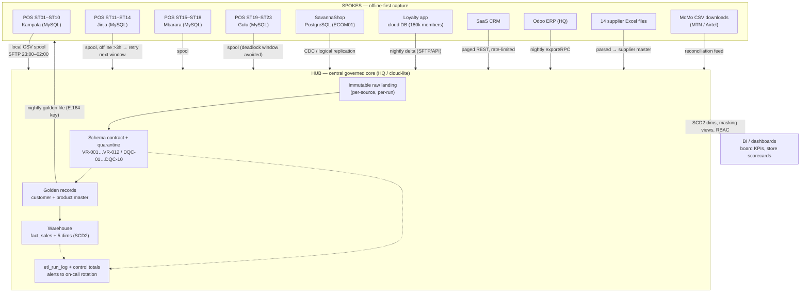

# Task B1 — Architecture & Data Modeling (C3)

**Client:** Savanna Retail Group (SRG) — Kampala, Uganda
**Deliverable:** Part B(i) — Enterprise data architecture pattern decision
**Author:** Lead Enterprise Data Management Consultant
**Budget envelope:** UGX 480,000,000/yr (~USD 130,000 @ UGX 3,700/USD) · **Team:** 4 IT staff (2 SQL-capable, 0 data-engineering experience) · **Horizon:** quick wins by month 6, PDPO audit ≤ 12 months

---

## Task B1(i) — Architecture Pattern Decision (C3)

### 1. Recommendation (headline)

**Adopt a HUB-AND-SPOKE architecture**: one central governed core (staging → warehouse → golden customer/product records, hosted HQ-side "cloud-lite") fed by offline-first spokes (23 store POS + SavannaShop + loyalty app + CRM + Odoo), with store-side local buffering and scheduled sync windows. **Weighted score: 4.35 / 5.00** — first on every constraint that is non-negotiable (connectivity, skills, budget, month-6 deadline).

### 2. The four candidate patterns in SRG terms

| Pattern | What it means at SRG | Structural signature |
|---|---|---|
| **Centralized** | All 23 POS databases, e-commerce, loyalty and CRM stream directly into one HQ platform; stores are thin clients with no local persistence | 1 core, 0 spokes, synchronous always-on links |
| **Decentralized** | Each store/system keeps owning its data; integrations are point-to-point; reporting is assembled locally per store/domain | N autonomous nodes, N×(N−1) point-to-point links |
| **Federated** | Domain owners (store ops, e-commerce, loyalty, supply chain) publish their own conformed data products to shared standards; central team sets definitions only | N domains, standards bus, no single physical core |
| **Hub-and-spoke** | Central governed core (staging, warehouse, golden records, DQ rules); spokes capture locally, buffer offline, sync in defined windows | 1 core + N offline-tolerant spokes, asynchronous replication |

### 3. Evaluation criteria and weight justification

Weights are derived directly from the constraint set, not from generic architecture scorecards.

| # | Criterion | Weight | Justification from SRG constraints |
|---|---|---:|---|
| C1 | Resilience under intermittent connectivity | **25%** | "Several stores lose connectivity for hours daily" is a *hard* physical constraint (also power risk, UPS-backed POS). Any pattern that assumes an always-on link fails at ST07/ST17-class stores before it fails anywhere else. Highest weight because it is the least negotiable. |
| C2 | Fit for the 4-person team's skills | **20%** | 2 of 4 staff write SQL, none have data-engineering experience. A pattern whose daily operation requires streaming/JDBC/enterprise tooling staffing does not survive contact with the roster. |
| C3 | Budget fit (UGX 480M/yr, all-in) | **20%** | Licences + cloud + hires share one envelope; ~USD 130k/yr cannot carry an enterprise MDM/integration suite *and* the connectivity remediation *and* the hires. |
| C4 | Time-to-value by month 6 | **15%** | Board explicitly expects visible quick wins by month 6; a pattern with a long platform-build phase scores poorly regardless of elegance. |
| C5 | Single version of truth | **10%** | Real but *recoverable* — a delayed-but-governed core (golden records, star schema) restores one truth, whereas connectivity outages cannot be negotiated away. Weighted below C1–C4 deliberately. |
| C6 | Scalability to Kenya/Rwanda + EU distributor | **10%** | Expansion and GDPR-equivalent due diligence are 12–18 month concerns, not month-6 concerns; the pattern must not paint SRG into a corner, but must not drive today's design either. |
| | **Total** | **100%** | |

Scores are 1 (worst) – 5 (best).

### 4. Weighted trade-off matrix

| Criterion | Wt. | Centralized | Decentralized | Federated | **Hub-and-spoke** |
|---|---:|:-:|:-:|:-:|:-:|
| C1 Resilience under intermittent connectivity | 25% | 1 | 5 | 4 | **4** |
| C2 Fit for 4-person team skills | 20% | 3 | 2 | 2 | **4** |
| C3 Budget fit (UGX 480M envelope) | 20% | 2 | 3 | 3 | **5** |
| C4 Time-to-value by month 6 | 15% | 2 | 3 | 2 | **5** |
| C5 Single version of truth | 10% | 5 | 1 | 3 | **4** |
| C6 Scalability to Kenya/Rwanda | 10% | 4 | 2 | 5 | **4** |
| **Weighted total (Σ score × weight)** | 100% | **2.45** | **3.00** | **3.10** | **4.35** |
| Rank | | 4 | 3 | 2 | **1** |

**Worked example (hub-and-spoke):** (4×25 + 4×20 + 5×20 + 5×15 + 4×10 + 4×10) / 100 = 435/100 = **4.35**.

### 5. Why the scores fall where they do

| Pattern | Evidence-based reasoning |
|---|---|
| **Centralized (2.45)** | Scores 1 on C1 because synchronous central capture converts every store outage into lost/queued sales: an ST17 (Mbarara) store offline 3 hours cannot write to HQ at all, and SRG's own failure log already shows what happens when a central batch assumes connectivity — the nightly job aborted entirely (`etl_diagnosis.md`, 0 of 21,562 rows staged). Scores 2 on C3/C4 because network remediation across 23 sites is a capex project that consumes the month-6 window before a single dashboard ships. Its one genuine strength — C5 = 5 — is real but unattainable without C1/C3/C4 being solved first. |
| **Decentralized (3.00)** | Scores 5 on C1 (a store that cannot reach anyone still sells) — this is the pattern SRG *already runs*, and the results are on the record: 23 MySQL silos, ~23% duplicate customers, "same product, 5 identifiers", 11-day monthly consolidation, 8.4% book-to-physical stock variance. Scoring it 1 on C5 is not hypothetical; it is the current-state diagnosis. It also fails C2 (four staff cannot maintain 23 divergent schemas plus 8 side-channel Excel processes). |
| **Federated (3.10)** | Scales best (C6 = 5) and tolerates locality (C1 = 4), but demands domain ownership maturity, published data contracts per domain, and stewardship capacity SRG does not possess — no data owners, no stewards, no catalog (Part A2 defines them *as an outcome* of this programme). Scoring 2 on C2/C4: federation's governance scaffolding is exactly the multi-quarter programme that misses month 6. It is the right *destination* posture for year 3, not the year-1 backbone. |
| **Hub-and-spoke (4.35)** | Offline-first spokes absorb outages (spool → sync), so C1 = 4 rather than 5 — the central core is a single point of failure, mitigated by replayable spools, immutable raw landing and UPS/cloud-lite redundancy, not eliminated. C2 = 4: one pipeline, SQL + pandas, one run log — the team can operate it. C3 = 5: no 23× infrastructure, no enterprise licence. C4 = 5: cleansed golden records + star schema + quarantine-hardened pipeline are demonstrably deliverable inside the first two quarters (built and self-tested in this repository: 10,000 rows, control total UGX 252,382,814.16, 3/3 self-tests PASS). C5 = 4, not 5: spoke-local records may diverge for hours until the sync window reconciles them. |

### 6. Recommended topology

### 7. How the recommendation maps to what was actually built

| Hub-and-spoke design commitment | Implemented evidence in this repository |
|---|---|
| Spokes capture offline and sync later | `srg_etl_pipeline.py`: walk-in/offline rows load with `customer_sk = 0` ("Unknown / Walk-in") instead of aborting; missing MoMo refs become `payment_ref='PENDING_RECON'`, `reconciliation_status='PENDING'` — offline capture is a *designed state*, not an error |
| Single central pipeline, one version of truth | `module3_etl` → `module5_warehouse/star_schema_ddl.sql`: 5 conformed sources → `fact_sales` + `dim_customer`/`dim_product` (SCD2) + `dim_store`/`dim_date`/`dim_payment_method` |
| Asynchronous, windowed sync (never synchronous always-on) | Nightly sync window 23:00–02:00 with single-writer advisory lock so offline store-sync replay (ST17) cannot deadlock the ETL (fix for RC-3) |
| Fail-visible core, not fail-silent | Quarantine table + `etl_run_log` + post-load control total (UGX 252,382,814.16) replace the diagnosed "partial mode" stale-fallback anti-pattern (RC-4) |
| Golden records at the hub, distributed back to spokes | Module 2 survivorship (5,000 → 3,858 golden customer records; `merged_customer_ids` audit trail) consumed by `dim_customer`; nightly golden file keyed by E.164 phone |
| Governed core accessible to a 4-person team | pandas + SQLAlchemy + SQL they already have; sqlfluff-validated SQL; no unattended streaming platform in the critical path |

### 8. Rejected alternatives — summary

| Alternative | Rejected because | What would change the verdict |
|---|---|---|
| Pure centralized | Requires always-on links SRG does not have; a single bad file aborts the whole batch (proven: RC-1, 0 rows staged); network remediation eats the month-6 window and the UGX envelope | Ubiquitous, metered, resilient store links + verified 99.5% site availability for 6 consecutive months |
| Pure decentralized | *Is* the current disease: 23 silos → ~23% duplicate customers, 5 identifiers per product, 11-day closes, 8.4% stock variance; scales as O(N²) links | Never — it contradicts the brief's definition of the problem |
| Federated / data-mesh style | Needs domain ownership, stewardship and data-product skills SRG lacks; governance scaffolding overruns month 6; C2/C4 scores reflect that | Mature stewardship (≥12 months of operating the A2 charter) and ≥2 SQL staff cross-trained on contracts/CI |
| Enterprise commercial integration/MDM suite | Licence + skills cost falls outside a UGX 480M envelope already carrying cloud, licences and hires (see Task B3 rejected-alternatives analysis) | A funded, separate licence line approved by the Board **and** a trained hire |

### 9. Assumptions register (this decision rests on)

| # | Assumption | If false → |
|---|---|---|
| A1 | Store outages are *hours per day*, not days per week; spool-and-replay remains viable | Spoke storage grows unbounded; must add store-level persistent queue capacity (SQLite spool) and raise C1 weighting |
| A2 | Existing MySQL POS + PostgreSQL e-comm + SQL-capable staff can be reused without replacement | Budget line and timeline re-baseline; possibly justifies centralization on new SaaS POS |
| A3 | Nightly windows (23:00–02:00) are acceptable for management reporting; sub-hour latency only needed for the two use cases in Task B4(v) | Real-time paths multiply → broker ops burden exceeds 4-person capacity |
| A4 | The 480M UGX envelope is nominal, not elastic; no separate connectivity capex line exists | Centralized/wide-area options re-enter the matrix |
| A5 | Kenya/Rwanda entry is 12+ months out and will reuse the same core with new spokes | C6 weight rises; federation posture may become justified earlier |
| A6 | Board accepts "governed core, eventually consistent spokes" as one version of truth (goldens + warehouse, not synchronous mirroring) | C5 must be re-scored; might force higher centralization |

### Think-deeper answer

The four patterns are not competing ideologies — they are different answers to *where you pay the consistency-vs-availability tax*. SRG has already paid the availability tax by accident (23 silos, 22.84% duplicates, 5 identifiers per product, an 11-day close), which is why "decentralized" scores 1 on single-version-of-truth: that score is measured, not assumed. Centralized architecture asks SRG to pre-pay a tax it cannot afford — always-on links, network capex, platform skills — before collecting any return, and the programme would show nothing by month 6 except remediation. Hub-and-spoke is the deliberate engineering compromise: it accepts *bounded* inconsistency (spoke-local records may be up to one sync window stale) and buys, in exchange, capture that never stops at the till and a single governed core that a four-person SQL team can actually run. The decisive evidence is in the repo itself: the repaired pipeline treats an offline walk-in as a first-class state (`customer_sk = 0`) rather than a failure, and treats a central-batch abort (RC-1: 0 of 21,562 rows staged) as the defect class to eliminate. If store connectivity later stabilises above ~99% for six months, the correct move is *not* to switch patterns — it is to tighten the sync window (hourly micro-batch) inside the same topology, which is precisely the escalation path documented in Task B4(v).
