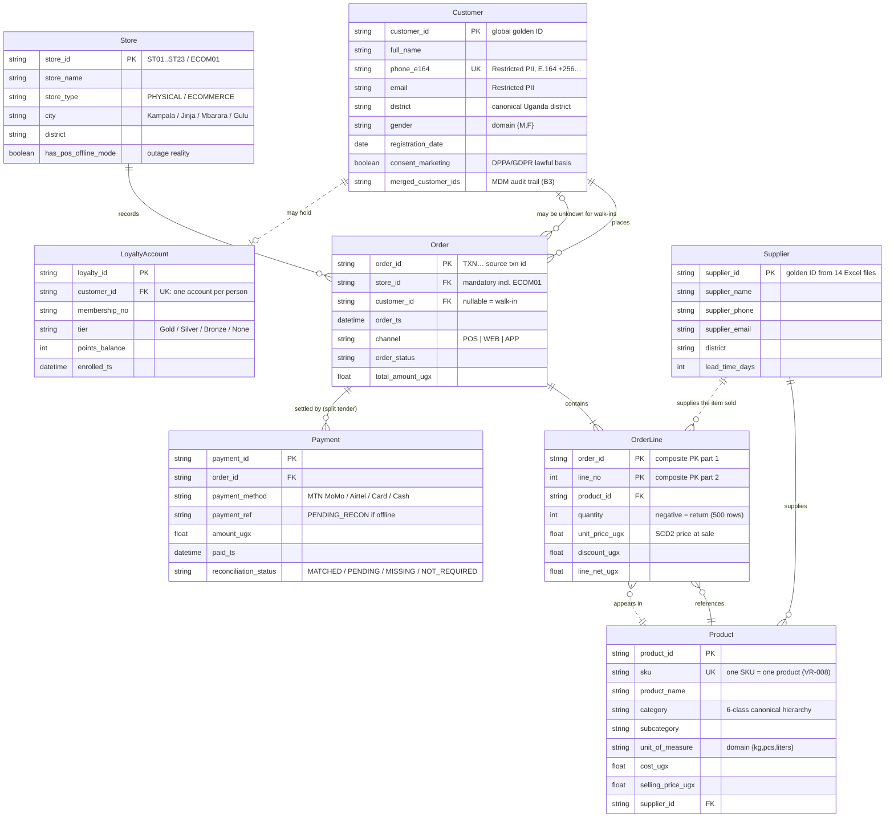

# Task B1 — Architecture & Data Modeling (C3)

**Client:** Savanna Retail Group (SRG) — Kampala, Uganda
**Deliverable:** Part B(ii) — Conceptual & logical ER model for the consolidated operational core (Customer, Product, Store, Order, OrderLine, Payment, Supplier, LoyaltyAccount)
**Notation:** Crow's Foot (conceptual narrative → logical `erDiagram`)
**Design horizon:** feeds `module5_warehouse/star_schema_ddl.sql` (fact_sales + dim_customer/dim_product SCD2); identity layer governed by Task B3 MDM golden records

---

## Task B1(ii) — Conceptual ER Model (C3)

### 1. Conceptual entity–relationship narrative

| Entity | Key business attributes | Relationships (words, cardinality, optionality) |
|---|---|---|
| **Customer** | `customer_id` (PK, global), `full_name`, `phone_e164` (UK), `email`, `district`, `gender`, `registration_date`, `consent_marketing`, golden-record status | A Customer **places** Order(s): **1:M**, optional on the customer side — an Order may be a walk-in with **no** customer (0..1), so Customer→Order is *optional*. A Customer **holds** at most one LoyaltyAccount: **1:0..1**. A Customer **is served by** the CRM/loyalty systems (1:M contact/consent records). A Customer **may belong to** a Household (soft, non-identifying, 1:M — see §3-A1). |
| **Product** | `product_id` (PK), `sku` (UK), `product_name`, `category`, `subcategory`, `unit_of_measure`, `cost_ugx`, `selling_price_ugx`, `supplier_id` (FK) | A Product **is supplied by** exactly one Supplier in the operational model: **M:1**, mandatory (each line must resolve a source). A Product **appears in** OrderLine(s): **1:M**, optional (new SKU may have no sales yet). A Product **is versioned by** warehouse `dim_product` SCD2 rows (1:M versions). |
| **Store** | `store_id` (PK: ST01…ST23, ECOM01), `store_name`, `store_type` (PHYSICAL/ECOMMERCE), `city`, `district`, `region`, `has_pos_offline_mode` | A Store **records** Order(s): **1:M**, mandatory per order (every order belongs to exactly one selling location, including ECOM01). A Store **is reconciled by** MoMo settlement files (1:M). |
| **Order** | `order_id` (PK, e.g. TXN…), `store_id` (FK), `customer_id` (FK, nullable), `order_ts`, `channel`, `order_status`, `total_amount_ugx` | An Order **contains** OrderLine(s): **1:M**, mandatory (an order with zero lines has no economic substance — rejected by validation). An Order **is settled by** Payment(s): **1:M** (split tender: MoMo + cash), optional at capture time (offline orders may have 0 payments until reconciliation). An Order **is placed by** at most one Customer (0..1). |
| **OrderLine** | `order_id` + `line_no` (composite PK), `product_id` (FK), `quantity` (negative = return), `unit_price_ugx`, `discount_ugx`, `line_net_ugx` | An OrderLine **references** exactly one Product: **M:1**, mandatory. An OrderLine **belongs to** exactly one Order: **M:1**, mandatory (identifying). |
| **Payment** | `payment_id` (PK), `order_id` (FK), `payment_method` (MTN MoMo / Airtel Money / Card / Cash), `payment_ref` (UK when present), `amount_ugx`, `paid_ts`, `reconciliation_status` (MATCHED/PENDING/MISSING/NOT_REQUIRED) | A Payment **settles** exactly one Order: **M:1**, mandatory. Payments **reconcile against** provider settlement feeds (M:1 match, optional until MoMo CSV arrives). |
| **Supplier** | `supplier_id` (PK), `supplier_name`, `supplier_phone`, `supplier_email`, `district`, `lead_time_days`, `source_file_ref` (one of 14 Excel masters) | A Supplier **supplies** Product(s): **1:M**, optional (a newly onboarded supplier may have no SKUs). A Supplier **is merged** from 14 Excel files into one golden supplier record (M:1 survivorship, Task B3 pattern reused). |
| **LoyaltyAccount** | `loyalty_id` (PK), `customer_id` (FK, UK), `membership_no`, `tier` (Gold/Silver/Bronze/None), `points_balance`, `enrolled_ts`, `app_device_id` | A LoyaltyAccount **belongs to** at most one golden Customer: **M:1**, mandatory *from the account side* (no account without an owner) — Customer side optional (walk-ins hold none). Points **are attributed only to** the golden record (fixes "points issued to wrong members"). |

### 2. Logical ER model (Crow's Foot)

**Reading the diagram:** every order resolves to exactly one selling location (`Store ||--o{ Order`) but only zero-or-one customer (`Customer |o--o{ Order`) so a walk-in sale never violates the model; an order always has ≥1 line (`Order ||--|{ OrderLine`); lines are the only place prices are frozen (`OrderLine }o--|| Product` with SCD2 `dim_product` supplying the contemporaneous price); mobile-money split tenders are represented as multiple `Payment` rows per `Order` rather than nullable columns.

### 3. Assumptions embedded in this model

| # | Assumption made by the model | Where it is encoded | Real SRG situation where it breaks |
|---|---|---|---|
| A1 | **A household is a defensible grouping** of customers (shared address + surname) | Optional Household grouping off `Customer` (soft, non-identifying) | In Jinja, three unrelated students rent rooms in the same house and share the landlord's surname on deliveries; a shared phone line is common in households where one handset serves 4–5 family members — household inference would wrongly group them and leak one member's purchase history to another at the till |
| A2 | **One customer = one phone number** (unique `phone_e164`) | `Customer.phone_e164 UK` + MDM deterministic key | A family in Mbarara calls from whichever handset answers; the same `+2567…` appears for father, daughter and the shop's business account — uniqueness would force merges of distinct people (exactly the 365 homonym pairs the email-conflict rule protects) |
| A3 | **One product = one supplier** | `Product.supplier_id` FK, M:1 mandatory | During the 2024 sugar shortage, the same SKU "Kakira Sugar 1kg" was dual-sourced (Kakira + an importer) with different costs; a single mandatory supplier FK would either falsify cost/margin history or block item setup |
| A4 | **One order = one payment** (in the reader's intuition) | Broken deliberately: `Order ||--o{ Payment` is 1:M | Split tender is the norm, not the exception: a customer pays UGX 40,000 of a UGX 62,000 basket by Airtel Money and the rest in cash — and offline, payment rows arrive *after* the order in a later sync window (0 payments at capture) |
| A5 | **A store = a physical location** | `Store.store_id` with `store_type` | `ECOM01` has no city, no doors, no stock of its own, and it fulfils from other stores' back-rooms — yet the Board reports "sales by store", so it must still exist as a Store row with `store_type = ECOMMERCE` |
| A6 | **Order lines are one per product per order** (grain = line, not product) | Composite PK `order_id + line_no` | Promotional bundles ("buy 2 sugar + 1 soap at UGX 15,000") and loyalty-free-gift lines have no standalone `unit_price_ugx`; naive line grain either invents prices or loses the bundle |
| A7 | **Identity is stable across systems** (`customer_id` is global) | `Customer.customer_id` PK | SRG has no global ID today — POS `CUST1…`, e-commerce checkout emails, loyalty `membership_no`, CRM contact IDs; without Task B3 golden records + `golden_map` remapping, one human appears 3–4 times and loyalty points land on the wrong member |

### 4. Model-to-warehouse alignment

| ER entity | Warehouse object | Notes |
|---|---|---|
| OrderLine | `fact_sales` (grain: one row per sales line; `sale_sk = SHA1(transaction_id)`) | Additive UGX measures, returns as negative quantity (500 rows) |
| Customer | `dim_customer` SCD2 (`customer_sk`, `is_current`, `valid_from/valid_to`) | Survivorship applied upstream by MDM; `customer_sk = 0` = Unknown/Walk-in |
| Product | `dim_product` SCD2 | Price snapshot at time of sale preserved |
| Store | `dim_store` (Type 1 + relocation note) | `store_bk` = ST01…ST23 / ECOM01 |
| Payment | `dim_payment_method` + `fact_sales.payment_ref` / `reconciliation_status` | MoMo refs may be `PENDING` |
| Supplier | `dim_product.supplier_bk` + supplier master (B3 crosswalk) | Supplier detail is a conformed reference, not a fact dimension in v1 |
| LoyaltyAccount | `dim_customer.loyalty_tier` (+ loyalty points in loyalty platform) | Points remain in the loyalty system of record; warehouse carries the tier snapshot |

### Think-deeper answer

Three embedded assumptions and where each breaks at SRG (the full table of seven is §3; these are the three with the sharpest failure modes):

1. **"One customer = one phone number."** Encoded as `phone_e164 UK` and reused as the MDM deterministic matching key. *Breaks in Jinja*: shared family handsets — one `+2567…` number legitimately belongs to several people. Left unchecked, phone-uniqueness would collapse them into one golden record, mis-allocating loyalty value between family members. The implemented rule already defends against this: phone equality alone only ever *raises a score*; auto-merge still requires the full threshold (score ≥ 90 **and** a positive identifier), email conflict is a hard reject, and 365 homonym pairs were rejected rather than merged.
2. **"One product = one supplier."** Encoded as a mandatory M:1 FK. *Breaks during shortages*: dual-sourced sugar and flour mean the same SKU arrives with two supplier IDs and two costs within one week. The model must either version the assignment (SCD2 supplier on the product, price snapshot in `cost_ugx` per version) or allow a sourcing table; asserting a single supplier falsifies margin analysis that the Pricing Analyst uses for VR-011.
3. **"A customer may belong to a household."** Encoded as a soft, non-identifying grouping — deliberately *not* an identity relationship. *Breaks with student tenants and shared addresses in Jinja/Mbarara*: same house, same surname as registered by the landlord, unrelated occupants. This is precisely why Task B3 specifies household as a **low-confidence soft grouping that never merges identities**: merging would link one person's purchase history to another's, corrupting consent records (DPPA s.7 / GDPR Art.7) — a privacy breach, not just a data-quality defect.

The deeper pattern: every assumption above is safe *only because* it is modelled as optional, versioned, or soft. The failures all occur when an assumption is silently promoted to a constraint (UNIQUE, mandatory FK, or identity merge). That is the general rule for SRG's ER design — model the exception you have already observed, not the textbook case you expect.
