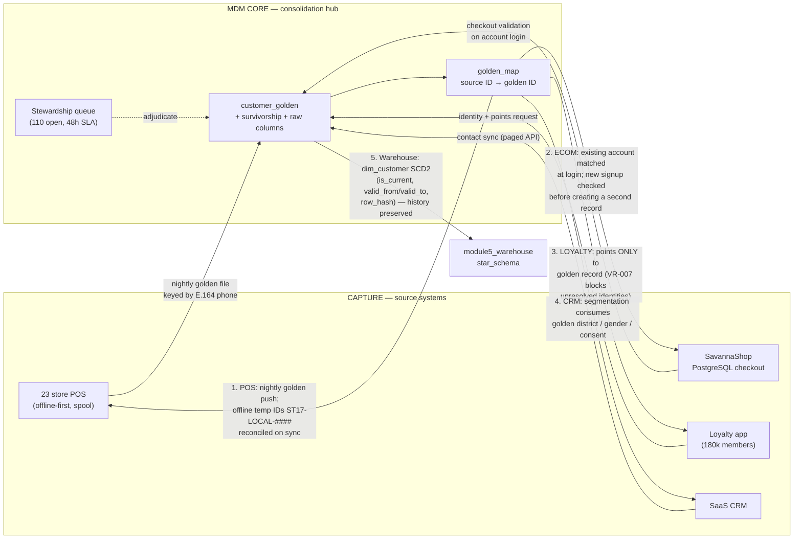

# Task B3 — Master Data Management Design (C5)

**Client:** Savanna Retail Group (SRG) — Kampala, Uganda
**Deliverable:** Customer MDM solution — style selection, golden-record schema with survivorship, matching rules, hierarchies + integration flows, governance process
**Evidence base:** `module2_data_quality/` (profiling, standardization, dedupe, `dedupe_match_log.json`, `SRG_Customers_clean.csv`), `module3_etl/srg_etl_pipeline.py` (`golden_map` remap), `module5_warehouse/star_schema_ddl.sql` (`dim_customer` SCD2)
**Scale:** 23 POS DBs + SavannaShop + loyalty app (180,000 members) + SaaS CRM + Odoo; measured duplicate load **23%** (22.84% auto-matchable of 5,000 sampled records)

---

## Task B3.1 — MDM Style Selection & Rejected-Alternatives Analysis (C5)

### 1.1 The four styles, scored against SRG's constraints

| Style | Mechanism | Budget fit (UGX 480M/yr, 4 staff) | Connectivity fit (hours-daily outages) | Duplicate control (23% dupes) | Time-to-value (month 6) | Verdict |
|---|---|---|---|---|---|---|
| **Registry** | Index of match keys + pointers; each system keeps its own record; no golden master | 5 (cheap index) | 5 (nothing to sync centrally) | **1** — no survivorship enforcement; every system keeps its own copy, so duplicates *regenerate* the moment a store clerk types a new signup | 4 (fast to stand up) | **Rejected** |
| **Consolidation** | Periodic extract from all systems → match → survivorship → golden record; *source systems stay authoritative for capture* | 4 (SQL + Python only — exactly the team's skills) | **5** — built for batch/scheduled sync: spool at the store, consolidate in the nightly window | 3–4 — golden record with enforced survivorship + stewardship queue; bounded by sync lag | **5** — Module 2 already delivers the hard part (implemented, executed) | **Recommended** |
| **Coexistence** | Golden record propagated *back* bidirectionally to every source; writes flow both ways continuously | 2 (needs bidirectional sync services + conflict resolution per system × 23 stores) | **1** — continuous propagation assumes links that are down for hours; conflict queues explode offline | 4 (strongest enforcement once running) | 1 (build the sync fabric first) | **Rejected now** |
| **Centralized (transactional) MDM** | The MDM hub *is* the write path — all systems must call it to create/update a customer | **1** — commercial suites (Informatica MDM, Profisee, Stibo) licence + implementation typically exceeds the entire UGX 480M envelope before any cloud/hire cost; needs skills SRG does not have | 2 — a blocked POS signup at ST19 (Gulu) during an outage blocks the till | 5 | 1 | **Rejected** |

### 1.2 Recommendation

**Adopt a CONSOLIDATION-style MDM, implemented pragmatically in-database**: a central golden record with attribute-level survivorship and a stewardship queue, built in SQL + Python on the existing PostgreSQL/SQLite estate — *not* an enterprise MDM product.

Design commitments that make this a real consolidation hub rather than a registry:

1. **One physical golden table** (`customer_golden`) — not an index of pointers. Survivorship is *enforced at merge time*, so a merged-away record cannot be re-read by any consumer.
2. **Persistent survivorship rules** (§1.3) applied by the pipeline, not by each consuming system's ad-hoc logic.
3. **Stewardship queue as a first-class table** — 110 open rows are visible work items with owners and SLAs, not silently dropped candidates (VR-007: normalized phone unique across golden records *or* record in the review queue).
4. **Reversible merges** — `merged_customer_ids` audit trail on every survivor row; any merge can be un-done and re-adjudicated.

**Rejected-alternatives summary (what would change each verdict):**

| Rejected | Reason (evidence) | Revisit when |
|---|---|---|
| Centralized commercial MDM | Licence + skills cost outside the envelope; write-path coupling breaks the offline till (a coordinator call per signup is impossible at ST19 during outages) | Board funds a separate licence line **and** a trained hire exists — note this would still fail the connectivity test |
| Coexistence | Requires mature bidirectional golden sync + conflict-resolution SRG does not have; with 23 offline stores, "last writer wins" would overwrite verified golden data with clerk-typed variants every day | ≥12 months of stable consolidation runs + store links ≥99% for 6 months |
| Pure registry | No survivorship enforcement → the 23% returns; DQC-01 (duplicate-person rate > 1%) would alarm permanently; nothing prevents loyalty points attaching to the wrong member | Only if source systems could be *forced* to consume match keys at write time — which is, in effect, coexistence |

### 1.3 Survivorship rules actually implemented (consistency with Module 2)

Applied at merge time, deterministic and idempotent across re-runs:

1. **Most complete record wins** — non-null count across `full_name, phone_e164, email, district_std, gender_std, registration_date_iso`.
2. **Tie → earliest `registration_date`** (golden record keeps the longest relationship history).
3. **Tie → lowest `customer_id`** (deterministic; re-running the pipeline yields the same survivor).

All losing-row values are preserved: originals sit in `*_raw` columns (`phone_number_raw`, `district_raw`, `registration_date_raw`, `gender_raw`), merged-away identifiers in `merged_customer_ids`.

---

## Task B3.2 — Golden-Record Schema & Attribute-Level Survivorship (C5)

### 2.1 Attribute, winning source, rule, justification

| Attribute | Winning source | Survivorship / standardization rule | Business justification |
|---|---|---|---|
| **full_name** | The **most complete registration record** (source with all name parts present); tie → **earliest `registration_date`**; further tie → **lowest `customer_id`** | Trim/case-normalize; must pass VR-006 (≥2 chars, letters/dots/dashes) | The name a human recognizes at the till; earliest registration is the name the customer gave when the relationship started and is what loyalty/CRM correspondence uses |
| **phone** | **Loyalty app E.164-verified number wins** (app has verified the handset via OTP); else **most recent valid** value | Standardized to `+2567XXXXXXXX` — all 6 input variants (`+2567…`, `077…`, `2567…`, `7…`, `'+256 77 123 4567'`, `077-123-4567`) collapse to 1 (measured: 6 variants → 1) | Phone is SRG's operational key (till lookup, MoMo linkage, loyalty SMS). Verified-at-capture beats merely-typed; E.164 makes the deterministic match key portable across POS/e-comm/loyalty |
| **email** | **E-commerce checkout-validated address wins** (it has completed a real transaction verification); **conflicts flag review** — never silently picked | Lower-cased, VR-003 RFC-5322-lite validation; a conflicting email on a match candidate is a **hard reject** (homonym protection, §3.3) | A checkout-validated email is the only one proven to reach the customer; but two *different* emails on two records is evidence they may be two people — automation must not choose |
| **address / district** | **Latest POS-verified value** checked against the official Uganda district reference list | Alias dictionary → fuzzy (≥88 WRatio) → steward queue; 127 raw labels → 42 canonical; region derived from District table (3NF) | District drives catchment/staffing analysis; "latest verified" reflects reality after relocations, while the official list keeps reporting stable |
| **preferences** (marketing consent, contact channel) | **CRM wins** | Recency of consent capture; `consent_marketing`/`consent_gdpr_eu` booleans carry lawful basis | Consent records must reflect the *most recent, evidenced* opt-in/out (DPPA 2019 / GDPR Art.7) — recency is the only defensible ordering for consent |
| **loyalty tier & points balance** | **Loyalty platform wins** | System of record for points; golden record stores the tier snapshot only | Points are a financial liability owned by the loyalty ledger; duplicating balances into MDM would create a second, competing truth |
| **customer_id (golden key)** | MDM itself | Stable global ID; all source IDs mapped via `golden_map` (see §4.3) | One human = one ID; source systems keep their local IDs as aliases |
| **`*_raw` columns** | — | Originals always preserved beside standardized values | Auditability for PDPO/DPPA data-subject requests: SRG must show what was stored, what was changed, when and why |

### 2.2 Golden-record table shape (as produced by the cleansing pipeline)

`module2_data_quality/output/SRG_Customers_clean.csv` columns demonstrate the schema in operation: standardized fields (`phone_e164`, `district_std`, `registration_date_iso`, `gender_std`) + originals (`phone_number_raw`, `district_raw`, `registration_date_raw`, `gender_raw`) + MDM control columns (`merged_customer_ids`, `stewardship_flag`). Result: **5,000 raw rows → 3,858 golden records**, duplicate-person rate **22.84% → 0.00%**, total flag rate 25.06% → 2.85%.

---

## Task B3.3 — Matching Rules (C5)

### 3.1 Deterministic layer (executed first)

| Rule | Key | Effect (measured) |
|---|---|---|
| **R1 — normalized phone equality** | `phone_e164` (E.164, non-empty) | **953 unions** — every pair of records sharing a verified `+2567…` number is clustered for merge; this is the workhorse given 90%+ phone availability after cleansing |

Deterministic keys never fire on empty values (an empty phone is *missing evidence*, not shared evidence) and operate on the standardized value only — matching before standardization would lose the 6-format variant clusters.

### 3.2 Probabilistic weighted scoring (exactly as implemented)

Candidate generation is **blocked on canonical district** (comparison scope control — Uganda districts are stable and 99.4% resolved post-cleansing) and requires **name token/Levenshtein similarity ≥ 90** before any score is computed.

| Signal | Weight | Tiers |
|---|---:|---|
| **Name similarity** | **+60** base (token-sort ratio ≥ 90) | **+70** when similarity ≥ 97 (near-exact spelling) — i.e. `60 + (10 if sim ≥ 97 else 0)` |
| **District match** | **+20** | Mandatory by the blocking key (both records resolved to the same canonical district) |
| **Phone** | **+20** exact E.164 equality | **+10** partial/neutral evidence (one side missing — same national base, never contradicting); **0** for differing non-empty numbers |
| **Email** | **+15** exact equality | **+5** one side missing; **−10** **conflicting emails (both present, different)** |

**Decision gates:**

| Gate | Condition | Outcome |
|---|---|---|
| **Auto-merge** | `score ≥ 90` **AND a positive identifier match exists** (equal phone **or** equal email) | Cluster-merge with survivorship; name similarity alone **never** auto-merges |
| **Stewardship queue** | `65 ≤ score < 90` (or ≥ 90 without any positive identifier) | Human adjudication; `stewardship_flag = 'REVIEW: possible duplicate'` |
| **Hard reject (homonym protection)** | Conflicting non-empty emails on a high-name-similarity pair | Rejected outright — counted, not merged: **365 homonym pairs rejected** |
| **Below band** | `score < 65` | Left as separate records (assumed different people) |

### 3.3 Justifying the thresholds with measured outcomes

| Measured result (`dedupe_match_log.json`, `before_after_metrics.md`) | Figure |
|---|---|
| Duplicate rows injected into the sample (ground truth, `injection_report.json`) | **1,150** |
| Rows actually merged | **1,142** (964 clusters: 953 deterministic phone + 189 fuzzy auto) |
| Homonym pairs **correctly rejected** by the email-conflict rule | **365** |
| Pairs/rows held in stewardship review (no fabricated merges) | **110** |
| Duplicate-person rate before → after | **22.84% → 0.00%** |

The trade-off is deliberately asymmetric: **a false merge is strictly costlier than a missed match.**

| | False merge (two people become one) | Missed match (one person stays two records) |
|---|---|---|
| Business | One customer's loyalty history and points are absorbed into another's; wrong-member points are *created* (the defect SRG reported) | Duplicate contact — annoying, visible, fixable |
| Privacy/law | Corrupts consent records: marketing opt-out of Person A may be inherited/overwritten for Person B — breaches **DPPA s.7** and **GDPR Art.7** accuracy/lawful-basis duties; a data-subject request then returns *another person's* purchase history | No rights are destroyed; the record is simply incomplete |
| Reversibility | Only if someone notices; merge has already propagated to loyalty/CRM | Always — steward merges it later with full context |
| **Operational stance** | **Prevented by construction** (threshold ≥ 90 + mandatory positive identifier + email-conflict hard reject) | **Accepted** — routed to the stewardship queue under VR-007 |

Hence: automation is capped at high-confidence, identifier-backed merges; the 110-row queue with a 48-hour steward SLA is a *feature*, not a backlog. This is also why loyalty point posting is blocked for unresolved identities (VR-007 action clause).

**Ethics controls built into the rule set:** (i) no merge without a positive identifier; (ii) email conflict stops automation cold (homonyms — 365 cases — are invisible to name+district scoring); (iii) every merge stores `merged_customer_ids` (the losing IDs) so any merge can be **un-done** and re-adjudicated; (iv) fairness note for the reflective record — deterministic reliance on phone equality under-serves customers with shared family handsets, which is exactly why those cases land in review rather than being auto-resolved either way.

---

## Task B3.4 — Master Data Hierarchies & Integration Flows (C5)

### 4.1 Customer → Household (soft, low-confidence)

| Rule | Value |
|---|---|
| Grouping key | Same normalized **address/district + surname + shared phone**, activity within **90 days** |
| Confidence | Stored as a **score 0–1**, never as an identity link — `household_id` is a soft attribute, **no merge, no shared golden record** |
| Permitted uses | Catchment/household marketing *counts*, delivery batching, Board "household penetration" metrics |
| Forbidden uses | Loyalty accrual, consent inheritance, identity resolution, single-customer-view roll-ups |
| Justification | Household is genuinely useful for retail catchment analysis, but SRG's real households are noisy: shared family handsets, student tenants under a landlord's surname, and (Jinja) multi-generational homes with one delivery phone |

**Break scenario (why identity merge is forbidden):** three students in a Jinja rental share the landlord's surname *and* the house phone; the grouping correctly fires — but merging them would move one student's snack purchases into another's loyalty ledger and let one person's marketing opt-out silently suppress the others. Soft grouping keeps the analytic value and refuses the privacy damage.

### 4.2 Product → Category → Subcategory + identifier crosswalk

Canonical **6-class merchandise hierarchy** (matches `CATEGORY_MAP`/VR-010, measured 30 raw labels → 6):

| Category | Representative subcategories |
|---|---|
| **Beverages** | Juices, Soft drinks, Water |
| **Grains & Cereals** | Maize flour, Rice, Sugar, Beans |
| **Snacks** | Biscuits, Crisps, Confectionery |
| **Household** | Detergents, Paper products, Candles |
| **Personal Care** | Soap, Oral care, Sanitary |
| **Stationery** | Exercise books, Pens, Paper |

**Product identifier crosswalk:** one golden SKU per product, with every legacy code mapped as an alias — the reported "same product, 5 identifiers" case (POS `KAK1002`, e-commerce `SUG-KAK-1K`, Odoo `100234`, supplier Excel `KSL/1kg`, app `sugar-kakira-1kg` → **golden SKU `KAK1002`**). Enforced by VR-008 (one SKU = one product name; 141 duplicate-SKU rows and 69 SKU→multi-name rows are *flagged for stewardship*, never auto-merged — same false-merge asymmetry as customers).

### 4.3 Integration flows (golden record back into the business)

| Flow | Mechanism | Defect it fixes |
|---|---|---|
| **POS** | Nightly **golden file keyed by E.164 phone** pushed to each store; offline signups get a **local temp ID** (`ST17-LOCAL-####`) that reconciles to the golden ID on sync (`golden_map` remap in `srg_etl_pipeline.py`) | Points/sales booked against phantom local records; walk-ins stay `customer_sk = 0` (Unknown/Walk-in) instead of fabricated identities |
| **E-commerce** | Checkout **validates the account login against the golden record** before insert; near-match → link, conflict → steward queue | SavannaShop re-registering existing loyalty members |
| **Loyalty** | Points attributed **only to the golden record**; posting blocked while identity unresolved (VR-007) | "Loyalty points issued to wrong members" — SRG's reported symptom |
| **CRM** | Segmentation consumes golden **district/gender/consent** fields | Segment reports built on stale CRM copies; consent drift |
| **Warehouse** | `dim_customer` **SCD2** receives golden versions (`row_hash` change detection) — history stays queryable as-of any date | Re-hiding history after a merge; supports PDPO data-subject requests |

---

## Task B3.5 — MDM Governance Process (C5)

| Process | Who | Steps | SLA |
|---|---|---|---|
| **New attribute approval** | Proposer: any domain steward; Approver: **Data Governance Council** (existing staff, quarterly cycle per Part A2) | 1) Steward submits business need, source system, PII classification, retention class → 2) Council reviews at quarterly meeting (or fast-track for regulatory items) → 3) Approved → **ETL/schema-change ticket** raised against `customer_golden` + consuming systems → 4) ETL change deployed with a data contract update → 5) Change log entry | Quarterly cycle; regulatory fast-track ≤ 10 working days |
| **Stewardship dispute resolution** (e.g., "these two records are the same person?") | **Domain steward** for the data domain (customer → CRM Officer) | 1) Steward decides within **48h** with evidence (source screenshots, call logs) → 2) Unresolved/escalated → **Data Governance Council** → 3) If Council is deadlocked (e.g., cross-domain or first-year tie) → **Lead EDM Consultant** tie-break, *initially only*, with written rationale — role retires after 12 months | 48h steward; 5 working days Council |
| **Propagation SLA** (golden change → consumers) | IT Operations Lead | Normal: golden change lands in the **next scheduled sync ≤ 24h**. Critical corrections (consent withdrawal, wrongful merge, breach-related suppression): **immediate** — pushed out-of-band to loyalty + CRM, warehouse re-versions via SCD2 same run | ≤ 24h normal; immediate critical |
| **Change log** | Owned by MDM pipeline + steward | Every merge/un-merge stores `merged_customer_ids`, `stewardship_flag`, timestamp, `etl_run_id`; attribute edits carry before/after (`*_raw` vs standardized); log is read-only to all roles except Data Steward Admin | Immutable; retained per DPPA retention policy |
| **Queue monitoring** | DQC-01 (duplicate-person rate > 1% daily, > 2% = P1) | Stewardship queue depth and age reported weekly; queue growth is treated as a *capture-quality* signal, triggering form fixes at the offending store | Weekly review |

---

## Think-deeper answer

**The store manager who keeps creating "quick" local customer records during outages — resolved technically *and* politically.**

**Why the manager is right:** blocking the sale to satisfy an MDM rule would be a worse business outcome than a duplicate record. During a 3-hour Gulu outage the till must keep taking money; the manager's "quick record" is rational behaviour under a constraint the central system ignored. The design must therefore treat offline capture as a **designed state**, not as non-compliance — the same principle that made `customer_sk = 0` (walk-in) a first-class value in the repaired ETL.

**Technical resolution (none of this requires the network):**

1. **Offline-first capture forms with local validation** — the POS form runs locally (SQLite) and enforces the *same* rules as the hub: VR-001 phone mask (`+2567…`), district dropdown from the canonical list, VR-006 name check. Quality is enforced at the edge, so nothing is accepted offline that would be rejected online.
2. **Temp local IDs, explicitly namespaced** — `ST17-LOCAL-0042`. The ID announces itself as provisional; it cannot collide with golden IDs, and it carries `source_system` + `pending_reconciliation` flags.
3. **Reconciliation on reconnect** — during the nightly sync window the temp record runs through the standard matchers (§3): it resolves to an existing golden record (attributes merged under survivorship) or, if genuinely new, is minted a golden ID; `golden_map` remaps every transaction and points posted under the temp ID (the same remap mechanism `srg_etl_pipeline.py` applies to `merged_customer_ids`).
4. **Walk-ins get `customer_sk = 0` / "Unknown — walk-in"**, never a fabricated identity. A sale without a resolvable customer is *legitimate*; a sale with an invented customer is a future duplicate.
5. **Benefits activate only after golden match** — loyalty points and marketing attribution are gated on a resolved golden ID (VR-007 blocks point posting for unresolved identities). This aligns incentives: the *customer* now asks the cashier to do the lookup properly, which gives the manager a reason to reconcile rather than to invent.

**Political resolution:**

1. **Do not block the sale** — said explicitly and publicly; the MDM programme is not going to be the reason a customer walks out of ST17.
2. **Co-design the capture form** — the store managers who live through the outages specify the offline fields (they will drop the district free-text in favour of a dropdown once they see it removes their evening clean-up). Ownership converts resistors into reviewers.
3. **Measure the right thing** — replace punishment for outage behaviour with the KPI **"unreconciled local records > 48h"** per store. The metric blames the *process* (a sync that didn't run, a form that wasn't fixed), not the outage. Under DQC-01 it rolls up weekly to the Council.
4. **Stewardship SLA back to the stores** — if a store submits a temp record for adjudication, the steward answers within 48h (§B3.5). Nothing kills cooperation faster than sending records into a void; nothing builds it faster than a 48-hour reply.
5. **Recognition, not blame** — publish "cleanest records" per store on the same board as sales; stores with zero unresolved temp records after 48h get called out in the monthly ops meeting. The manager who previously blocked the form becomes the reference user.

**Why this does not break the MDM design:** no bypass of survivorship (temp IDs reconcile through the same matching gates), no identity fabrication (walk-ins remain Unknown), no ungoverned attributes (the co-designed form *is* the data contract), and the political layer simply moves the enforcement point from "block at capture" to "reconcile on sync + measure ageing" — which is the only posture compatible with hours-daily connectivity loss.
