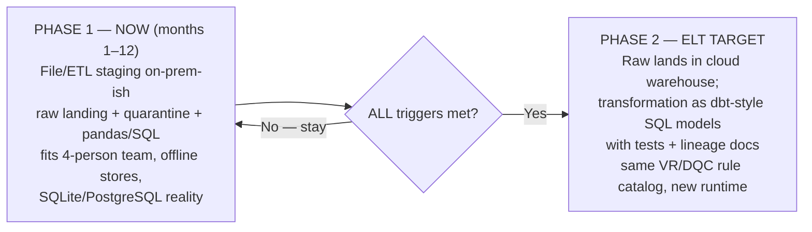

# Task B4 — Data Integration & Real-Time Architecture (C6)

**Client:** Savanna Retail Group (SRG) — Kampala, Uganda
**Deliverable:** Part B4(iii) — ETL vs ELT decision matrix for the present state and the future cloud migration
**Budget frame:** UGX 480,000,000/yr all-in (licences + cloud + hires, ≈ USD 130,000 @ UGX 3,700) — *every* option below is priced against this single envelope
**Current estate:** 23 offline-tolerant MySQL POS + PostgreSQL e-comm + cloud loyalty + SaaS CRM + Odoo; team of 4 (2 SQL, 0 data-engineering); warehouse on PostgreSQL/SQLite today

---

## Task B4(iii) — ETL vs ELT Decision Matrix (C6)

### 1. Definitions as applied at SRG

| Mode | Where transformation happens | SRG concrete form |
|---|---|---|
| **ETL** (Extract–Transform–Load) | Transform in an intermediate staging layer *before* the warehouse load | Files/CDC → **immutable raw landing** → validation, standardization, dedupe, enrichment (pandas/SQL) → load dims/facts — i.e. `srg_etl_pipeline.py` as built |
| **ELT** (Extract–Load–Transform) | Raw data loaded first; transformation executes *inside* the target warehouse | Files/CDC → raw tables in cloud warehouse → SQL/dbt models (contracts, tests, materializations) build dims/facts |
| **Hybrid** | Both, staged in time | **Phase 1 (now):** file/ETL staging on-prem-ish, offline-first. **Phase 2 (post-triggers):** raw lands in cloud warehouse, transformation moves there as dbt-style SQL — same rules, new runtime |

### 2. Decision matrix (scores 1 = worst … 5 = best; justification per row)

| # | Criterion | ETL (now) | ELT (cloud) | Hybrid (staged) | Justification for the scores |
|---|---|:-:|:-:|:-:|---|
| 1 | **Latency** | 3 | 5 | 4 | ETL is window-bound (spool 23:00–02:00, warehouse by 03:30) — fine for Board KPIs, weak for CDC e-comm events. ELT loads raw instantly and transforms continuously → 5. Hybrid inherits ETL latency in Phase 1, near-ELT after cutover → 4 |
| 2 | **Cost (within UGX 480M)** | 4 | 3 | 4 | ETL runs on commodity SQL + pandas already owned — near-zero marginal licence cost, and only *cleaned* rows cross the WAN (egress minimized). ELT requires an always-on cloud warehouse compute line carved from the same envelope (indicative UGX 60–90M/yr, ~USD 16–24k, displacing something else) plus raw-volume egress. Hybrid stages that spend until it is justified |
| 3 | **Scalability** | 2 | 5 | 4 | Single-node pandas scales by lengthening the window; at 10s of millions of fact rows (23 stores + Kenya/Rwanda) the window eventually breaks. ELT scales elastically with the warehouse → 5. Hybrid gets there in Phase 2 → 4 |
| 4 | **Complexity / ops burden (4 staff)** | 4 | 3 | 3 | ETL = one pipeline, one `etl_run_log`, one alert rotation — operable by 2 SQL-capable people. ELT adds warehouse modelling, orchestration, test suites and tool upgrades to the same four people. Hybrid carries *both* stacks during transition → 3 (deliberate, time-boxed cost) |
| 5 | **SRG skills fit** | 5 | 2 | 3 | ETL is pandas + SQL they already write (validated: self-test 3/3 PASS). ELT assumes dbt/warehouse-SQL/CI habits that do not exist yet — must be trained *before* adoption, not during. Hybrid = ETL now, training runway before cutover → 3 |
| 6 | **Connectivity / offline fit** | 5 | 2 | 4 | Stores spool CSV → SFTP and are validated *before* wide-area transit; an outage delays a file, it never corrupts a cloud load. ELT's "stream raw upward" posture assumes links several stores lose for hours daily. Hybrid keeps store-side spooling forever → 4 |
| 7 | **Auditability (PDPO ≤ 12 months)** | 5 | 4 | 5 | ETL today already has immutable raw landing + per-row quarantine + `etl_run_log` + control totals (UGX 252,382,814.16) — every figure reproducible. ELT preserves raw in-warehouse (good lineage) but transform logic lives in many SQL models that need tooling to trace for an auditor → 4. Hybrid keeps immutable landing *and* warehouse lineage → 5 |
| 8 | **Time-to-value by month 6** | 5 | 2 | 4 | ETL path is built and evidenced now (quarantine, idempotency, SCD2 dims, dashboards feedable). ELT re-platforms working code before month 6 → 2. Hybrid delivers with ETL, converts later → 4 |
| 9 | **Future cloud-migration fit** | 2 | 5 | 4 | Hand-rolled Python does not lift to a managed stack as cleanly as SQL models do; but because transformations are *specified* as rules + tests (VR/DQC catalog), porting them is a rewrite, not a redesign → ETL 2, ELT 5, Hybrid 4 |
| | **Total (max 45)** | **35** | **29** | **35** | ETL wins *today*; ELT wins *after* the triggers; hybrid is the staged path that gets SRG from the first number to the second without a re-platform gamble |

### 3. Recommendation

**Stage it: run file/ETL staging now; convert to ELT-style transformation-in-warehouse only when the trigger conditions below are all met.** Hybrid is not fence-sitting — it is two explicit decisions with a gate between them.

**Why not ELT now:** re-platforming a *working, evidenced* pipeline (3/3 self-tests, control totals, RC-1…RC-6 fixes) into a cloud warehouse before month 6 spends scarce budget and the only two SQL-capable staff on migration instead of on the Board's quick wins — and still cannot fix store connectivity, which is the binding constraint on both latency and cost.

**Why not ETL forever:** single-node windows eventually break at 23-store-plus-expansion volume, and hand-rolled Python accumulates maintenance debt for a team that should be spending its hours on rules, not runners.

### 4. Migration trigger conditions (all must hold)

| # | Trigger | Measurable test | Owner |
|---|---|---|---|
| T1 | **Cloud budget line approved** | Board approves a discrete warehouse/compute line (indicative UGX 60–90M/yr) *within* the UGX 480M envelope, with the offsetting item named | CFO + Board |
| T2 | **Staff trained** | ≥ 2 of the 4 IT staff complete warehouse-SQL + dbt-style modelling training and ship one model to production unassisted | IT Operations Lead |
| T3 | **≥ 2 stable pipelines** | Two pipelines (POS spool + e-comm CDC) with ≥ 60 consecutive green runs, quarantine rate < 0.5% (DQC-07), zero unmonitored failures (RC-6 regression test) | IT Operations Lead |
| T4 | **Connectivity improved** | ≥ 99% site-availability for 6 consecutive months across the 23 stores (measured by spool upload success) — otherwise Phase 2 merely moves the bottleneck | IT Manager |
| T5 *(supporting)* | **Volume pressure** | Fact volume or query SLA proves the single-node window is the constraint (e.g., load window > 4 h sustained) | Consultant |

### 5. Target tooling pattern

On trigger, adopt **dbt-style transformation-in-warehouse** (declarative SQL models, automated tests mapped 1:1 to VR-001…VR-012 and DQC-01…DQC-10, lineage documentation generated per model, incremental materialization replacing hand-rolled delete-then-insert). The *rules do not change* — only their runtime. This is why the rule catalog is documented as portable specifications rather than embedded Python: conversion is a translation exercise with an existing test suite (control totals, orphan checks, idempotency tests) to prove parity.

### Think-deeper answer

The real question in "ETL vs ELT" at SRG is not technical — it is *who is paying for latency nobody consumes*. ELT's score-5 latency and scalability are only worth their cloud line if the business has a consumer for sub-hour data; today it does not (board KPIs are monthly, churn scoring nightly, fraud reviewed in 5–15-minute windows — Task B4(v)). Paying an always-on compute line from the same UGX 480M envelope to transform raw data faster than anyone reads it would be a cost with no return. Conversely, ETL's score-2 scalability has a fuse: it burns at 23-store-plus-Kenya/Rwanda volume, and the correct engineering response is the pre-registered trigger table above — so the decision today does not lock the decision tomorrow. That is the test of a real architecture decision: it names, in advance, the evidence that would overturn it.
