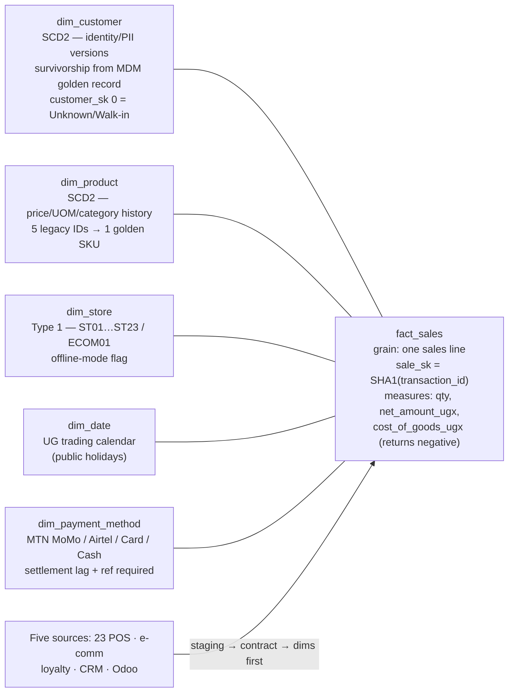
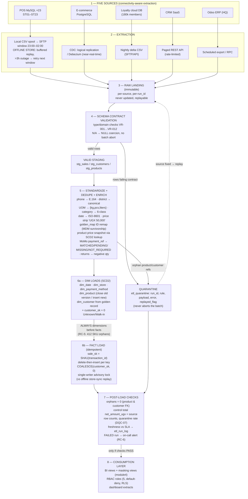

# Task B4 — Data Integration & Real-Time Architecture (C6)

**Client:** Savanna Retail Group (SRG) — Kampala, Uganda
**Deliverable:** Part B4(i) — star-schema warehouse design reference; Part B4(ii) — complete ETL workflow documentation (diagram, extraction matrix, transformation rules, load sequencing, implemented core transformations)
**Evidence base:** `module3_etl/srg_etl_pipeline.py` (repaired pipeline, executed, self-test 3/3 PASS), `module3_etl/etl_diagnosis.md` (RC-1…RC-6), `module5_warehouse/star_schema_ddl.sql`, `module2_data_quality/output/validation_rules.md` (VR-001…VR-012), `dq_monitoring_spec.md` (DQC-01…DQC-10)

---

## Task B4(i) — Star-Schema Warehouse Fed by Five Sources (C6)

Design and DDL live in `module5_warehouse/star_schema_ddl.sql`; shape summary:

| Object | Grain / role | Fed by |
|---|---|---|
| `fact_sales` | One row per sales line (`sale_sk = SHA1(transaction_id)`); additive UGX measures; returns = negative quantity | All five sources via staging |
| `dim_customer` (SCD2) | One row per identity version (`is_current`, `valid_from/valid_to`, `row_hash`) | MDM golden record (Task B3) |
| `dim_product` (SCD2) | One row per product version — price/UOM/category history frozen at time of sale | Product master + 5-ID crosswalk |
| `dim_store` | Type 1 + relocation note; `store_bk` = ST01…ST23 / ECOM01 | Store master (offline flag `has_pos_offline_mode`) |
| `dim_date` | UG trading calendar incl. public holidays | Static |
| `dim_payment_method` | MTN MoMo / Airtel Money / Card / Cash; `settlement_lag_days`, `requires_payment_ref` | Payment reference data |



**Load order (hard rule):** `dim_date → dim_store → dim_payment_method → dim_product → dim_customer → fact_sales`.

---

## Task B4(ii) — Complete ETL Workflow (C6)

### (a) End-to-end workflow diagram



**Offline-store spooling, explicitly annotated:** each store's POS writes to a local spool during the day; the sync worker uploads in the 23:00–02:00 window; if a store has been offline > 3 hours the batch defers to the *next* window rather than half-applying; replay is serialized against the ETL by the single-writer advisory lock (fix for RC-3, the ST17 deadlock).

### (b) Extraction method per source (honouring connectivity reality)

| # | Source | Volume/shape | Extraction method | Window / cadence | Connectivity handling |
|---|---|---|---|---|---|
| 1 | **23× MySQL POS** (ST01–ST23) | ~10k lines/6 months sample → full estate much larger | **Local CSV spool → SFTP** (agent on store box; plain files, no long-lived DB connections) | **23:00–02:00** nightly | Stores offline > 3 h → retry next window; UPS-backed POS keeps capturing; spool is immutable and idempotently replayable; sync replay serialized vs ETL |
| 2 | **E-commerce PostgreSQL** (SavannaShop) | Continuous | **CDC via logical replication / Debezium** | Near-real-time into raw landing (micro-batch downstream) | Data centre link is HQ-side and stable; CDC decouples from store connectivity entirely |
| 3 | **Loyalty cloud DB** | 180k members, daily deltas | **Nightly delta CSV via SFTP/API** | 02:15 | API rate limits respected; full snapshot weekly as reconciliation backstop |
| 4 | **CRM SaaS** | Contact/consent records | **Paged REST API** with rate limiting + `updated_since` cursor | 02:30, paged | Throttled by contract; cursor checkpoint resumes after mid-run failure |
| 5 | **Odoo ERP (HQ)** | Item master, purchase costs | **Scheduled export / RPC** (server-side, HQ LAN) | 01:45 | HQ-local; no WAN dependency |
| — | *Supporting*: MoMo provider CSVs (MTN/Airtel) | Daily settlement | Manual download → drop folder (automated later) | Daily AM | `PENDING` refs age via DQC-08 until matched |
| — | *Supporting*: 14 supplier Excel files | Ad-hoc | Parsed to supplier master on change | Weekly/on change | Never loaded raw into facts |

### (c) Transformation rules

| # | Rule | From → To | Failure behaviour |
|---|---|---|---|
| T1 | Type coercion | `'N/A'`, `''`, `'null'` → `NULL` (never → 0 / fake values) | Uncoercible (`'UGX cheap'` in quantity) → quarantine `SCHEMA_TYPE`, batch continues (fixes **RC-1**) |
| T2 | Currency/price strip | `'UGX 50,000'`, `'11,500'` → `50000.0` / `11500.0` numeric | Non-numeric → quarantine |
| T3 | Phone → E.164 | `077-123-4567`, `2567…`, `7…`, `'+256 77 …'` → `+2567XXXXXXXX` (6 variants → 1) | Unrepairable → keep raw + `phone_status=invalid` (VR-001 monitoring, DQC-02) |
| T4 | District → canonical list | 127 raw labels → 42 official (alias dict → fuzzy ≥88 → steward) | `UNRESOLVED` → stewardship, never fabricated (DQC-03) |
| T5 | Date → ISO-8601 | `12/07/2024`, `2024-07-12`, `07/08/2024` → `2024-07-12T…` | Unparseable → quarantine `VR-005` (e.g. `31/02/2024`) |
| T6 | Gender → domain | `Male/M/male`, `F/female/…` → `{M,F}` | Unmapped → keep raw, flag (100% conformance achieved in Module 2) |
| T7 | UOM → domain | `kg/KGS/Kilograms/…` → `{kg,pcs,liters}` (label-mapped; `g`/`ml` *values* flagged for source fix, not silently scaled) | Non-conforming new rows → DQC-05 alert |
| T8 | Category → 6-class | 30 raw labels → Beverages, Grains & Cereals, Snacks, Household, Personal Care, Stationery (alias + fuzzy ≥85) | Unresolved → steward (VR-010) |
| T9 | Golden-record ID remap | source `customer_id` → golden ID via `golden_map` (`merged_customer_ids` on survivor) | Unknown ID → `COALESCE(customer_sk, 0)` Unknown/Walk-in (**fixes RC-2**) |
| T10 | Dedupe keys | Deterministic `phone_e164` equality; fuzzy name ≥90 blocked on district, auto-merge ≥90 **+ positive identifier** (Task B3) | Score band 65–90 → stewardship queue; email conflict → reject |
| T11 | Lookup enrichment | `unit_price_ugx`/`cost` from `dim_product` version valid at sale; store attributes from `dim_store` | Missing product → quarantine `VR-008`, replay after dim refresh (**fixes RC-5**) |
| T12 | MoMo payment_ref status | ref present → `MATCHED`; MoMo without ref (offline) → `payment_ref='PENDING_RECON'`, `reconciliation_status='PENDING'`; non-MoMo → `NOT_REQUIRED`; provider file lost → `MISSING` | Never blocks revenue load; aged refs escalate via **DQC-08** (> 24 h, > 50 = P1) |
| T13 | Returns | `quantity` negative (500 rows), `is_return = TRUE` | Sign flip validated; control totals computed on signed values |
| T14 | Contract enforcement per source | Schema JSON published with each extract; loader refuses files failing the contract *before* touching the database | Contract breach → halt that source only, alert on-call (VR-004/VR-008 enforced at the boundary) |

### (d) Load sequencing, idempotency, freshness

| Control | Rule | Evidence / lesson |
|---|---|---|
| **Dimensions ALWAYS before facts** | `dim_date → dim_store → dim_payment_method → dim_product (SCD2) → dim_customer (SCD2) → fact_sales` (stated in `star_schema_ddl.sql` footer) | **RC-5**: dimensions loaded after facts produced **412 SKU orphans**; now orphan FKs are quarantined and replayed after the dim refresh, never FK-crash |
| **Quarantine, never abort** | Bad rows → `etl_quarantine` (run_id, rule, payload, error, replayed_flag); valid rows proceed; `--replay-quarantine` re-loads after source fix | Self-test: 6/6 injected bad rows quarantined, batch still loaded 10,000 rows |
| **Idempotent re-runs** | `sale_sk = SHA1(transaction_id)` → **delete-then-insert** per key set; dimension upserts keyed by `row_hash` | Self-test TEST 1: rows before = 10,000, after re-run = 10,000 → PASS |
| **Single-writer discipline** | Advisory lock (`pg_advisory_lock(hashtext('dim_store_writers'))`, dialect-aware fallback) around shared-dimension writes; store-sync replay confined to 23:00–01:45; `dim_store` updates ordered by `store_sk` | **RC-3**: ST17 sync replay deadlocked the nightly ETL |
| **Fail fast, no silent fallback** | The diagnosed job's "partial mode" (reusing yesterday's staging) is **removed**; a failed run marks `etl_run_log.status = FAILED`, exits non-zero | **RC-4**: stale-data masking propagated wrong results for 4 days |
| **Post-load checks** | `fact_orphan_product_fks = 0`, `fact_orphan_customer_fks = 0`, `control_total_net_amount_ugx` matches source, row counts, pending-MoMo count | Executed: control total **UGX 252,382,814.16 OK**, **849** pending MoMo refs, **500** returns, 10,000/10,000 loaded |
| **Freshness SLA + monitoring** | SLA: staging by 02:30, warehouse by 03:30, BI views by 04:00; breach → alert. **DQC-07** quarantine rate > 0.5% or > 100 rows/run → IT Operations Lead; DQC-08 pending MoMo > 24 h → Finance | **RC-6**: prior job alerted to an unmonitored mailbox — alerts now go to the on-call rotation (SMS/WhatsApp) + 06:00 run-state check |
| **Run audit** | `etl_run_log`: run_id, started/finished, status, rows_read/loaded/quarantined, control total, error detail | Every number in this document is traceable to a run row |

### (e) Implemented core transformations

**Executable pipeline:** `module3_etl/srg_etl_pipeline.py` — pandas + SQLAlchemy, dialect-aware (PostgreSQL/SQLite), executed in this environment:

```text
[TEST 1] idempotency: rows before=10000 after re-run=10000 -> PASS
[TEST 2] bad rows quarantined: 6/6 (rows in etl_quarantine=6) -> PASS
[TEST 3] mobile-money missing ref handled gracefully (PENDING_RECON) -> PASS
ALL TESTS PASS
[POST-LOAD CHECKS] fact_orphan_product_fks=0 OK, fact_orphan_customer_fks=0 OK,
                   control_total_net_amount_ugx=252382814.16 OK
```

**Warehouse target:** `module5_warehouse/star_schema_ddl.sql` (ANSI, sqlfluff-validated; load order in file footer).

**Warehouse-side SCD2 upsert pattern for `dim_product`** — clearly labelled: this is the *warehouse-side* pattern applied by the dim-load step (the pipeline's pandas equivalent uses `row_hash` comparison on `product_bk`):

```sql
-- WAREHOUSE-SIDE PATTERN: SCD2 upsert for dim_product (PostgreSQL 15/16, ANSI MERGE-style)
-- Change detection = row_hash of the business payload; unchanged rows are untouched.
WITH src AS (
    SELECT  p.product_bk,
            p.sku, p.product_name, p.category, p.subcategory,
            p.unit_of_measure, p.cost_ugx, p.selling_price_ugx, p.supplier_bk,
            encode(digest(concat_ws('|', p.product_bk, p.sku, p.product_name,
                                    p.category, p.subcategory, p.unit_of_measure,
                                    p.cost_ugx, p.selling_price_ugx, p.supplier_bk),
                            'sha1'), 'hex')            AS row_hash,
            p.etl_run_id
    FROM     staging.stg_products p          -- validated, post-contract rows only
),
changed AS (
    SELECT s.*
    FROM   src s
    LEFT   JOIN warehouse.dim_product d
           ON  d.product_bk = s.product_bk
           AND d.is_current                 -- compare against CURRENT version only
    WHERE  d.product_sk IS NULL             -- brand new product
        OR d.row_hash <> s.row_hash         -- attribute change -> new version
)
-- 1) CLOSE the old version (valid_to = now) only when the hash changed
UPDATE warehouse.dim_product d
SET    valid_to      = now(),
       is_current    = FALSE,
       etl_run_id    = c.etl_run_id
FROM   changed c
WHERE  d.product_bk = c.product_bk
  AND  d.is_current;

-- 2) INSERT the new version (or the very first version) as current
INSERT INTO warehouse.dim_product (
    product_sk, product_bk, sku, product_name, category, subcategory,
    unit_of_measure, cost_ugx, selling_price_ugx, supplier_bk,
    valid_from, valid_to, is_current, row_hash, source_system, etl_run_id)
SELECT nextval('warehouse.seq_product_sk'), c.product_bk, c.sku, c.product_name,
       c.category, c.subcategory, c.unit_of_measure, c.cost_ugx,
       c.selling_price_ugx, c.supplier_bk,
       now(), '9999-12-31 00:00:00+00', TRUE, c.row_hash, 'POS', c.etl_run_id
FROM   changed c;
-- Invariant: exactly one is_current row per product_bk;
-- historical fact rows keep the product_sk valid AT TIME OF SALE (never re-pointed).
```

Why SCD2 for product and customer, Type 1 for store: price/category/UOM changes and identity changes **rewrite history** if kept current-only (margin analysis, PDPO subject requests), while store attributes rarely redefine the past (`store_relocation_note` records the exception).

### Think-deeper answer

Every element of this workflow answers a defect that SRG actually exhibited, which is why the design reads as a sequence of lessons: contracts before load (**RC-1**), unknown-member as a state rather than an error (**RC-2**), a lock window between sync replay and the ETL (**RC-3**), fail-fast instead of "partial mode" (**RC-4**), dimensions before facts (**RC-5**, 412 orphans), and alerts a human reads (**RC-6**). The deeper point is that an ETL workflow is not a data-movement diagram — it is a *control system*: immutable landing for replay, quarantine for containment, idempotency for re-runs, control totals for proof, and a run log for accountability. Move any control and the corresponding failure returns silently: without the control total, a run that loads 9,000 of 10,000 rows "succeeds"; without `etl_run_log`, RC-6's four days of invisibility recur; without quarantine, one `'N/A'` aborts the whole night. For a four-person team, controls are also the only scalable form of diligence — they work at 03:00 without anyone watching.
