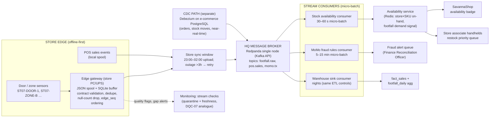

# Task B4 — Data Integration & Real-Time Architecture (C6)

**Client:** Savanna Retail Group (SRG) — Kampala, Uganda
**Deliverable:** Part B4(v) — real-time integration design around the in-store footfall sensor stream, with a justified batch-vs-stream verdict **per use case** (not "real-time for everything")
**Sample artefact:** `module7_realtime/footfall_stream_sample.json` — *see the provenance note in §1; the instructor-provided footfall file was not available in this build environment, so a representative sample matching this design was generated and validated instead*
**Board context:** the Board has asked for "real-time everything" — §7 answers that request with numbers

---

## Task B4(v) — Real-Time Integration Architecture (C6)

### 1. Input stream: footfall sensor sample

| Item | Detail |
|---|---|
| File | `module7_realtime/footfall_stream_sample.json` (JSON object with `_comment` provenance note + `events[]`) |
| Provenance | **Honest disclosure:** the instructor-provided `footfall_stream_sample.json` was not present in this environment; the committed file is a clearly-labelled **representative sample generated to this design** (≈60 events), not a copy of the original |
| Fields | `event_id`, `sensor_id` (e.g. `ST07-DOOR-1`, `ST07-ZONE-B`), `store_id` (physical stores only: ST07, ST17 — `ECOM01-NA` carries no door sensors), `site` (city), `ts` (ISO-8601 `+03:00`), `zone` (entrance / aisle_snacks / aisle_beverages / till / exit), `direction` (in/out), `count` (1–40), `dwell_seconds`, `edge_seq` (monotonic — proves offline spool ordering), `quality` (`ok` for most; a few `suspect`/`duplicate` records and one null-`count` record for robustness discussion) |
| Design lessons encoded | `edge_seq` gaps = offline store buffering; `quality` flags drive the dedupe/drop rules in §3; null `count` demonstrates contract validation at the gateway, not downstream |

### 2. Streaming component architecture

**Component choices and why (budget + skills tested):**

| Component | Choice | Justification | Rejected |
|---|---|---|---|
| Edge gateway | Store PC/UPS box writing **JSON spool + SQLite**, validating the event contract locally | Store outages are hours-daily: the spool *is* the system of record until upload; SQLite needs no ops staff; `edge_seq` makes replay idempotent | Cloud IoT ingress per store (needs links that don't exist; recurring cost from the 480M envelope) |
| Transport to HQ | HTTPS/SFTP batch in the existing 23:00–02:00 window (near-real-time only where the link is proven stable) | Reuses the proven spool pattern from the POS ETL — one operational habit, not two | Per-store persistent MQTT sessions (reconnection storms, another daemon to babysit at 23 sites) |
| **HQ broker** | **Redpanda, single node, Kafka API** (indicative: commodity HQ box, no licence) | Kafka-compatible semantics (partitions, replay, consumer groups) with **no ZooKeeper, no JVM tuning** — the ops profile fits 4 non-DE staff; replay is exactly what the offline-gap story requires | Full Kafka + ZooKeeper (ops burden exceeds team capacity); cloud Pub/Sub or Confluent (licence + egress inside UGX 480M); MQTT as the *central* broker (weak replay/consumer-group story for CDC integration — acceptable as an edge protocol, not as the HQ spine) |
| CDC path | **Debezium on e-commerce PostgreSQL**, publishing to the same broker | HQ-side, stable link; stock moves and orders feed the availability consumer without polling | Polling e-comm DB from stream jobs (latency + load on the storefront) |
| Availability sink | **Redis** | Sub-second key/value lookup (`store×SKU`) for storefront badge + handhelds; trivial client libraries | Serving queries straight off the warehouse (seconds-to-minutes, wrong tool for a lookup) |
| Fraud sink | Alert queue table + daily digest | Matches the 5–15 min verdict (§5) and the Finance officer's workflow | Real-time card-style authorization UI nobody staffs 24/7 |

### 3. Stream processing logic (contract-aware)

1. **Gateway contract validation:** drop/re-flag malformed events *at the edge* (null `count`, `quality ∈ {suspect, duplicate}`, non-monotonic `edge_seq`) — the stream never carries what the warehouse ETL would quarantine anyway.
2. **Duplicate suppression:** key on `(sensor_id, edge_seq)`; gateway stamps upload batches so replayed spools after an outage don't double-count footfall.
3. **Gap detection:** `edge_seq` discontinuity → freshness alert (stream analogue of DQC-07); outages become *visible latency*, not silent zeros.
4. **Aggregation:** zone dwell + door in/out → per-store per-15-min footfall and per-zone browse minutes; SKU-level signals only where a zone→category mapping exists (realistic: **zones map to categories, not to individual SKUs**).

### 4. Use case 1 — LIVE STOCK VISIBILITY

| Element | Design |
|---|---|
| Question answered | "Can SavannaShop promise this item, and which store should get restocked first?" |
| Signal A — footfall | Door/zone counts → **store-level demand pressure**: browse minutes in `aisle_snacks` vs completed till visits → footprint→browse conversion estimates (category-level proxy, not SKU-level — sensors cannot see SKUs) |
| Signal B — actual stock | **SKU-level availability comes from POS/CDC**: sales decrements (Debezium on e-comm stock moves + POS sales stream) + inbound deliveries from Odoo |
| Processing | Availability consumer, **30–60 second micro-batch**: `on_hand(t) = last_odoo_qty − Σ sales + Σ receipts`, clamped ≥ 0, with a shrink allowance (SRG's unexplained 8.4% book-vs-physical variance gets *surfaced here* as drift, not hidden) |
| Output | Redis `store:SKU → qty/status` → (1) e-commerce availability badge with confidence flag; (2) handheld "restock priority" queue ranked by on-hand **and** footfall pressure |
| **Batch vs stream verdict** | **NEAR-real-time micro-batch (30–60 s) — not sub-second streaming.** Justification: a stock-out at ST07 makes SavannaShop promise an item that doesn't exist *and* loses the sale in-aisle — cost is per-minute, not per-millisecond. Sub-second adds cost (broker ops, always-on consumers) with zero incremental business value; a 60-second stale qty is within the shrink/noise envelope anyway |

### 5. Use case 2 — MoMo FRAUD PATTERN DETECTION

| Element | Design |
|---|---|
| Question answered | "Is this mobile-money transaction one of the patterns SRG already loses money to?" |
| Input | `momo.tx` topic: `payment_ref`, amount, store, timestamp, cashier, basket size; plus refund events; reconciles with the `PENDING_RECON`/`MISSING` states from the ETL |
| Rules (velocity & pattern) | **R1** same `payment_ref` reused across >1 store within 24 h; **R2** refund-then-refund loops (refund > N per cashier/day); **R3** off-hours basket outliers (value > μ+3σ for that store-hour, zoned against the 01:02-timestamp anomaly class in the sample data); **R4** walk-in (`customer_sk = 0`) + high-value basket combinations; **R5** MoMo ref never settles (`MISSING` beyond 48 h — DQC-08 escalation) |
| Processing | Rules consumer in a **5–15 minute micro-batch** over a 24 h sliding window; state = per-ref/cashier counters in Redis/SQLite |
| Output | Alert queue → Finance Reconciliation Officer (+ daily digest to CFO); alert carries replayable event IDs for evidence |
| **Batch vs stream verdict** | **5–15 minute micro-batch — not real-time authorization.** Justification: true real-time authorization means sitting *inside* the payment gateway callback — a path SRG does not control (MTN MTN/Airtel rails, merchant API tiers); building/buying it fails cost-benefit now. Fraud *settlement* risk is T+1, so a 15-minute window catches the same losses a 15-second window does, at a fraction of the ops cost. **Escalation trigger:** only if measured fraud losses exceed an agreed annual threshold (fraud loss > the annualized cost of gateway integration) does SRG revisit real-time auth |

### 6. Other SRG use cases — classified honestly

| Use case | Right cadence | Why not faster |
|---|---|---|
| Footfall for **staffing/shift decisions** | **Hourly batch** | Rosters change by the shift; a manager reading 15-minute footfall changes nothing intra-hour |
| **Churn scoring** (180k loyalty members) | **Nightly** | Next-best-offer emails/SMS go out daily; sub-hour churn scores would still be acted on tomorrow |
| **Board KPIs / monthly reporting** | **Daily (monthly close)** | The Board consumes monthly; today's close takes 11 days — a *daily* close is the actual win |
| **MoMo reconciliation** | Daily provider file + 15-min fraud window | Settlement is T+1 regardless |
| **Warehouse back-fills / history loads** | Batch nights | No consumer waits on them |
| **Price updates** | Hourly push to POS | Tills cache prices; minutes add nothing |

### 7. When NOT to go real-time (cost reasons)

| "Real-time" proposal | Verdict | Cost reason |
|---|---|---|
| Real-time everything across 23 stores | **Reject** | Several stores are offline hours daily — true real-time is a **lie at the edge**: the stream would silently report "no events" as "no activity". Every store would need resilient links (WAN capex + recurring) that break the UGX 480M envelope |
| Real-time ERP (Odoo) replication | **Reject** | Master/stock data changes at human speed; replicating it continuously buys nothing and adds another always-on integration to maintain with 4 staff |
| Sub-second analytics for monthly reporting | **Reject** | Consumer of the data reads it monthly; the entire broker/consumer/monitoring burden would be paid for an audience of a slide deck |
| 24/7 streaming ops coverage | **Reject (for now)** | Streaming infrastructure that nobody watches at 03:00 is RC-6 (alerts to an unmonitored mailbox) reborn at a higher price; broker + consumers + gap monitoring is a real ops load for a team with zero data-engineering experience |
| Egress/latency economics | **Caution** | Continuous sensor egress from 23 sites = recurring cost inside the same envelope; spooling moves bulk transfer to one nightly window |
| What *is* approved | **Pilot** | **Footfall pilot, 3 stores, indicative UGX 45–50M** (sensors + edge gateways + pilot integration), treated as a **roadmap pilot line item** — sized to prove (or disprove) the footprint→browse signal before any chain-wide rollout |

### 8. Budget & sequencing note

Footfall pilot (3 stores) ≈ **UGX 45–50M indicative**, drawn against the programme roadmap budget, deliberately structured so a failed pilot caps the loss at that line. Broker, CDC and the two consumers run on existing HQ infrastructure (Redpanda single node, Redis) — no per-event cloud fees. Phase gate: pilot metrics (event completeness, gap rate, conversion-signal usefulness) decide whether store 4–23 get sensors, **before** any "real-time everything" conversation resumes.

### Think-deeper answer

**Where real-time genuinely creates value at SRG:** (1) **Stock availability** — every minute a shelf is empty *and* SavannaShop still promises the item, SRG loses a sale in one channel while holding stock in another; the 30–60 s micro-batch closes that gap at trivial cost, and it is the one place where latency converts directly to revenue. (2) **The fraud window** — MoMo fraud patterns (ref reuse across stores, refund loops, off-hours outliers) are only detectable *within* the window before the money is gone; 5–15 minutes captures the same economic loss as sub-second because settlement is T+1, so the value is in *bounded* freshness, not maximum freshness. In both cases the paying customer of latency is a person making a decision — a shopper checking availability, an officer approving a refund.

**Where real-time burns the entire budget for no return:** (a) **Real-time ERP replication** — Odoo data changes on human timescales; continuous replication is a permanently-on integration with zero decision attached, and it is the kind of always-on component that fails first in a country where stores drop links for hours. (b) **"Real-time everything" across offline stores** — the edge makes it physically impossible: an offline store cannot stream, so the "real-time" dashboard silently becomes a *wrong-time* dashboard, which is worse than an honestly-labeled batch one (it is RC-4's stale-fallback anti-pattern at Board scale). (c) **Sub-second analytics for monthly reporting** — the audience reads monthly; here the full cost stack (broker ops, 24/7 monitoring, egress, training for 4 non-DE staff) is incurred to serve a consumer whose decision cadence is 30 days. The precision test for the Board: *name the person, their decision, and the cost of being 15 minutes late.* If the answer is "the monthly pack," the correct cadence is daily-close, not streaming — and the UGX 45–50M pilot line, not a chain-wide real-time programme, is the honest next step.
