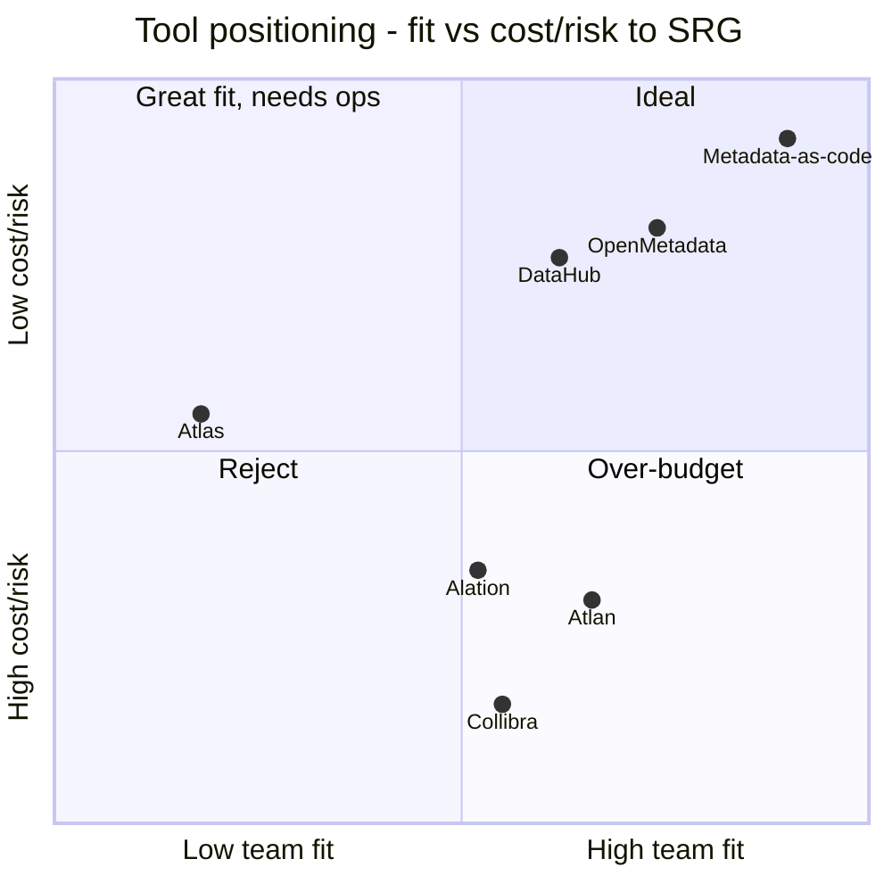

# Task C1 Deliverable — Metadata Catalog & Tooling Recommendation

## Task C1 — Metadata Management (C7)

**Client:** Savanna Retail Group (SRG) · **Prepared by:** Lead Enterprise Data Management Consultant
**Status:** Draft for Data Governance Council · **Version:** 1.0
**Decision requested:** approve the staged lightweight metadata approach (Phase 1 metadata-as-code → Phase 2 self-hosted catalog pilot) and reject Apache Atlas and Collibra.
**Budget envelope:** UGX 480,000,000/year (~USD 130,000; 1 USD ≈ UGX 3,700) covering licences, cloud **and** hires; IT team of 4 (2 SQL-capable, **zero data-engineering**); quick wins required by month 6; expansion to Kenya/Rwanda + European distributor partnership requiring GDPR-equivalent practice.
**Cross-references:** `docs/C1_lineage_kpi.md` (lineage to be catalogued), `docs/C1_impact_analysis.md` (catalog as change-control surface), Task A2 charter (steward/Council roles, POL-001 classification tags), `module5_warehouse/data_dictionary.md` (seed content).

---

### 1. Evaluation criteria (weights sum to 100)

| # | Criterion | Weight | Why it matters at SRG |
|---|---|---|---|
| C1 | **Cost within budget** | **25** | Every shilling spent on tooling competes with stores, cloud, and hires inside UGX 480M/yr |
| C2 | **Operable by a 4-person team (0 data engineers)** | **20** | A tool nobody can run becomes shelfware; Java/Hadoop ops skills do not exist in-house |
| C3 | **Integrations with PostgreSQL / MySQL / Python ETL** | **20** | SRG's real stack: 23× MySQL POS, PostgreSQL warehouse, `srg_etl_pipeline.py` (SQLAlchemy) |
| C4 | **Business glossary + lineage UX** | **15** | Stewards and the Council must *use* it; 23% duplicate-customer history proves glossary gaps hurt |
| C5 | **Community / support** | **10** | No vendor SLA at Phase 1 price points; community is the support model |
| C6 | **Cloud-readiness / Kenya–Rwanda scalability** | **10** | Multi-country rollout within 18 months; catalog must scale with the estate, not precede it |
| | **Total** | **100** | |

Scoring: 1 = does not meet · 5 = fully meets. **Weighted total = Σ(weight × score) ÷ 5, out of 100.**

---

### 2. Weighted comparison

| Option | C1 Cost (25) | C2 Team fit (20) | C3 Integrations (20) | C4 Glossary/lineage UX (15) | C5 Community (10) | C6 Cloud/scale (10) | **Weighted total /100** |
|---|---|---|---|---|---|---|---|
| **OpenMetadata (self-hosted, Phase 2 target)** | 5 | 4 | 5 | 4 | 4 | 4 | **89.0** |
| **DataHub (self-hosted, runner-up)** | 5 | 3 | 5 | 3 | 4 | 4 | **82.0** |
| **Metadata-as-code in this repo (Phase 1)** | 5 | 5 | 3 | 2 | 4 | 4 | **79.0** |
| **Atlan (commercial SaaS — considered)** | 2 | 4 | 5 | 5 | 3 | 5 | **77.0** |
| **Collibra (commercial — considered)** | 1 | 3 | 4 | 5 | 4 | 5 | **66.0** |
| **Alation (commercial — considered)** | 2 | 3 | 4 | 4 | 3 | 4 | **64.0** |
| **Apache Atlas (OSS — considered)** | 3 | 1 | 2 | 2 | 3 | 2 | **43.0** |

*Scoring notes: Collibra scores 1 on cost because indicative enterprise licensing of **USD 30k–60k+/yr ≈ UGX 110M–220M/yr** is 23%–46% of the entire UGX 480M envelope; its governance/workflow UX is genuinely the best in class (5) — which is exactly the capability SRG cannot yet exploit without a mature steward model. Atlan/Alation pricing is not published; scored at commercial-SaaS parity with Collibra-class budgets (assumed mid-to-high five figures USD) — a figure SRG cannot verify, hence 2. Apache Atlas scores 1 on team fit (Hadoop/Java operational burden) and 2 on integrations (native strength is HDFS/Kafka/Hive, not PostgreSQL/MySQL/Python). DataHub scores 3 on team fit (more moving parts: GMS + search/indexing + event bus) and 3 on glossary UX versus OpenMetadata's faster-improving UI.*

---

### 3. Alternatives considered and rejected (with reasons)

| Option | Considered for | Decision | Reason |
|---|---|---|---|
| **Apache Atlas** | Free, strong lineage, mature business-metadata model | **Reject — explicit** | Requires the HDFS/Kafka/Hive ecosystem SRG does not have and will not build; Java operations burden for a 4-person team with **zero data-engineering** staff; no first-class PostgreSQL/MySQL/Python-ETL story; lineage would need custom hooks into `srg_etl_pipeline.py`. Stack mismatch, not price, is decisive |
| **Collibra** | Strongest governance workflows, stewardship UI, lineage UX | **Reject — explicit** | Indicative enterprise licensing **USD 30k–60k+/yr ≈ UGX 110M–220M/yr = up to ~45% of the entire UGX 480M budget**. That spend would land before SRG has an operating steward model, a catalogue of pipelines, or a completed PDPO registration — buying maturity tooling for a maturity level the client cannot yet exploit |
| **Atlan / Alation** | Modern SaaS catalog UX | **Considered, not shortlisted** | Commercial SaaS pricing at Collibra-class budgets (unpublished); UX advantage does not offset budget weight C1 or the need to first prove glossary adoption |
| **DataHub** | OSS, strong lineage ingestion, PostgreSQL/MySQL connectors | **Reserve option (Phase 2 shortlist)** | Excellent technical fit; heavier runtime and glossary UX slightly behind OpenMetadata for SRG's business-user stewards |
| **Purview / cloud-native catalog** | Bundled with cloud | **Deferred** | Locks the catalog to one cloud before SRG's Kenya/Rwanda cloud decision; revisit at Phase 2 exit |
| **No catalog at all (status quo)** | Zero cost | **Reject** | Status quo already costs money: 23% duplicate customers, 11-day monthly reporting, five product identifiers, no answer to segment growth/churn |

---

### 4. Recommendation — staged lightweight approach

#### Phase 1 (months 1–9): "metadata-as-code" in this GitHub repo — ~zero licence cost

| Component | Location | Content |
|---|---|---|
| Data dictionary | `module5_warehouse/data_dictionary.md` | 25 attributes with classification (Public/Confidential/Restricted), source systems, tagging taxonomy (`domain`/`sensitivity`/`quality`) |
| ER / star-schema models | `module5_warehouse/star_schema_ddl.sql` | fact_sales + 5 dims, SCD2 customer/product — the model *is* the technical metadata |
| Business glossary | `README.md` glossary section + `docs/` | KPI definitions (`docs/C1_lineage_kpi.md` §2: walk-in exclusion, golden record, active customer), controlled vocabularies (42 districts, UOM, categories) |
| Lineage | `docs/C1_lineage_kpi.md` hop table + `module3_etl/srg_etl_pipeline.py` annotations | 9 hops with VR/DQC rule IDs and failure handling |
| DQ metadata | `module2_data_quality/output/validation_rules.md`, `dq_monitoring_spec.md` | VR-001…VR-012, DQC-01…DQC-10 with owners and thresholds |
| Change control | Git pull requests | Impact analysis (`docs/C1_impact_analysis.md`) attached to every schema change |

**Why Phase 1 first:** SRG's metadata does not need a *platform* yet; it needs *discipline* — single-sourced definitions, PR-based change control, and one owner per glossary entry. A catalog ingested today from inconsistent sources would automate the inconsistency. Cost: **UGX ~0 licence**; ~0.2 FTE EDM Consultant time; fits the "quick wins by month 6" constraint (dictionary + glossary + lineage live in month 1–2).

#### Phase 2 (months 10–18): pilot OpenMetadata **or** DataHub self-hosted

- **Trigger (entry gate):** ≥ 2 pipelines stable — (1) `srg_etl_pipeline.py` green for 60 consecutive days with quarantine < 0.5% (DQC-07), (2) a second governed feed (DQ monitoring or the address-migration ETL from `docs/C1_impact_analysis.md`) running with documented owners; PDPO registration filed (CHK-01) so the catalog's register/RoPA exports have a compliance home.
- **Scope:** ingest PostgreSQL schema + MySQL POS metadata, Python-ETL column lineage, glossary seeded from Phase 1, sensitivity tags mapped 1:1 to POL-001 classification tags.
- **Indicative cost:** **UGX 15–25M/yr all-in** (cloud instance/VM, storage, backup, minor setup effort) = **3.1%–5.2% of the UGX 480M envelope**; no new FTE — one of the 2 SQL-capable staff becomes catalog owner with vendor/community support.
- **Exit gate (month 18):** ≥ 80% of warehouse tables with automated column lineage; glossary adoption by all domain stewards; DQ results (DQC-01…10) surfacing in the catalog; Council uses the catalog as the system of record for change approvals.

#### Budget justification against the UGX 480M envelope

| Line | UGX/yr | % of 480M | Verdict |
|---|---|---|---|
| Collibra (indicative) | 110M–220M | **23%–45%** | **Rejected** — would crowd out endpoint encryption, backup, and the DPO hire (see `docs/C2_encryption_masking_spec.md` §b) |
| Phase 1 metadata-as-code | ~0 | ~0% | **Approved** |
| Phase 2 self-hosted catalog | 15–25M | 3%–5% | **Approved for pilot**, funded from the platform/cloud line |
| Apache Atlas | Licence 0, but opex of senior Java/Hadoop time SRG does not have | n/a | **Rejected** — unaffordable in *people*, not licence |

---

### 5. Metadata governance process

| Aspect | Rule |
|---|---|
| **Who updates** | **Domain stewards own their glossary entries and dictionary rows** (customer-domain: Data Steward/Marketing Officer; product: Merchandising Officer; finance/payment: Finance Reconciliation Officer; KPI: CRM Officer as KPI owner). EDM Consultant curates technical lineage and reviews. No anonymous edits |
| **How** | **PR-based change in this repo** — every dictionary/glossary/lineage edit is a pull request naming the change, the affected artifacts (per `docs/C1_impact_analysis.md` dependency table), and the DQ rule IDs touched; EDM Consultant approves; merged PR = metadata change of record |
| **Review cycles** | **Quarterly dictionary review** (25 attributes + glossary) **plus event-driven review on any schema change** (CHG-ADDR-001 pattern: metadata updated in the *same* PR as the DDL); DQ rules reviewed quarterly or when DQC thresholds fire 3× in a month |
| **Escalation** | Disputed definitions → EDM Consultant ruling within 5 working days → unresolved → **Data Governance Council** (per Task A2 charter); P1 metadata defects (e.g., wrong KPI definition published) escalate to Council at next sitting or ad hoc if board-facing |
| **Integration with Task A2 charter** | Charter supplies **roles** (steward, Council, EDM Consultant) and **POL-001 classification tags**; catalog sensitivity tags = POL-001 tags exactly (Public / Confidential / Restricted), so one taxonomy governs classification, masking, and catalog search; Council approves glossary of board-level KPIs (KPI-CRM-001 included) |
| **Automation** | ETL emits **column-level lineage events** (source → target, transform rule ID, batch ID) and **DQ results** (VR outcomes, DQC-01…DQC-10 pass/fail) into the catalog nightly; failures land as catalog-linked tickets with the remediation command from `dq_monitoring_spec.md`; RoPA export (GDPR Art.30) generated from catalog attributes + POL-001 tags |
| **Retention of metadata** | Metadata is versioned in git history indefinitely (accountability, DPPA s.3 / GDPR Art.5(2); Cap. 97 consolidated numbering — verify against official gazette before external use); superseded entries are marked `deprecated`, never silently deleted |

---

### Think-deeper answer

**Prompt: "Free" Apache Atlas and enterprise Collibra both exist — why is the answer neither, and why is the middle path not just budget-driven cowardice?**

Because **total cost at SRG is denominated in scarce skills, not just shillings.** Atlas is licence-free but demands exactly the capability SRG lacks: a data-engineering function (zero staff) to run Hadoop/Java infrastructure and hand-build connectors to 23 MySQL POS boxes, PostgreSQL, and a SQLAlchemy ETL — its 43/100 is a *people* cost wearing a licence costume. Collibra solves that operational gap by being a managed product, but at UGX 110M–220M/yr it would consume up to ~45% of the UGX 480M envelope — money that `docs/C2_encryption_masking_spec.md` shows is already needed for the direct fix to the realised Jinja breach (endpoint encryption, encrypted backup, MFA, penetration test, PDPO audit readiness). Buying the best catalog while failing DPPA s.20/s.23 obligations would be governance theatre: beautiful lineage over an unencrypted laptop. The staged path is *not* cowardice because it is **gated, not open-ended**: Phase 1 earns the discipline (PR-based change control, one owner per term, definitions like MAC that survive audit), and Phase 2's entry gate (2 stable pipelines + PDPO filing) makes the tool investment conditional on evidence of adoption. 89/100 for UGX 15–25M/yr — 3–5% of the envelope — versus 66/100 for up to 45% is not settling; it is sequencing spend behind demonstrated maturity, which is the only ordering that survives a PDPO audit and a Kenya/Rwanda scale-up simultaneously.
