# Task C1 Deliverable — KPI Lineage & Metadata for "Monthly Active Customers (MAC)"

## Task C1 — Metadata Management (C7)

**Client:** Savanna Retail Group (SRG) · **Prepared by:** Lead Enterprise Data Management Consultant
**Status:** Draft for Data Governance Council · **Version:** 1.0
**Scope:** End-to-end, board-level KPI lineage for *Monthly Active Customers (MAC)* — definition, hop-by-hop lineage, metadata payload, and the metadata storage model.
**Regulatory anchor:** Uganda Data Protection and Privacy Act 2019 (Cap. 97), s.3 principles, s.20 security measures, s.28 rectification/erasure (Cap. 97 consolidated numbering — verify against official gazette before external use); GDPR Art.5 (integrity & accountability), Art.30 (records of processing), Art.32 (security) where EU-resident members are in scope.
**Related deliverables:** `docs/C1_impact_analysis.md`, `docs/C1_catalog_tools.md`, `module5_warehouse/star_schema_ddl.sql`, `module5_warehouse/data_dictionary.md`, `module2_data_quality/output/validation_rules.md`, `module2_data_quality/output/dq_monitoring_spec.md`, `module3_etl/srg_etl_pipeline.py`, `module4_security/data_masking.sql`.

---

### 1. Why a board KPI needs documented lineage

SRG's board reads one customer number every month, yet the number is produced by a chain that crosses 23 offline-capable POS databases, SavannaShop (ECOM01), a 180,000-member loyalty app, an MDM golden-record step, and a star schema — with a documented history of silent failure (root causes RC-1…RC-6 in `module3_etl/etl_diagnosis.md`, incl. 4 days of invisible failure). Lineage for MAC is therefore not documentation overhead; it is the control that makes the KPI **defensible** (DPPA s.3 accountability; GDPR Art.5(2) accountability principle) and **impact-analysable** (see `docs/C1_impact_analysis.md`).

---

### 2. KPI definition — Monthly Active Customers (MAC)

#### 2.1 Definition table

| Attribute | Definition |
|---|---|
| **KPI ID** | `KPI-CRM-001` |
| **KPI name** | Monthly Active Customers (MAC) |
| **Business question** | How many distinct identified customers transacted with SRG in the calendar month? |
| **Numerator** | `COUNT(DISTINCT fact_sales.customer_sk)` where `customer_sk > 0` **AND** `is_return = FALSE` **AND** `event_ts >= month_start` **AND** `event_ts < month_end` (next month 00:00) |
| **Denominator** | **None** — MAC is an absolute count (not a rate). For derived rates the denominator is stated explicitly, e.g. MAC-30d retention = customers active in month *n*−1 who are also in month *n*, ÷ active in *n*−1 |
| **Filter — walk-ins** | `customer_sk = 0` ("Unknown / Walk-in Customer", created by CA-2 in `module3_etl/srg_etl_pipeline.py`) is **excluded by design** and this exclusion is recorded in the KPI metadata (see §2.3) |
| **Filter — returns** | `is_return = FALSE` (Jul–Dec 2024 baseline contains 500 return lines totalling −UGX 10,224,221) |
| **Time grain** | Calendar month, timezone `Africa/Kampala` (UTC+3); `event_ts` is the *business event* timestamp, never `load_ts` |
| **Owner (accountable)** | **CRM Officer** — definition, interpretation, board commentary |
| **Data steward (custodian)** | Data Steward (Marketing Officer) for customer-domain glossary entries; EDM Consultant for technical lineage |
| **Approver of definition changes** | Data Governance Council (per Task A2 charter); changes land as a PR against `data_dictionary.md` + this file |
| **Cadence** | Monthly board pack (closed T+2 business days after month-end for offline sync catch-up); dashboard tile refreshes daily with a rolling 30-day variant `MAC-30d` |
| **Source of record** | `module5_warehouse/star_schema_ddl.sql` → `fact_sales` ⋈ `dim_customer` (`is_current = TRUE`) |
| **Refresh mechanism** | Nightly `module3_etl/srg_etl_pipeline.py` (idempotent, advisory-locked, `etl_run_log` audited); aggregation job reads only from the warehouse |
| **Presentation surface** | Dashboard tile "Monthly Active Customers" via the analyst masking view (`module4_security/data_masking.sql`) — raw PII never reaches the tile |
| **Baseline (Jul–Dec 2024)** | 10,000 sales lines · UGX 252,382,814 net revenue · avg basket UGX 25,238 · repeat buyers 2,447 of 3,362 known customers (72.8%) driving 90.1% of known-customer transactions · new known customers 1,272 → 148/month (−88%) · 69.4% of November's 1,237 active customers did not buy in December |

#### 2.2 Edge cases (must be visible in the KPI metadata, not folklore)

| # | Edge case | Treatment | Business consequence if mishandled |
|---|---|---|---|
| E1 | **Walk-in / unattributed transactions** — 8.0% of lines, 8.7% of revenue | Excluded from MAC (`customer_sk = 0`); disclosed on every board slide as an attribution caveat | MAC understates true buyer count; a dashboard that silently mixed walk-ins in would *overstate* growth month-over-month |
| E2 | **Duplicate identities pre-MDM** — 22.84% confirmed duplicate persons before cleansing | MAC is computed **only** on golden-record-surviving `customer_sk` (dedupe: 1,142/1,150 merged, 365 homonym pairs rejected, 110 in stewardship review; 5,000 → 3,858 golden records) | Pre-MDM MAC inflated ~1.2×; loyalty points misposted (the 23% duplicate problem) |
| E3 | **Residual open duplicate flags — 2.85%** | Excluded from auto-merge; records remain flagged; if merged later, SCD2 retro-amends the golden map and MAC restates | Small restatement risk — Council must be told when restatement > 1% |
| E4 | **Offline capture crossing month boundary** (stores lose connectivity hours daily) | Month close held at **T+2**; `event_ts` governs, not sync time; replay is idempotent (ETL self-test 1/3 PASS: 10,000 rows before and after re-run) | Late rows double-counted or lost → MAC drift |
| E5 | **Returns and exchanges** | `is_return = FALSE` | A return must not deactivate a customer |
| E6 | **MoMo `PENDING_RECON` payment refs** — 849 of 7,385 MoMo lines (11.5%) | Payment reconciliation status does **not** gate customer activity: the transaction occurred; revenue reporting quarantine (VR-012) is a separate concern | Confusing revenue-integrity flags with activity would swing MAC by up to 11.5% of lines |
| E7 | **SCD2 mid-month identity change / golden remap** | Customer counted once via surrogate key; historical fact rows remapped through the golden map (`srg_etl_pipeline.py`) | One member counted twice after a profile merge |
| E8 | **Loyalty member with no purchase** | Not active — MAC measures *transactions*, not app logins; logins tracked separately as `KPI-CRM-002` (candidate) | Conflating the two would mask the −88% new-customer decline |
| E9 | **Timezone / late-night trades** | `event_ts` normalised to Africa/Kampala; 00:00–03:00 boundary handling documented | Border rows shift between months |

#### 2.3 Known limitations (disclosed, not hidden)

1. **Walk-in bias:** MAC excludes ~8.7% of revenue-generating interactions; the true "people who bought" number is higher than MAC. Fix path: loyalty phone-capture at POS (target ≥ 95% attribution, monitored by DQC-04).
2. **Segment/churn blindness today:** SRG "cannot answer segment growth/churn" — MAC is a top-level count; segment-level MAC requires `dim_customer` attributes (district, gender, tier) which depend on the address change in `docs/C1_impact_analysis.md`.
3. **Identity debt:** 110 stewardship-review rows and 2.85% open flags mean a small MAC restatement window until the review queue clears.

---

### 3. Lineage diagram — raw sources to dashboard tile

```mermaid
flowchart LR
  subgraph H1["HOP 1 - Raw sources (system of record)"]
    POS["23x POS stores<br/>Kampala Jinja Mbarara Gulu<br/>customer_id phone email signup_ts"]
    ECOM["SavannaShop ECOM01<br/>account + checkout"]
    LOY["Loyalty app<br/>180,000 members"]
    CRM["CRM / loyalty import<br/>templates + spreadsheets"]
  end

  RAW["HOP 2 - Raw landing<br/>module1 files / real feeds<br/>schema contract + file manifest<br/>no destructive transforms"]

  VAL["HOP 3 - Validated landing<br/>type coercion NULLIF TRIM N-A to NULL<br/>bad rows to etl_quarantine<br/>fixes root cause RC-1"]

  STD["HOP 4 - Standardized<br/>VR-001 phone to E.164<br/>VR-002 district canonical list<br/>VR-005 dates ISO-8601"]

  GOLD["HOP 5 - Matched / golden record<br/>deterministic phone or email match<br/>weighted score auto-merge at 90 plus<br/>365 homonyms rejected 110 to review"]

  DIM["HOP 6 - dim_customer SCD2<br/>row_hash change detection<br/>valid_from valid_to is_current<br/>survivorship applied"]

  FACT["HOP 7 - fact_sales customer_sk<br/>COALESCE unknown member to 0<br/>golden_map remap of legacy ids<br/>unknown-member self-test 3/3 PASS"]

  AGG["HOP 8 - Monthly aggregation<br/>COUNT DISTINCT customer_sk<br/>where customer_sk greater than 0<br/>is_return false event_ts in month"]

  MASK["HOP 9 - Masking view for analysts<br/>module4 data_masking.sql<br/>phone +256-XXX-XX1234 name J*** D**<br/>email j***@domain"]

  TILE["HOP 10 - Dashboard tile<br/>Monthly Active Customers<br/>owner CRM Officer daily + monthly pack"]

  POS -->|"1 schema contract + manifest"| RAW
  ECOM -->|"1 schema contract + manifest"| RAW
  LOY -->|"1 schema contract + manifest"| RAW
  CRM -->|"1 schema contract + manifest"| RAW
  RAW -->|"2 coercion + quarantine"| VAL
  VAL -->|"3 standardization rules"| STD
  STD -->|"4 matching + survivorship"| GOLD
  GOLD -->|"5 SCD2 versioning"| DIM
  DIM -->|"6 surrogate key assignment"| FACT
  FACT -->|"7 month grain aggregation"| AGG
  AGG -->|"8 least-privilege masked surface"| MASK
  MASK -->|"9 tile render"| TILE
```

---

### 4. Hop-by-hop annotation table

| Hop | From → To | System / artifact | Transformation (rule IDs / survivorship) | Metadata captured | Failure handling |
|---|---|---|---|---|---|
| **1** | POS / ECOM01 / loyalty / CRM raw fields (`customer_id`, `phone`, `email`, `signup_ts`) → raw landing | 23× POS MySQL, SavannaShop, loyalty platform, CRM templates → `module1_synthetic_data/output/*` in build; real feeds in production | **No transformation.** Ingest under a **schema contract** (column names, types, nullability, file manifest, batch ID) | Source system ID, extract timestamp, row count, control totals, contract version, PII classification tag (POL-001) per column | Contract violation → reject whole file, alert IT Operations Lead (RC-1 lesson: never partial-load); no file → retain last-known-good and mark run `SOURCE_MISSING` in `etl_run_log` |
| **2** | Raw landing → validated staging | `module3_etl/srg_etl_pipeline.py` | Type coercion `NULLIF(TRIM(x),'N/A')`, empty string → NULL, per-row validation; **bad rows → `etl_quarantine` with error reason** | Validation outcome per row, error code, quarantine reason, run ID, idempotency key | Quarantine (never silent fallback — RC-4 removed); DQC-07 alerts if quarantine > 0.5% or >100 rows/run; replay from quarantine after source fix |
| **3** | Validated → standardized | `module2_data_quality/dq_assessment_cleansing.py` (standardize stage) | **VR-001** phone → single E.164 format (6 variants → 1); **VR-002** district → official Uganda list (127 → 42 labels); **VR-005** dates → ISO-8601 (3 formats → 1; 54.4% → 94.5% ISO); UOM and category controlled vocabularies | Rule ID fired, before/after value, rule version, standardization timestamp, steward alias approval | Rule failure → block/quarantine per rule severity table; district alias not in map → DQC-03 alert → Data Steward adds alias after approval |
| **4** | Standardized → matched / golden record | MDM stage in `dq_assessment_cleansing.py` (deterministic phone/email + weighted score) | Auto-merge requires a **positive identifier match** (equal phone or email) or score ≥ 90; **name similarity alone never auto-merges**; 1,142/1,150 dupes merged, **365 homonym pairs rejected** by email-conflict rule, **110 rows → stewardship review**; 5,000 → 3,858 golden records | Match rule ID, match score, cluster ID, survivorship decision per field (e.g. *district: latest POS-verified*), merge audit trail, reviewer identity for manual merges | Unresolved cluster → review queue; **VR-007** blocks loyalty point posting until resolved; DQC-01 escalates to Council if duplicate rate > 2% for 3 days |
| **5** | Golden record → `dim_customer` SCD2 | `module5_warehouse/star_schema_ddl.sql` | `row_hash` change detection; unchanged → no write; changed → close current row (`valid_to`, `is_current = FALSE`) and open new row (`valid_from`); survivorship applied upstream in the golden map | SCD2 version number, `valid_from`/`valid_to`, `row_hash`, load batch ID, source-system provenance per attribute | Dimension loads **before** facts (RC-5 fix, CA-5); shared-dimension writes take single-writer advisory lock (RC-3 fix); FK check failure aborts transaction (no orphans) |
| **6** | `dim_customer` → `fact_sales.customer_sk` | `srg_etl_pipeline.py` fact load | `COALESCE(customer_sk, 0)` unknown/walk-in → `customer_sk = 0`; legacy duplicate ids remapped through `golden_map` (MDM survivorship) | Unknown-member flag, golden-map version, remap count per run, orphan count (must be 0) | Missing `customer_sk = 0` member previously aborted offline rows (RC-2, CA-2); now rows load with revenue preserved while identity is resolved later |
| **7** | Fact rows → monthly aggregate | Aggregation job over `fact_sales` | `COUNT(DISTINCT customer_sk)` with `customer_sk > 0`, `is_return = FALSE`, `event_ts` within calendar month (Africa/Kampala); month close held at **T+2** for offline sync | Aggregation SQL version, KPI definition version, period start/end, run timestamp, row count in/out, late-arriving row count | Control-total mismatch → halt (fail-fast, CA-4); `etl_run_log` + 06:00 run-state check (CA-6); never publish a partial month |
| **8** | Aggregate → analyst surface | `module4_security/data_masking.sql` view + `rbac_postgresql.sql` roles | Analysts read the **masked** view only: phone → `+256-XXX-XX1234`, name → `J*** D**`, email → `j***@domain`; raw columns reachable only by `compliance_officer` / `cdm_admin` via column-level GRANT (default-deny) | Role used, view name, columns exposed, masking-function version, query audit (pg audit log) | Denied query → denied (15-test `rbac_test.sql` reference output 15/15 PASS; `data_masking_demo.py` 4/4 checks on live data); attempt to bypass the view → access review escalation |
| **9** | Analyst surface → dashboard tile | BI dashboard tile "Monthly Active Customers" | Render KPI-CRM-001; show walk-in exclusion footnote + last-refresh timestamp; rolling `MAC-30d` variant labelled separately | Tile ID, KPI ID/definition version, data-as-of timestamp, owner, last definition change (PR reference) | Stale-data guard: if `etl_run_log` shows failed run, tile shows "data as of <date>" banner (RC-6 lesson: no silent stale data) |

---

### 5. Which metadata types ride along

| Metadata type | Examples travelling with MAC | Recorded where (today) |
|---|---|---|
| **Technical** | Column names/types, schema contract, quarantine error codes, `row_hash`, SCD2 validity columns, surrogate keys, SQL/job version, run IDs, control totals, masking-function definitions | `star_schema_ddl.sql`, `srg_etl_pipeline.py` comments + `etl_run_log`, `validation_rules.md`, `dq_monitoring_spec.md` |
| **Business** | KPI definition & exclusions (walk-ins, returns), golden-record survivorship rules, controlled vocabularies (district list, UOM, category), glossary terms (customer, member, active, walk-in), segment definitions | This file (§2), `data_dictionary.md` (25 attributes: meaning + business name), README glossary |
| **Administrative** | Ownership (CRM Officer), steward (Marketing Officer), approval (Data Governance Council), classification tags (Public/Confidential/Restricted from `data_dictionary.md` = POL-001 sensitivity tags), retention (POL-003), lawful-basis/consent reference (DPPA s.7; GDPR Art.6/7), review cycle | `data_dictionary.md` classification column + tagging taxonomy (`domain`/`sensitivity`/`quality`); Task A2 charter for role names |
| **Operational** | DQC-01…DQC-10 results, alert thresholds, escalation roles, remediation commands | `module2_data_quality/output/dq_monitoring_spec.md` |
| **Lineage** | The 9 hops above, hop owners, transform rule IDs | Today: this document + ETL code annotations; future: catalog (below) |

### 6. Where lineage is stored: today vs future

| | Today (Phase 1 — metadata-as-code) | Future (Phase 2 — catalog pilot) |
|---|---|---|
| **Storage** | This GitHub repo: `docs/*.md`, `module5_warehouse/data_dictionary.md`, ER/star-schema DDL, ETL inline annotations, README glossary | Self-hosted **OpenMetadata** or **DataHub** (see `docs/C1_catalog_tools.md` for the weighted evaluation and budget line) |
| **Change control** | Pull request reviewed by the EDM Consultant; domain steward owns their glossary rows; quarterly dictionary review + event-driven review on schema change | Same PR flow, but the catalog ingests column-level lineage automatically from the Python ETL; PR bot attaches lineage diff to the change request |
| **Strengths** | ~zero licence cost inside the UGX 480,000,000/yr envelope; versioned with the code it describes; works for a 4-person IT team | Searchable glossary, automated column lineage, DQ-result surfaces, API for RoPA export (GDPR Art.30) |
| **Weakness** | No UI/search; lineage is read-as-text; manual hop maintenance | Hosting/setup indicatively UGX 15–25M/yr all-in; needs 1 stable owner |

**Rule:** the KPI definition in §2 is the *single source of truth*; any tool rendering MAC must link back to `KPI-CRM-001` in this file (and later, to the catalog entry seeded from it).

---

### Think-deeper answer

**Prompt (implicit): if MAC excludes 8.7% of revenue and 2.85% of identities are still flagged, is a "clean" KPI actually honest?**

Yes — provided the impurities are *declared metadata*, not buried footnotes. Three arguments: (1) **A disclosed exclusion beats an undocumented inclusion.** The pre-MDM count would have included ~23% duplicate identities, i.e. a KPI that rose while real customer growth fell (new known customers 1,272 → 148/month). That is the failure mode that destroys board trust; excluding walk-ins instead biases the number *downward by a known, measured amount* (8.0% of lines / 8.7% of revenue) and the gap itself is the CRM capture KPI. (2) **Lineage converts disagreement into engineering.** Once hops 1–9 carry rule IDs (VR-001/002/005, survivorship, COALESCE-to-0), a challenge to MAC becomes a challenge to a named rule with an owner — resolvable in a pull request rather than a meeting. (3) **The residual is bounded and monitored.** DQC-01 caps the duplicate rate at 1.0% (2.0% = P1 incident), DQC-03 caps district resolution at 99.5%, so the 2.85% open flags cannot silently grow. The honest position for the board: MAC is *defensible and directional*, exact to ±the disclosed walk-in band, and the roadmap to shrink that band is the loyalty-capture and stewardship-queue work already scheduled — not a cosmetic redefinition.
