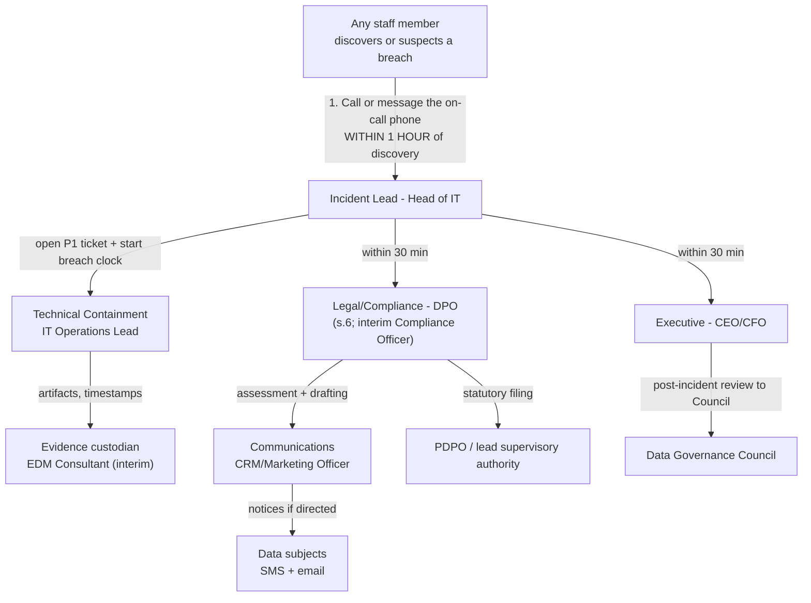
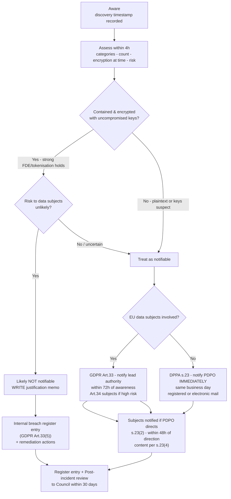

# Task C2 Deliverable — Data Breach Response Plan

## Task C2 — Security & Privacy (C8)

**Client:** Savanna Retail Group (SRG) · **Prepared by:** Lead Enterprise Data Management Consultant
**Status:** Draft for Data Governance Council — adoption requested (P1) · **Version:** 1.0
**Applies to:** any suspected or confirmed compromise of personal data across 23 stores, SavannaShop (ECOM01), the loyalty app (180,000 members), the warehouse, HR/supplier files, and partner flows (European distributor).
**Regulatory anchor:** DPPA 2019 (Cap. 97) **s.23 notification of data security breaches** — *"immediately notify the Authority"* (s.23(2) the Authority decides whether data subjects must be notified; s.23(3) notification by registered mail/electronic mail; s.23(4) content must let the data subject take protective measures); also s.20 security measures, s.6 data protection officer, s.3 principles (Cap. 97 consolidated numbering — verify against official gazette before external use). **GDPR** (where EU data subjects are affected, e.g. loyalty members in the EU rollout): **Art.33** notify the lead supervisory authority ≤ **72 hours** from awareness (with reasons for any delay), **Art.34** notify data subjects without undue delay when high risk, **Art.33(5)** document every breach internally even where no notification is made.
**Cross-references:** `docs/C2_threat_model_risk_register.md` (R1, R2, R11), `docs/C2_encryption_masking_spec.md` (encryption-at-time-of-breach assessment), `docs/C2_compliance_audit_checklist.md` (CHK-11/12/20), `docs/C2_dpia_loyalty_app.md` (M-09 tabletop).

---

### (a) Roles & 24/7 contact tree

| Role | Responsibility | Named holder | Deputy | Availability |
|---|---|---|---|---|
| **Incident Lead** | Runs the incident end-to-end, owns the timeline, declares severity, authorises containment | **Head of IT** | IT Operations Lead | 24/7 on-call phone |
| **Technical Containment** | Remote wipe, session revocation, credential/key rotation, isolation, evidence-preserving snapshots | **IT Operations Lead** | 2 SQL-capable IT staff (rota) | 24/7 on-call |
| **Legal / Compliance — notification owner** | Determines statutory notifications, files with the PDPO (Authority), drafts statutory wording, owns the breach register | **DPO** (per **DPPA s.6** — pending appointment; interim: EDM Consultant as Compliance Officer, `compliance_officer` role in `module4_security`) | EDM Consultant | Business hours + callout ≤ 30 min |
| **Communications** | Data-subject notices (SMS + email), call-centre/loyalty-app messaging, holding statements, media enquiries | **CRM / Marketing Officer** | Store Operations Manager | Business hours + callout ≤ 1h |
| **Executive decision** | Severity escalation, notification approval, budget release, partner/regulator posture, public statement sign-off | **CEO / CFO** | CEO | Callout ≤ 30 min |
| **Evidence custodian** | Chain of custody: logs, device images, ticket timestamps, hash-sealed artifacts, breach file assembly for audit | **EDM Consultant (interim)** | Head of IT | Business hours + callout ≤ 1h |

**Contact tree (24/7) — single entry point: on-call phone (published on every till)**

**Rule of the tree:** no node may "investigate first, report later." Discovery → 1h → Incident Lead is unconditional; only the Incident Lead may downgrade a suspected breach, and the downgrade decision itself is logged.

---

### (b) Phased procedure

| Phase | Actions | Owner | Evidence produced |
|---|---|---|---|
| **1. PREPARE** | Asset register (A1–A8 in the threat model); POL-001 classification on all datasets; **FDE on every export-capable device**; encrypted + tested backups; IR retainer (B7); pre-approved notification templates; **annual tabletop** incl. the Jinja scenario | Head of IT | Device-compliance report; backup restore tests; signed retainer; tabletop minutes |
| **2. DETECT & REPORT** | **Any staff member reports via the single channel within 1 hour of discovery** — no internal investigation before reporting (the 11-day Jinja delay is abolished by rule); automated detection: DQC-07 quarantine spikes, DQC-08 pending-payment surges, failed-login anomalies, `etl_run_log` failure alerts | Reporter + IT Operations Lead | Ticket opened ≤ 1h; detection timestamp recorded (starts "awareness") |
| **3. CONTAIN** | Remote wipe / disable stolen or lost device; revoke sessions and API keys; rotate credentials and keys (KMS); isolate affected systems (store box, DB, SaaS tenant); suspend the compromised export/automation; preserve forensic image **before** reimaging | Technical Containment | Containment log with timestamps; wipe/revoke confirmations; snapshot hashes |
| **4. ASSESS** | Record: (i) **data categories** (POL-001 tags), (ii) **approximate record count**, (iii) **encryption status at the time of breach** — a properly encrypted device with strong, uncompromised keys may be assessed as *"unlikely to result in a risk to data subjects"*, but **the justification is written down**, (iv) content/sensitivity (could it enable fraud, discrimination, reputational harm?), (v) **risk to data subjects** — likelihood and severity of harm | DPO + Evidence custodian | Completed assessment form; encrypted-justification memo where applicable; severity rating |
| **5. NOTIFY** | Follow §(c) timelines: PDPO "immediately"; GDPR ≤72h; data subjects per direction/high risk. Notices use the §(d) content checklist; every breach — notifiable or not — enters the **internal breach register** (Art.33(5)) | DPO (filing) / Communications (subjects) / Executive (approval) | Filed notification + delivery proof (registered/electronic mail); register entry |
| **6. REVIEW** | Root-cause analysis within 7 days; remediation plan with owners and dates (encryption, export bans, retraining, control gaps); **post-incident review to the Data Governance Council within 30 days**; register closed only when all actions verified | Incident Lead + EDM Consultant | Post-incident review pack; updated risk register; DQ/control changes merged as PRs |

---

### (c) Timeline under both regimes

#### DPPA 2019 (Cap. 97) — Uganda

| Clock | Obligation / internal target | Basis | Owner |
|---|---|---|---|
| **+0** | Awareness (discovery timestamp recorded) | Detection discipline | Reporter |
| **≤ 1 hour** | Internal escalation to Incident Lead + P1 ticket — **internal target**, no "investigate first" | Prevention of the 11-day delay | Any staff → Incident Lead |
| **≤ 2 hours** | Containment started (wipe/disable/revoke) | DPPA s.20 security measures | Technical Containment |
| **≤ 4 hours** | Assessment complete: categories, count, encryption-at-time, risk rating | s.23(4) content readiness | DPO |
| **Same business day** | **Notify the Authority (PDPO): "immediately notify the Authority"** of the unauthorised access/acquisition **and the remedial action taken** | **DPPA s.23** ("immediately") | DPO |
| Channel | **Registered mail and/or electronic mail** to the PDPO | s.23(3) | DPO |
| **≤ 48 hours after PDPO direction** | Notify affected data subjects if the **Authority so decides** (s.23(2) vests this decision in the PDPO, not SRG) | s.23(2)–(3) | Communications |
| Content | Notices must give enough information **for the data subject to take protective measures** (nature, categories, approximate numbers, DPO contact, likely consequences, measures taken/proposed) | s.23(4) | DPO + Communications |
| Ongoing | **Internal breach register entry regardless of notifiability**; retained for PDPO audit (expected within 12 months) | Accountability, s.3 | DPO |

#### GDPR — where EU data subjects are affected (e.g. loyalty/EU rollout)

| Clock | Obligation | Basis | Owner |
|---|---|---|---|
| **≤ 72 hours from awareness** | Notify the **lead supervisory authority**; if the deadline is missed, notification must **include reasons for the delay** | **Art.33(1),(3)** | DPO |
| **Without undue delay** | Notify data subjects when the risk is **high** (unless strong encryption rendered the data unintelligible — then communication may be unnecessary, **documented with justification**) | **Art.34(1),(3)** | DPO + Communications |
| **Content of Art.33 notification** | Nature of breach; categories & approximate numbers of records; DPO contact; likely consequences; measures taken/proposed | Art.33(3)(a)–(d) | DPO |
| **Always, even if not notifying** | Document the breach: facts, effects, remedial action — internal breach register | **Art.33(5)** | DPO |
| Internal target | First counsel engaged ≤ 24h; SCC/partner notice if the European distributor's data is involved (Art.44–49 flow) | Contractual | DPO |

#### Decision tree

---

### (d) Notification content checklist

Aligned to **DPPA s.23(4)** (enable the data subject to take protective measures) and **GDPR Art.33(3)** / **Art.34(1)**:

| # | Element | Required by | Drafting note |
|---|---|---|---|
| 1 | **Nature of the breach** — what happened, when, where (system/device/store) | s.23(4), Art.33(3)(a) | Plain language; no jargon, no minimising |
| 2 | **Categories of personal data affected** (names, phones, purchase history, addresses, payment references) | s.23(4), Art.33(3)(a) | Use POL-001 tags to enumerate |
| 3 | **Approximate number of records/data subjects** (e.g. 9,000 records; 180,000 members) | s.23(4), Art.33(3)(a) | Ranges acceptable if exact count pending |
| 4 | **DPO / contact point** with telephone and email for questions | Art.33(3)(b), Art.34(2) | Name the interim holder if DPO pending |
| 5 | **Likely consequences** of the breach (targeted fraud, SIM-swap risk, nuisance marketing) | Art.33(3)(c), s.23(4) | Be specific to the data: phone + purchase history → social-engineering risk |
| 6 | **Measures taken and proposed** — containment done + steps the individual should take (reset PIN, watch for smishing, freeze USSD alerts) | Art.33(3)(d), s.23(4) | Actionable instructions are the statutory point of s.23(4) |
| 7 | **Whether the Authority has been notified / direction status** | s.23(2) flow | Include when data subjects are being notified |
| 8 | **Reference number** of the incident + breach register ID | Accountability (s.3, Art.5(2)) | Enables PDPO audit tracing |
| 9 | **Delivery method proof** (registered mail receipt / electronic mail log) | s.23(3) | Evidence custodian files it |

---

### (e) WORKED EXAMPLE — the Jinja laptop incident, rewritten

**Incident of record:** unencrypted laptop containing an export of **9,000 customer records** (names, phone numbers, purchase history) stolen from the Jinja store; reported internally **11 days late**; **no breach notification made**.

| Dimension | **What actually happened** | **Compliant response (this plan)** |
|---|---|---|
| Discovery → escalation | Stolen device noticed, then days of internal discussion before escalation (**11 days**) | **Hour 0** discovery → **+1h** Incident Head of IT owns P1 ticket; "investigate before reporting" prohibited |
| Containment | No wipe/revoke record; device unencrypted → data readable immediately | **+2h** remote wipe/disable attempted, sessions revoked, credentials/keys rotated, store box isolated; forensic copy preserved |
| Assessment | No formal assessment of categories, count, or encryption status | **+4h** classify: 9,000 records, names + phones + purchase history, **UNENCRYPTED = high risk** to data subjects (fraud/social-engineering potential) |
| Authority notification | **None made** (DPPA s.23 breach) | **Same business day:** PDPO notified under **s.23** — unauthorised acquisition + remedial action — by registered/electronic mail (s.23(3)) |
| Data-subject notification | None | s.23(2): await **PDPO direction**, then subject notices within **48h**, content per s.23(4) (protective measures); SMS + email |
| GDPR clock | Not considered | **+72h** GDPR Art.33 clock started **if any EU loyalty members were in the export** (Art.33(1),(3)); Art.34 subjects if high risk |
| Register | No incident register entry | Breach register entry made at hour 4 regardless of notifiability (Art.33(5) discipline, DPPA s.3 accountability) |
| Remediation | None recorded | **+7 days:** FDE rollout (B1), export-approval ban, retraining, device-compliance reporting |
| Review | None | **+30 days:** post-incident review to Data Governance Council; risk register R1/R13 rescored |

**Provisions the as-was response violated**

| Provision | How it was violated |
|---|---|
| **DPPA s.23** — "immediately notify the Authority" | No notification was made at all, for a realised unauthorised acquisition of 9,000 records |
| **DPPA s.20** — security measures | Bulk personal-data export stored on an unencrypted device; no FDE, no export control |
| **DPPA s.3** — principles (integrity, accountability, confidentiality-by-design) | 11-day internal delay shows no accountability chain; no record of the decision *not* to notify |
| **GDPR Art.32 / Art.33** (if EU data subjects in the export) | No 72-hour notification; no documented assessment or justification |
| **Internal POL-001 (draft classification policy)** | Export of a Restricted dataset without approval, logging, or expiry |

**Lessons (feed the P1 remediation in `docs/C2_compliance_audit_checklist.md`)**
1. **Reporting latency is the real damage multiplier** — the laptop was unencrypted (control gap), but 11 days of silence is what converted an incident into a regulatory failure. Fix: 1-hour single-channel rule, no exceptions, measured and reported monthly.
2. **Encryption status must be *assessed and written down*** — had the device been FDE-protected with uncompromised keys, SRG could have documented "unlikely to result in risk" (Art.34(3)(a) logic) instead of having no assessment at all. Fix: FDE (B1) + the 4-hour assessment form.
3. **Notification is a statute with a clock, not a decision with a committee** — s.23 says *"immediately"*; GDPR says 72 hours from *awareness*. Fix: pre-approved templates, named DPO owner, executive sign-off within the same business day.
4. **The evidence trail is the defence** — without a breach register entry, SRG cannot prove what it did or when; the PDPO audit (expected within 12 months) will ask for exactly that. Fix: register live from day 1 of plan adoption.

---

### Think-deeper answer

**Prompt: the laptop was stolen — is the plan really about laptops?**

No. The laptop is only the *visible* failure; the plan exists because SRG's true weakness was **decision latency under ambiguity**: nobody knew who to call, what counted as a breach, or who could notify — so 11 days elapsed while the s.23 clock (and potentially the Art.33 72-hour clock) was already running. Every element above attacks that latency: a single entry point (any staff member → on-call phone → Incident Lead ≤ 1h), a named Incident Lead with authority to contain without waiting for the Council, a written assessment form that turns "is this serious?" into a 4-hour checklist (categories → count → encryption-at-time → risk), and pre-drafted notice content mapped line-by-line to s.23(4) and Art.33(3) so drafting never starts from a blank page. The plan also encodes the honest asymmetry of the two regimes: DPPA demands *immediacy to the Authority* with the **PDPO** — not SRG — deciding whether data subjects are told (s.23(2)), while GDPR imposes a hard **72-hour** deadline from awareness with **Art.33(5)** requiring documentation even when nothing is notified. Finally, the worked example is deliberately kept in the portfolio as a permanent training artifact: it shows that a compliant response to the *same* theft would have cost roughly one business day of coordinated effort — versus the reputational, regulatory, and trust debt SRG now carries with zero notification on record.
