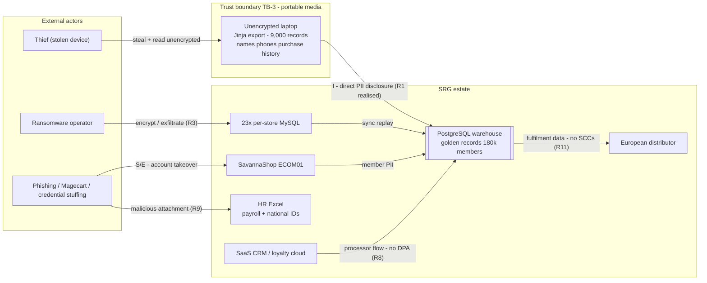

# Task C2 Deliverable — Threat Model & Enterprise Risk Register

## Task C2 — Security & Privacy (C8)

**Client:** Savanna Retail Group (SRG) · **Prepared by:** Lead Enterprise Data Management Consultant
**Status:** Draft for Data Governance Council · **Version:** 1.0
**Method:** Asset-centred threat model with STRIDE categorisation; risk register scored 5×5 (Likelihood × Impact), risk appetite proposed to Council.
**Regulatory anchor:** DPPA 2019 (Cap. 97) s.3 principles, s.9 prohibition on special personal data, s.10 protection of privacy, s.20 security measures, s.21 processor security measures, s.23 notification of data security breaches, s.29 data protection register (Cap. 97 consolidated numbering — verify against official gazette before external use); GDPR Art.28 processors, Art.30 records, Art.32 security, Art.33/34 breach notification, Art.44–49 transfers (for EU-resident members and the European distributor flow).
**Cross-references:** `docs/C2_encryption_masking_spec.md` (funded mitigations), `docs/C2_breach_response_plan.md` (R1/R11 response), `docs/C2_dpia_loyalty_app.md` (R4/R8 privacy measures), `docs/C2_compliance_audit_checklist.md` (control mapping), Task A2 charter (owners, POL-001 classification).

---

### 1. Asset inventory

| Asset ID | Asset | Sensitivity (POL-001) | Volume / scope | Business impact if lost, stolen or corrupted | Primary registers |
|---|---|---|---|---|---|
| A1 | **Customer PII** — names, phone numbers, emails, purchase history | Confidential → **Restricted** (bulk export) | 180,000 loyalty members + 5,000 sample records in the build set; POS/CRM records across 23 stores | Regulatory breach (DPPA s.20/s.23; GDPR Art.32/33), loss of member trust, direct marketing fraud | Phone (E.164) is SRG's identity key — mass leakage enables SIM-swap/social-engineering of members |
| A2 | **Payment identifiers** — MTN MoMo / Airtel Money `payment_ref`, transaction refs | Confidential | 73.2% of revenue is mobile money (MTN 48.2%, Airtel 25.1% — components rounded); 849 of 7,385 MoMo lines (11.5%) `PENDING` | Reconciliation fraud, revenue leakage, double-spend of refs | `VR-012`, `DQC-08`, `PENDING_RECON` path in `module3_etl/srg_etl_pipeline.py` |
| A3 | **Pricing & margin data** — `selling_price_ugx`, `cost_ugx`, promo approvals | Confidential | 1,200 products | Competitive leakage, margin erosion | `VR-011`, `DQC-10`; restricted by RBAC (`financial_reports` denied to cashiers) |
| A4 | **Supplier terms & contracts** | Confidential | Supplier master + manual files | Commercial disadvantage in negotiations | Partial inventory — **gap: no asset register entry yet for supplier file shares** |
| A5 | **Payroll + national IDs (HR Excel)** | **Restricted** | Small file, extreme sensitivity (special/personal identifiers) | Identity theft, employee harm, DPPA s.9 exposure if special data creeps in, GDPR-grade severity | Column-level REVOKE for payroll exists in `module4_security/rbac_postgresql.sql`; **the Excel itself is outside DB controls — GAP (R9)** |
| A6 | **Availability of POS / checkout** (offline-hours daily is a *designed* state) | Availability (CIA-A) | 23 stores + SavannaShop (ECOM01) | Direct revenue loss; duplicate offline captures degrade data quality | Advisory lock + idempotent loads (RC-3/CA-3 fixes); offline queue |
| A7 | **Warehouse & ETL integrity** (fact_sales control total UGX 252,382,814.16 / 10,000 lines) | Confidential | PostgreSQL + nightly ETL | Wrong board numbers → wrong decisions; 11-day reporting already delayed | `etl_quarantine`, `etl_run_log`, fail-fast (RC-4 fix), DQC-07 |
| A8 | **Identity store / golden records** (3,858 golden; 180k members) | Confidential | MDM layer | Wrong-person merges corrupt loyalty + privacy rights | Homonym rejection (365 pairs), stewardship queue (110), VR-007 |

---

### 2. Trust boundaries

| TB ID | Boundary | Crossing | Existing control | Gap |
|---|---|---|---|---|
| TB-1 | Store LAN/POS ↔ HQ warehouse | Offline sync replay + nightly ETL | Advisory lock window (CA-3), idempotent loads | 23 per-store MySQL boxes individually exposed; inconsistent hardening (**R3**) |
| TB-2 | Internet ↔ SavannaShop (ECOM01) | Customer sessions, checkout, payment redirect | TLS in transit (assumed), payment redirect to MoMo/Airtel | No independent penetration test yet; Magecart-class skimming untested (**R3/R13**) |
| TB-3 | **Portable media / laptop ↔ corporate data** | Bulk PII exports (the **Jinja vector**) | **None — realised breach** | No mandatory full-disk encryption, no export control, no remote wipe (**R1, R13**) |
| TB-4 | SaaS vendors ↔ SRG (CRM, loyalty cloud) | Member PII flows to processors | Contract in place? — **not evidenced** | No DPAs (GDPR Art.28 / DPPA s.21), no vendor assurance (**R8**) |
| TB-5 | European distributor ↔ SRG | Fulfilment data (name, address, phone) to EU/EEA partner | None evidenced | No SCCs / transfer impact assessment (GDPR Art.44–49) (**R11**) |
| TB-6 | Analyst/BI ↔ warehouse | Masked views, role-scoped reads | Default-deny GRANTs, column REVOKE, RLS, masking views; `rbac_test.sql` 15/15 PASS (reference run) | Deployment pending in production; shared-logins defeat accountability (**R4**) |
| TB-7 | Shared drives / email ↔ HR, Finance, Stores | Payroll, supplier, and ad-hoc CSV/Excel files | Email hygiene (informal) | No classification labels on files, no misdirection controls (**R9**) |

---

### 3. Threat scenarios (STRIDE-mapped)

> STRIDE tags: **S**poofing · **T**ampering · **R**epudiation · **I**nformation disclosure · **D**enial of service · **E**levation of privilege.

#### 3.1 INSIDER threats

| Scenario | STRIDE | Vector at SRG | Control today | GAP |
|---|---|---|---|---|
| Curious store staff browse neighbours'/celebrities' records ("shoulder browsing" the loyalty DB) | I, R | Cashier with a valid login queries customer table beyond their store | RLS store scoping + default-deny + masked views (module4) | Deployment pending; **shared till logins erase accountability** → audit logs cannot name the person (**R4**) |
| Departing employee exports contact list before exit | I, E | Bulk export of 180k phones/emails — same shape as the Jinja incident | No leaver checklist; no export logging | **GAP**: offboarding does not revoke/disable/export-audit (**R1, R4**) |
| Manager overrides pricing/promo approvals | T, R | VR-011 promo path | `promo_approved_by` attribution, DQC-10 weekly review | Approval workflow not enforced end-to-end (Medium) |

#### 3.2 EXTERNAL threats

| Scenario | STRIDE | Vector at SRG | Control today | GAP |
|---|---|---|---|---|
| Credential stuffing / brute force on SavannaShop accounts | S, E | 180k member credentials, password reuse | Rate limiting assumed; no evidence | **No MFA** for admin/staff; password manager absent (**R3/R4**) |
| Ransomware encrypting the **23 per-store MySQL boxes** | T, D, I | Flat store networks, exposed MySQL, offline hours mask detection | ETL quarantine & idempotency protect *data quality*, not *availability* | **No centralised patching/backup/EDR per store** (**R3**) |
| Magecart-style skimming on SavannaShop checkout | T, I, R | Injected script captures card/MoMo session data | Payment redirect to MTN/Airtel reduces card exposure | No script-integrity monitoring; untested (**R3**) |
| Phishing a supplier/HR file ("invoice.xlsx") | S, T, I | Opens door to supplier terms or payroll+national IDs | Informal email hygiene | **No training programme**; HR Excel is a single point of catastrophic disclosure (**R9**) |

#### 3.3 ACCIDENTAL threats

| Scenario | STRIDE | Vector at SRG | Control today | GAP |
|---|---|---|---|---|
| **The Jinja laptop: unencrypted bulk export of 9,000 customer records (names, phones, purchase history) stolen** | I | Analyst copied raw PII to a laptop for offline work; reported internally **11 days late**; **no breach notification made** | None at endpoint | **Realised breach** — DPPA s.20 (security measures), s.23 (immediate notification to the Authority) exposure; GDPR Art.32/33 if EU members in export (**R1, R2, R13**) |
| Misdirected CSV email to wrong customer/partner | I | Manual email attachments | Informal care | No DLP, no recipient-confirmation, no export templates (**R13**) |
| Manual Excel edits corrupt district/product data | T | 5 product identifiers; 127 district labels historically | Validation rules VR-001…VR-012 + monitoring DQC-01…DQC-10 (post-cleansing: dupes 22.84% → 0.00%) | Entry points still allow manual edits outside rules (**R7**) |

#### 3.4 ENVIRONMENTAL / SYSTEMIC threats

| Scenario | STRIDE | Vector at SRG | Control today | GAP |
|---|---|---|---|---|
| Hours-daily connectivity loss → duplicate offline captures / late sync | T, D | 23 stores; offline capture is a designed state | Idempotent loads, `customer_sk = 0`, `PENDING_RECON`, month-close T+2 | Duplicate risk persists at 2.85% open flags; replay windows can still collide (**R10, R7**) |
| Power loss → partial writes mid-transaction | T, D | Grid instability at store/HQ | Transactional DB semantics; quarantine for partial rows | Uninterruptible power + tested restore for the warehouse not evidenced (**R10**) |

#### 3.5 SUPPLY CHAIN threats

| Scenario | STRIDE | Vector at SRG | Control today | GAP |
|---|---|---|---|---|
| SaaS CRM vendor breached or shuts down (lock-in) | I, D | Member PII in third-party cloud | — | No DPA, no exit/portability plan (GDPR Art.28; DPPA s.21) (**R8**) |
| Loyalty cloud provider incident | I, D, S | 180k members hosted off-premises | — | No assurance report / breach SLA in contract (**R8**) |
| European distributor flow misused or over-collected | I, R, E | Fulfilment data shared with EU partner | — | No SCCs, no transfer impact assessment, no Art.30 record (**R11**) |

---

### 4. Risk register (5×5)

**Scoring:** Likelihood 1 (rare) – 5 (near certain) × Impact 1 (negligible) – 5 (severe: regulatory action, major revenue loss, or harm to individuals) = Score (1–25). Appetite: scores ≥ 15 = **not accepted** (mitigate now); 8–14 = reduce; < 8 = monitor.

| ID | Risk | Cause | L | I | Score | Current controls | Mitigation (artifact-linked) | Owner | Residual target |
|---|---|---|---|---|---|---|---|---|---|
| **R1** | **Stolen-device PII export (Jinja — realised)**: unencrypted laptop with 9,000 customer records (names, phones, purchase history) stolen; reported internally 11 days late; **no breach notification** | No endpoint encryption, no export control, no 1h reporting rule | 5 | 5 | **25** | None at endpoint; classification policy only in draft | **`docs/C2_encryption_masking_spec.md`** (mandatory FDE + export controls, UGX 15M); `docs/C2_breach_response_plan.md` (1h reporting, s.23 notification); retrospective PDPO engagement under CHK-01/CHK-11 | Head of IT | **≤ 8** (L2×I4) by month 6 |
| **R2** | **PDPO registration / notification failure** (DPPA s.29 registration; s.23 notification) | No filing made; no DPO; no breach register | 5 | 4 | **20** | None | Register with PDPO **month 1–3**; appoint DPO (s.6); adopt breach plan + register (CHK-01/02/11/12) | EDM Consultant → CEO | **≤ 6** (L2×I3) by month 3 |
| **R3** | **Ransomware on 23 per-store MySQL boxes** | Exposed per-store DBs, no central patching/MFA/backup | 3 | 5 | **15** | ETL quarantine protects quality not availability; store offline design masks detection | Segment store networks, centralised patch + encrypted per-store backups, MFA for admin (UGX 6M), quarterly threat-hunt (UGX 10M line) | Head of IT | **≤ 8** (L2×I4) by month 9 |
| **R4** | **Insider misuse of loyalty PII** (curious browsing, departing employee export, shared logins) | Shared logins, no offboarding checklist, no export logging | 3 | 4 | **12** | module4 RBAC/RLS/masking (`rbac_test.sql` 15/15 reference PASS; `data_masking_demo.py` 4/4) | Deploy module4 to production; unique named logins; leaver checklist; quarterly access recertification (CHK-25/29) | Head of IT | **≤ 6** (L2×I3) |
| **R5** | **MoMo payment_ref fraud / reconciliation gap** | 849 of 7,385 MoMo lines (11.5%) `PENDING_RECON`; offline capture | 4 | 3 | **12** | VR-012 permits offline capture but quarantines from revenue; DQC-08 escalation (>50 = P1); `reconcile_momo_pending.sql` | Daily provider-CSV reconciliation, age-based escalation, tokenised refs in analytics (`docs/C2_encryption_masking_spec.md` §a) | Finance Reconciliation Officer → CFO | **≤ 6** (L2×I3) |
| **R6** | **Unexplained 8.4% stock variance** | Manual stock edits, offline capture, no audit of adjustments | 5 | 3 | **15** | Quarantine + idempotency; DQC-06 SKU uniqueness | Cycle counts by store, adjustment approval workflow, variance dashboard per store (quick win month 4–6) | Merchandising Officer | **≤ 8** (L2×I4) by month 6 |
| **R7** | **Residual duplicate identities after MDM** (2.85% open flags; 110 in stewardship review) | Fuzzy matches, homonyms, offline captures without identifiers | 4 | 3 | **12** | Dedupe 1,142/1,150 merged; 365 homonym pairs rejected (never auto-merged); VR-007 blocks point posting; DQC-01 thresholds | Clear stewardship queue (target: flags < 1.0%), enforce phone capture at POS, quarterly re-match | CRM Officer | **≤ 4** (L2×I2) by month 6 |
| **R8** | **SaaS/cloud vendor breach or lock-in** (CRM, loyalty cloud) | No DPAs, no assurance review, no exit plan | 3 | 4 | **12** | Contracts exist commercially | DPAs per GDPR Art.28 / DPPA s.21, breach SLA ≤ 24h, portability/exit clause, vendor register (CHK-10/23) | EDM Consultant + Procurement | **≤ 6** (L2×I3) |
| **R9** | **Shadow HR/supplier Excel leakage** (salary + national IDs) | Files outside DB controls; phishing; no classification labels | 4 | 5 | **20** | Column-level REVOKE protects payroll *inside* the DB only | Move HR/supplier registers into controlled stores; POL-001 labels on files; encrypted laptops (UGX 15M); training (CHK-30); restrict national ID to strict need-to-know | Head of HR + Head of IT | **≤ 8** (L2×I4) by month 9 |
| **R10** | **Connectivity-driven duplicate / late sync** (stores offline hours daily) | Power/network outages, replay windows | 5 | 2 | **10** | Idempotent loads (self-test 3/3 PASS), `customer_sk = 0`, advisory lock window (CA-3) | Monitoring of replay collisions, UPS + tested restore, month-close T+2 discipline | IT Operations Lead | **≤ 6** (L3×I2) |
| **R11** | **GDPR exposure via EU partnership** (Art.33/34 notification, Art.44–49 transfers) | EU-resident members + sharing with European distributor; no SCCs, no DPO | 3 | 5 | **15** | Masking + RBAC designed; DPIA drafted (`docs/C2_dpia_loyalty_app.md`) | Execute SCCs + transfer impact assessment **before** EU data flows; appoint DPO; 72h clock in breach plan; DPIA sign-off | DPO (once appointed) + EDM Consultant | **≤ 6** (L2×I3) |
| **R12** | **Key-person dependency** (0 data engineers; EDM Consultant leaves) | Team of 4; no DE skills; undocumented tribal knowledge | 4 | 4 | **16** | metadata-as-code repo; runbooks in `docs/` | Cross-train 2 SQL-capable staff (budgeted hours), named deputy for each artifact, quarterly knowledge transfer, catalogue automation (`docs/C1_catalog_tools.md`) | Head of IT | **≤ 8** (L2×I4) by month 12 |
| **R13** | **Weak endpoint encryption everywhere (systemic Jinja pattern)** | No FDE policy, no device inventory, no screen-lock enforcement | 5 | 4 | **20** | Cloud object storage server-side encryption (partial) | **Mandatory FDE + MDM-style enforcement for any device able to export Restricted data** — direct Jinja fix (UGX 15M); monthly device-compliance report (CHK-09) | Head of IT | **≤ 6** (L2×I3) by month 6 |

#### 4.1 Heat map (Likelihood × Impact)

| Likelihood ↓ / Impact → | 1 Negligible | 2 Minor | 3 Moderate | 4 Major | 5 Severe |
|---|---|---|---|---|---|
| **5 — Near certain** | — | R10 | R6 | R2, R13 | **R1** |
| **4 — Likely** | — | — | R5, R7 | R12 | R9 |
| **3 — Possible** | — | — | — | R4, R8 | R3, R11 |
| **2 — Unlikely** | — | — | — | — | — |
| **1 — Rare** | — | — | — | — | — |

*Bands: red (≥15, not accepted): **R1, R2, R3, R6, R9, R11, R12, R13** · amber (8–14, reduce): R4, R5, R7, R8, R10 · green (<8, monitor): none at present — deliberately conservative scoring until the PDPO registration and FDE rollout land.*

#### 4.2 Top 5 by score

| Rank | Risk | Score | Why it is top-5 |
|---|---|---|---|
| 1 | **R1 — Stolen-device PII export (Jinja)** | **25** | Not a forecast: it **already happened** — 9,000 records, 11-day internal delay, no notification. Until FDE + the breach plan land, the same loss recurs with identical probability and maximum impact (individuals harmed + regulator engaged) |
| 2 | **R2 — PDPO registration/notification failure** | **20** | Certainty of non-compliance (nothing filed) × regulator-visible impact; DPPA s.29/s.23 obligations are live *today*, and the Jinja incident is already a reportable event that was not reported |
| 3 | **R9 — HR/supplier Excel leakage** | **20** | Payroll + national IDs in a file outside every database control — one phishing click converts a spreadsheet into identity-theft harm; likelihood high (phishing is constant), impact maximal |
| 4 | **R13 — Systemic endpoint encryption gap** | **20** | The *class* behind R1: every laptop is a potential Jinja. 5×4 because the exposure is universal and unremediated, and it is the cheapest high-yield fix in the portfolio (UGX 15M) |
| 5 | **R12 — Key-person dependency** | **16** | Zero data-engineering capacity + a departing consultant is a slow-motion outage: all other mitigations lose their owner. Tie-break: scored above the 15-band risks R3/R6/R11 because it *degrades every other control simultaneously* |

---

### Think-deeper answer

**Prompt (from the C2 portfolio): does a threat model change anything if the budget is fixed — or does it just produce a longer worry-list?**

It changes *ordering*, and ordering is the whole game under a fixed envelope. Three of the four largest-scoring risks (R1, R13, R2) are closed by roughly UGX 15M of endpoint encryption plus a filing duty that costs staff time, not capital — while the classic enterprise answer (DLP, SOC, HSM) would consume the envelope for risks scored no higher. The register also forces **evidence-based humility**: module4's RBAC/masking and the ETL's quarantine protect against *quality and access* threats but were powerless before an unencrypted laptop (TB-3), which is exactly why R1/R13 are scored 25/20 rather than "controlled". Finally, the "no green cells" posture is deliberate: SRG cannot yet *demonstrate* registration (s.29), notification readiness (s.23), or FDE, and a threat model that shades cells green on the strength of designed-but-undeployed artifacts would repeat the Jinja failure mode — internally documented intent mistaken for external protection. The register is the input to `docs/C2_encryption_masking_spec.md` §b, where every shilling and every deliberate omission is defended against these IDs.
