# Analytics Maturity Assessment & BI Operating Model (supports C3.1–C3.4)

**Client:** Savanna Retail Group (SRG) | **Prepared by:** Lead Enterprise Data Management Consultant
**Method:** evidence-based scoring — a dimension only advances a level when a *committed artefact or an executed metric* exists, not when a workshop says so. Every score below cites the artefact or its absence.

**Scale:** **L0** Ad hoc (undocumented, hero-dependent) · **L1** Repeatable (works, but manual and inconsistent) · **L2** Managed & measured (defined process, automated checks, named owner) · **L3** Integrated & quantified (Board-integrated cadence, predictive diagnostics in production) · **L4** Optimising (prescriptive/ML in production, self-improving). *No dimension claims L4 within 18 months — that claim would not survive audit.*

---

## Task C3 — Analytics, BI & Emerging Technology (C9)

### Maturity scorecard — baseline (M0) vs delivered vs target

| # | Dimension | Baseline **M0** (as found) | Level | Evidence of the M0 score | Delivered by **M6** | Target **M12** | Target **M18** |
|---|---|---|---|---|---|---|---|
| 1 | **Strategy & decision alignment** — Board questions, KPI ownership, cadence | Board cannot answer segment growth/churn; reporting arrives **11 days** late | **L0** | No KPI tree, no metric owners, no decision calendar | **L2** — five decision-grade questions (C3.1), monthly executive insight brief, KPI owners named, 11 → ≤5 days | **L3** — KPI targets on every Board pack (floor ≥600 new customers/month, churn proxy ≤50%) | **L3** — annual decision calendar; benefits traced to D1 roadmap |
| 2 | **Data foundation & quality** — golden records, rules, monitoring | 23% duplicate customers; **5 product identifiers**; 127 district labels; UOM 15.33% conformance; 8.4% stock variance | **L0** | No rules, no measurement — defects unknown until profiled | **L2** — dupes 22.84% → **0.00%** (5,000 → 3,858 golden records), 12 rules VR-001…VR-012 live, 10 checks DQC-01…DQC-10 scheduled, districts 127 → 42, category 22% → 100%, UOM 15.33% → 100%, composite product validity 3.25% → 100% | **L2+** — entry-point enforcement (till/POS forms) so quality is *prevented*, not corrected; stock variance ≤2.0% with Odoo feed | **L3** — quality economics tracked (cost of poor quality in UGX); anomaly detection pilot live |
| 3 | **Platform & architecture** — ETL, warehouse, integration, ops | Nightly job fails silently: 4 days stale, alerts to an unmonitored mailbox | **L1** (`etl_diagnosis.md` RC-1…RC-6) | `etl_error_log.txt`; zero run-state visibility | **L2** — repaired pipeline: schema contracts, `etl_quarantine`, idempotent loads, `customer_sk=0`, `PENDING_RECON`, advisory lock, `etl_run_log`; self-test **3/3 PASS**; star schema + 25-attribute data dictionary | **L2+** — Odoo stock feed + source contracts (POS/e-commerce/loyalty); CI runs self-tests; reporting lag ≤3 days | **L3** — cloud migration evaluated against triggers T1–T6; catalog/lineage automation |
| 4 | **Analytics & BI delivery** — insight products, adoption | Manual monthly spreadsheet pack, 11 days; no self-service | **L0** | No dashboard exists; no shared definitions | **L2** — `dashboard.html` live on GitHub Pages (KPI cards, 5 charts, filters, drill-up), monthly brief adopted | **L3** — churn/segment lifecycle views operational; store/city drill-downs used in trading meetings | **L3** — segment profitability (once margin feed exists); footfall-augmented catchment analytics |
| 5 | **Security, privacy & compliance** — access, masking, incident response | Unencrypted laptop with **9,000 customer records** stolen; reported internally **11 days late**; **no breach notification** | **L0/L1** | The incident itself; no RBAC, no masking, no SOP | **L2** — RBAC 5 roles default-deny + RLS + column grants (15-test suite), masking executed (`+256-XXX-XX1234`, `J*** D**`, demo 4/4), encryption/MDM roll-out + 72-hour notification SOP adopted | **L2+ → L3** — **PDPO audit passed within 12 months**; SCC pack for EU distributor (GDPR Art.44–49, DPPA 2019 s.3); tabletop breach exercise | **L3** — audit surveillance cycle, pen-test, access recertification twice yearly |
| 6 | **People, skills & data culture** — capability, stewardship, literacy | 4 IT staff (2 SQL-capable, **0 data-engineering**); no data stewards; no shared vocabulary | **L0** | Org chart + skill matrix; no stewardship assignments | **L1** — stewards assigned from business roles (Marketing = customer, Merchandising = product, Finance = payments, IT = technical); training funded (UGX 28,000,000 / 18 months); 3 hires planned | **L2** — hires onboarded (Analytics/Data Engineer, BI Analyst, Data Steward); 6 staff certified; dashboard/brief used weekly | **L2+** — data literacy embedded in trading meetings; succession for key-person risk |

**Composite view:** M0 ≈ **L0.3** (simple average of the six dimensions: L0, L0, L1, L0, L0/L1, L0 → (0+0+1+0+0.5+0) ÷ 6 = 0.25) → **M6 = L2** → **M12 = L2.5–L3** → **M18 = L3**. The jump from M0 to M6 is carried by *artefacts already executed in this repository*; every step beyond M6 depends on organisational change (hires, Odoo feed, audit), which is why `D1_roadmap_18months.md` funds people and integration, not more prototypes.

---

### KPI tree — how maturity converts into Board decisions

```mermaid
flowchart TB
    O["SRG objective: profitable, compliant growth<br/>UGX 252,382,814 base (Jul-Dec 2024)"]
    O --> B1["Revenue growth"]
    O --> B2["Revenue integrity"]
    O --> B3["Asset & availability control"]
    O --> B4["Trust & compliance"]

    B1 --> K11["New known customers / month<br/>base 148, target 600 or more (M9)"]
    B1 --> K12["Churn proxy<br/>base 69.4 pct, target 50 pct or lower (M9)"]
    B1 --> K13["Repeat-buyer revenue share<br/>90.1 pct of identified transactions"]
    B1 --> K14["Avg basket UGX 25,238"]

    B2 --> K21["MoMo share of revenue 73.2 pct"]
    B2 --> K22["Pending MoMo lines<br/>base 849 of 7,385 = 11.5 pct, target below 0.5 pct (M12)"]
    B2 --> K23["Walk-in / unattributed revenue<br/>base 8.7 pct, target below 3 pct (M9)"]
    B2 --> K24["Reporting lag<br/>base 11 days, target 3 days or fewer (M12)"]

    B3 --> K31["Book-vs-physical variance<br/>base 8.4 pct, target 2.0 pct or lower (M12)"]
    B3 --> K32["Stock-out hours in high-velocity cells<br/>halve by M12"]
    B3 --> K33["Returns<br/>500 lines, UGX 10,224,221 (~4 pct)"]
    B3 --> K34["E-commerce share 20.3 pct from one node"]

    B4 --> K41["PDPO audit passed by M12"]
    B4 --> K42["Breach notification SOP + 72h readiness"]
    B4 --> K43["Duplicate-person rate below 1 pct (DQC-01)"]
    B4 --> K44["RBAC/masking test suites green"]
```

Each leaf metric has exactly one accountable owner (Marketing Officer, Finance/Reconciliation Officer, Merchandising Manager, IT Operations Lead/Compliance), one definition frozen in `module5_warehouse/data_dictionary.md`, and one refresh path (`srg_etl_pipeline.py` → `etl_demo.db` → `dashboard.html`). A metric without all three is not a KPI — it is an opinion.

---

### BI operating model (who runs analytics with 4 + 3 people)

| Role | Holder | Accountability in the analytics cycle |
|---|---|---|
| Executive sponsor | CFO (Board delegate) | Owns the KPI tree; chairs the monthly Steering Group; signs gate decisions G1–G4 |
| Data Governance Council | Finance, Marketing, Merchandising, Compliance, IT (monthly) | Approves metric definitions, stewardship queue releases (110 open records), remediation priorities |
| Data stewards (business, part-time) | Marketing Officer (customer), Merchandising Manager (product), Finance/Reconciliation Officer (payment) | Own entry-point quality (VR rules) and sign off variance/reconciliation closes |
| IT team of 4 (2 SQL-capable) | IT Operations Lead + 3 | Pipeline operation, 06:00 run-state routine, on-call alerts (replaces RC-6 mailbox) |
| **3 planned hires** (funded, UGX 150,650,000 / 18 months incl. 15% on-costs) | Analytics/Data Engineer, BI Analyst, Data Steward | Build/maintain star schema loads, dashboard/brief production, ML pilot preparation (M12+) |
| Analytics consumer | Board, Strategy, Store managers | Reads KPI cards + brief; raises decisions at gates, not ad-hoc data requests |

**Cadence ladder:** daily (DQC-01…DQC-10 automated checks, MoMo pending register) → weekly (trading view: dashboard filters) → monthly (executive insight brief, variance close) → quarterly (double-down list, cohort review) → gate (G1 M3, G2 M6, G3 M12, G4 M18).

**Capability plan (funded at UGX 28,000,000 / 18 months):** SQL analytics & window functions (2 SQL staff → self-sufficient on RFM/cohorts), Python for data pipelines (ETL maintenance), data stewardship fundamentals (3 stewards), Power BI/visualisation literacy incl. Tufte/Few principles (BI Analyst + Board secretary), privacy & incident response (all 6 — closes the capability root cause of the 11-day reporting delay on the stolen laptop).

---

### Think-deeper answer

**Isn't this maturity scorecard self-congratulatory — what evidence would falsify the claim that SRG reaches L2 by M6?**

The scorecard is written so that three pieces of evidence would *falsify* it rather than merely disappoint:

1. **A single month of failed monitoring.** Level 2 requires "measured, not asserted". If, in any month by M6, DQC-01…DQC-10 are not run, or run and ignored (threshold breaches without a ticket), dimensions 2 and 3 fall back to L1 regardless of how good the cleansed numbers look — the RC-6 failure mode (alert to an unmonitored mailbox) is precisely what L1-vs-L2 means. The falsifier: an empty or green-without-run `etl_run_log`/DQ log for 30 days.
2. **Quality achieved only by the batch cleanse, not by the process.** The 22.84% → 0.00% duplicate result is a *state*, not a capability. If new registrations reintroduce duplicates above DQC-01's 1.0% threshold, or if the 110 stewardship-queue records are never cleared with an owner, dimension 2 is L1: the pipeline can cleanse but the organisation cannot govern. The falsifier: duplicate-person rate >1.0% for 3 consecutive days, or a stewardship queue older than 30 days.
3. **Nobody uses it.** BI maturity is adoption, not deployment. If the dashboard has no readers in trading meetings and the executive brief is not tabled at the Board, dimension 4 remains L1 however correct the charts are. The falsifiers: <1 weekly active reader in each of the four owner roles, or a missed monthly brief.

The same honesty applies upward: the M12 "L3" claims are *conditional* — PDPO audit passed, reporting lag ≤3 days, churn views operational — and each is a binary gate in `D1_roadmap_18months.md`, not a percentage. Finally, the baseline itself was scored against artefacts (the incident record, the ETL error log, the profiling metrics) rather than interviews, precisely to avoid the common maturity-assessment failure of rating ambition as current state; if the Board disagrees with an M0 score, the disagreement is about evidence, and the cited file can be opened.
