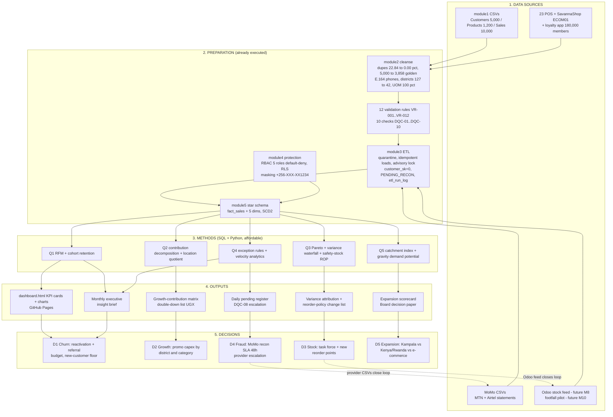

# Task C3.1 / C3.2 — Strategic Business Questions & End-to-End Analytics Alignment

**Client:** Savanna Retail Group (SRG) — 23 stores (ST01–ST10 Kampala, ST11–ST14 Jinja, ST15–ST18 Mbarara, ST19–ST23 Gulu) + SavannaShop (ECOM01) + loyalty app (180,000 members)
**Prepared by:** Lead Enterprise Data Management Consultant
**Evidence base:** `module5_warehouse/star_schema_ddl.sql` (`warehouse.fact_sales`, `dim_customer`, `dim_product`, `dim_store`, `dim_date`, `dim_payment_method`), loaded by `module3_etl/srg_etl_pipeline.py` into `module3_etl/etl_demo.db` — 10,000 sales lines, Jul–Dec 2024, net revenue **UGX 252,382,814**, average basket **UGX 25,238** (252,382,814 ÷ 10,000 lines = 25,238.28).
**Design rule:** every question is answerable with SQL/Python the team already has (2 SQL-capable IT staff + planned hires); machine learning appears only as a gated later pilot, never as a prerequisite for a Board decision.

---

## Task C3 — Analytics, BI & Emerging Technology (C9)

### C3.1 — The Five Strategic Board Questions (one per required theme)

Each question below is written to be *decision-grade*: it names the decision it serves, is measurable against warehouse fields, and specifies an affordable method with an explicit justification.

#### Q1 — CHURN: "Which customer segments are churning, why, and what is the monthly revenue at risk?"

| Element | Specification |
|---|---|
| **Decision to be made** | Approve the reactivation/referral budget and set a monthly new-customer floor; decide which segments to defend (investment) versus manage for margin (no acquisition spend). |
| **Question (refined, measurable)** | For every segment defined as *city × first-purchase cohort month × channel (store / ECOM01 / loyalty app)*: (a) what is the churn rate, where churn = a customer active in month *t* with no purchase in *t+1*; (b) what drives it (price/mix, availability, service) via cancelled/returned lines and category exit patterns; (c) what is the **monthly revenue at risk in UGX** = trailing-90-day `net_amount_ugx` of customers who have not purchased in the last 45 days? Anchor evidence: 858 of 1,237 (69.4%) November active known customers did not purchase in December; new known customers collapsed 1,272 → 148/month (−88%); repeat buyers are 2,447 of 3,362 known buyers (72.8%) yet drive 90.1% of identified transactions. |
| **Data sources** | `warehouse.fact_sales` × `dim_customer` (SCD2), `dim_date`, `dim_store`, `dim_payment_method` in `module3_etl/etl_demo.db`; `module1_synthetic_data/output/SRG_Customers.csv` (5,000 rows) and `SRG_Sales.csv` (10,000 rows) for lineage proof; loyalty-app membership extract (180,000 members); SavannaShop order export; analyst access only through the masked surface `srg.customers_masked` (`module4_security/data_masking.sql`). |
| **Preparation steps** | Golden-record build already executed (`module2_data_quality/dq_assessment_cleansing.py`): duplicates 22.84% → **0.00%**, total flag 25.06% → 2.85%, **5,000 → 3,858 golden records**; phones standardised to E.164 (6 → 1 variants); districts 127 → 42; quarantine rows excluded via `etl_quarantine`; walk-ins isolated as `customer_sk = 0` and reported as a separate segment (8.0% of lines / 8.7% of revenue); PII masked (`+256-XXX-XX1234`, `J*** D**`) before any analyst handling; SCD2 point-in-time joins so a churn month is never scored against a later customer version. |
| **Analytical method + why** | **RFM scoring + cohort retention curves** (SQL window functions, then `pandas` groupby). *Why:* both methods need only transaction history that already exists in `fact_sales` — no labels, no training data, no specialist hire; RFM segments are directly actionable for a campaign (send to R/F/M bands), and cohort curves make the "new-customer collapse" visible as a retention story the Board can read in one chart. Machine-learning churn propensity is deliberately deferred to a gated pilot (M15, see `C3_emerging_tech.md`) — it cannot be trusted until 12+ months of post-cleanse history exist. |
| **Output / format** | Churn segment table (segment, actives, churned, churn %, UGX at risk) + retention heatmap + revenue-at-risk waterfall (UGX); "Customers" view on `module6_dashboard/dashboard.html`; 1-page addition to the monthly executive insight brief. |
| **Cadence** | Monthly (segment refresh), quarterly cohort deep-dive with the Marketing Officer. |
| **Owner** | Marketing / CRM Officer (accountable); Finance Manager validates the UGX at-risk figure; EDM Consultant owns method. |

#### Q2 — SEGMENT GROWTH: "Which districts/city segments and product categories are genuinely growing (not just shifting), and where should we double down?"

| Element | Specification |
|---|---|
| **Decision to be made** | Allocate the FY marketing capex and promo slots by district × category; stop funding segments that only *appear* to grow. |
| **Question (refined, measurable)** | For each of the 42 cleansed districts and the 6 conformed categories: what portion of the Δ revenue versus the prior month comes from (i) genuinely new buyers, (ii) retained buyers buying more often, (iii) larger basket size, (iv) price/mix effects — and what is each segment's contribution to the six-month base of UGX 252,382,814? Which segments grow on *volume/buyers* (durable) versus *price/mix* (transitory)? Anchor evidence: category revenue Personal Care UGX 50.9M > Grains & Cereals 44.7M > Stationery 43.5M > Snacks 38.8M > Beverages 37.4M > Household 37.0M (sums to UGX 252.3M); monthly revenue peaks at Aug UGX 45.28M then declines to Dec UGX 35.76M (−13.6% vs Nov UGX 41.37M). |
| **Data sources** | `warehouse.dim_customer.district`, `dim_product.category`, `dim_store.city`, `fact_sales.net_amount_ugx`; `module2_data_quality/output/before_after_metrics.md` (district 127 → 42 labels; category conformance 22% → 100%) as the confidence basis; `module1_synthetic_data/output/injection_report.json` to bound error rates; footfall pilot data (from M10) as the tie-breaker for catchment-driven growth. |
| **Preparation steps** | Same golden-record and E.164 pipeline as Q1; category conformance enforced by VR-010 and monitored by DQC-05; district alias table applied at load; SCD2-valid product version joined at sale date (so a price change is scored as *price*, not as organic growth); the 8.7% walk-in/unattributed revenue is excluded from district attribution and disclosed as a separate line — never silently spread across districts. |
| **Analytical method + why** | **Cohort analysis + contribution decomposition** (Δ revenue = new buyers + retained-buyer frequency + basket + price/mix), plus a **location quotient** per district (district revenue share ÷ district customer share). *Why:* SRG's stated fear is "shifting counted as growth" — decomposition is the cheapest method that separates durable demand from mix/price noise, and it is fully auditable in SQL for the CFO. A location quotient needs no external market data to be useful and becomes sharper once the cleansed 42-district list replaces the 127 free-text labels. ML demand models rejected for now: 6 months of history cannot train one honestly. |
| **Output / format** | Growth-contribution matrix (district × category, UGX and %), ranked "double-down list" with modelled UGX upside, and a "watch list" of price/mix-only growth; rendered as the series-toggle line chart and sortable table in `dashboard.html`. |
| **Cadence** | Monthly refresh in the dashboard; quarterly double-down decision paper to the Board. |
| **Owner** | Marketing Officer (demand) + Merchandising Manager (category); Strategy reviews the double-down list. |

#### Q3 — STOCK OPTIMIZATION: "What explains the 8.4% book-vs-physical variance and which SKUs/stores need reorder-policy changes to end stock-outs without overstock?"

| Element | Specification |
|---|---|
| **Decision to be made** | Fund the stock-variance task force; change reorder points/safety stock for named SKU × store combinations; decide whether to block new item setup until identifiers are unified. |
| **Question (refined, measurable)** | Decompose the **8.4% book-vs-physical variance** into attributable causes — identifier fragmentation (5 competing product identifiers), unit-of-measure errors, offline sales not yet posted, inter-store transfers, returns (500 lines, −UGX 10,224,221 ≈ 4% of gross), and shrinkage — as a UGX and % attribution table; then identify the Pareto-critical SKU × store cells where the reorder point must change, with the target: zero stock-outs in high-velocity cells and no increase in on-hand value for slow cells. |
| **Data sources** | `warehouse.dim_product` (`sku`, category, SCD2 price) and `fact_sales.quantity` for velocity; `module1_synthetic_data/output/SRG_Products.csv` (1,200 products, 5 identifiers) and `SRG_Sales.csv`; **Odoo stock feed (future, from M8)** — daily on-hand and movement ledger; POS stock ledger per store; `etl_quarantine` (posting failures); footfall pilot (M10–M12) for demand uplift in stock-out windows. |
| **Preparation steps** | One golden product key produced by the Module 2 product cleanse (composite product validity 3.25% → 100%, UOM conformance 15.33% → 100%, category 22% → 100%); SKU uniqueness enforced by VR-008 with DQC-06 zero-tolerance nightly check (141 duplicate-SKU rows and 69 SKU→multi-name rows currently flagged, never silently merged); returns kept as facts (negative `quantity`) rather than deleted; offline-capture rows identified via `customer_sk = 0` and their posting lag measured, because an unposted offline sale reads as shrinkage. |
| **Analytical method + why** | **Pareto analysis** (vital-few SKUs/stores) + **reconciliation variance analysis** (book vs physical, per store × SKU, waterfall by cause) + a **deterministic safety-stock model**: reorder point = *d̄ × LT + z × σ_d × √LT*. *Why:* this is arithmetic on data the firm will own once the Odoo feed lands — no model risk, every number explainable to a store manager, and it maps directly onto a policy change (a number on a reorder screen). It also needs only SQL/pandas, matching the 4-person team. ML forecasting is explicitly *not* the first move: an 8.4% unexplained variance would poison any trained model (garbage-in, automated). |
| **Output / format** | Variance attribution table (cause × UGX × %); reorder-policy change list (SKU, store, old ROP, new ROP, expected stock-out hours avoided); stock-out risk index per store; monthly "Variance Reconciliation Report" for Finance. |
| **Cadence** | Monthly variance review (Finance + Merchandising); weekly reorder run once rules are live (M9). |
| **Owner** | Merchandising Manager (policy); IT Operations Lead (Odoo feed); Finance signs the variance close. |

#### Q4 — FRAUD: "How much revenue is exposed in unreconciled mobile-money transactions (11.5% of MoMo lines PENDING) and what fraud patterns are visible?"

| Element | Specification |
|---|---|
| **Decision to be made** | Fund automated mobile-money reconciliation with a 48-hour Finance sign-off SLA; decide on provider escalation/write-offs; size the fraud-control effort. |
| **Question (refined, measurable)** | What UGX value sits in `reconciliation_status = 'PENDING'` — currently **849 of 7,385 MoMo lines (11.5%)** — and how much of it exceeds the 24-hour rule in VR-012? What exception patterns exist: duplicate `payment_ref`, one phone/ref with abnormal transaction velocity, amount-rounding clusters, refund/return clustering by store or till, and PENDING aged beyond the offline-sync window? Value framing (line-count proxy): mobile money is 73.2% of revenue (MTN MoMo 48.2%, Airtel Money 25.1% — components rounded), so 0.732 × UGX 252,382,814 × 0.115 ≈ **UGX 21,245,585 ≈ UGX 21.2M of six-month revenue ≈ UGX 3.54M/month** lacks a payment reference — to be re-based on *value* rather than line count at the first provider reconciliation. |
| **Data sources** | `warehouse.fact_sales.payment_ref`, `reconciliation_status`, `dim_payment_method` (MTN_MOMO, AIRTEL_MOMO, CASH, CARD); `etl_demo.db` table `etl_quarantine` (rejected rows); **MTN MoMo and Airtel Money provider CSV statements** matched by `reconcile_momo_pending.sql`; `etl_run_log` for posting timing; monitoring check **DQC-08** (pending > 24h; > 50/day = P1); rules **VR-012** (payment_ref within 24h or PENDING). |
| **Preparation steps** | Payment refs captured in E.164-consistent form (payer phone already standardised); idempotent load keyed on SHA1(`transaction_id`) (`sale_sk`) eliminates double-counting as a fraud hypothesis; offline stores deliberately permitted to post with `PENDING_RECON` (an offline capture is a designed state at SRG, not an anomaly — `module3_etl/etl_diagnosis.md` RC-2/RC-3 context), so the analysis separates *lag* from *loss* by age band (0–24h, 24–72h, >72h); masked phone view used by analysts. |
| **Analytical method + why** | **Rule-based exception engine** (VR-012 aging, duplicate-ref detection, refund clustering) + **velocity analytics** (per-ref/per-phone counts and amount z-scores, computed in SQL). *Why:* deterministic and reproducible evidence is what Finance needs to dispute or write off with providers and what an auditor under the Uganda DPPA 2019 will accept; it runs on DQC-08 daily without a data scientist. AI-based anomaly detection is sequenced *after* the deterministic baseline exists (PILOT from M12+, per `C3_emerging_tech.md`) because anomaly models trained on unlabelled PENDING noise produce accusations, not evidence. |
| **Output / format** | Daily pending register (line count + UGX), aged >24h escalation list, exception scorecard (pattern, count, UGX, store/phone); KPI card "MoMo share" and returns % on `dashboard.html`; monthly line in the executive insight brief. |
| **Cadence** | Daily automated check (DQC-08), weekly Finance reconciliation review, monthly Board KPI. |
| **Owner** | Finance / Reconciliation Officer; CFO escalation when >50 pending/day; IT Operations Lead owns the pipeline flag. |

#### Q5 — EXPANSION: "Given per-city performance and catchments, which of the next expansion moves (more Kampala stores, Kenya/Rwanda, deeper e-commerce) is justified first?"

| Element | Specification |
|---|---|
| **Decision to be made** | Sequence the next capex: (a) additional Kampala stores, (b) Kenya entry, (c) Rwanda entry, (d) deeper e-commerce investment — with an explicit stop/continue gate for each. |
| **Question (refined, measurable)** | Which catchments (42-district granularity) are under-served, how does each city's revenue share compare with its share of the estate, and how productive is ECOM01 versus an average physical node — i.e. where does the next UGX 1 of capex earn the highest *validated* return? Base arithmetic from the committed warehouse: Kampala holds 10 of 23 stores (43.5% of estate) but delivers 45.4% of physical revenue (36.2% ÷ 79.7%) → index **1.04**; Jinja 4/23 (17.4%) vs 16.3% → **0.94**; Mbarara 4/23 (17.4%) vs 17.3% → **1.00**; Gulu 5/23 (21.7%) vs 21.0% → **0.96**; top single store ≈ 4.1% (flat distribution); ECOM01 = 20.3% of total revenue from **one** node versus an average physical node of 79.7% ÷ 23 = 3.47% → **≈ 5.9×** (20.3 ÷ 3.47 = 5.85). Read-through: revenue tracks store count almost exactly (indices 0.94–1.04) — *city averages show no per-store winner*, so catchment evidence, not city averages, must decide. |
| **Data sources** | `warehouse.dim_store` (store_bk, city), `dim_customer.district` (42 cleansed labels), `fact_sales`; loyalty penetration by district (180,000 members); SavannaShop orders (ECOM01); **footfall pilot, 3 stores, M10–M12**; store opening dates and trading hours; external: district population/income indicators and Kenya/Rwanda competitor scans (used only as context, clearly separated from warehouse evidence). |
| **Preparation steps** | District standardisation (127 → 42) so catchment counts are comparable; store conformance (`ST01–ST23`, `ECOM01` per data dictionary attribute 22); walk-in 8.7% of revenue disclosed as *catchment-unknown* (it cannot be assigned to any district without the M7 loyalty phone-capture fix); opening-date normalisation so a store open 2 of 6 months is never ranked as underperforming. |
| **Analytical method + why** | **Catchment / location-quotient index** (revenue share ÷ store-count or member share) + **digital-penetration analysis** (members per district vs revenue per member) + a simple **gravity-style demand-potential index** (population × purchasing proxy ÷ travel time), re-scored once footfall data arrives. *Why:* these are transparent ratios a Board can audit line-by-line before committing multi-hundred-million-UGX capex; they work on the flat-distribution evidence we already have and degrade gracefully as footfall replaces estimates. No ML: the sample is one six-month window and two of the four options (Kenya, Rwanda) have *zero* internal history — a model would manufacture precision we do not have. |
| **Output / format** | Expansion scorecard — one row per option (capex UGX, payback months, catchment index, channel productivity, execution risk), ranked, with a clear recommendation and gate conditions; presented as a Board decision paper at gates G2/G3/G4. |
| **Cadence** | Quarterly decision gate: **G1 (M3)** platform/security, **G2 (M6)** quick-win proof, **G3 (M12)** PDPO audit + scale, **G4 (M18)** expansion & ML authorisation. |
| **Owner** | Strategy / Expansion Director (accountable), CFO (capex), EDM Consultant (analytics), Data Governance Council (gate sign-off). |

---

### C3.2 — End-to-End Analytics Workflow (sources → preparation → methods → outputs → decisions)

**Rationale notes per decision (why this path produces a defensible decision):**

| Decision | Why the path is defensible |
|---|---|
| **D1 — Churn** | Cleansed golden records remove the 23% duplicate noise that previously mis-assigned loyalty points and would have *inflated* apparent churn; masking precedes analysis, so the churn list can be handed to Marketing without exposing raw PII (DPPA 2019 / GDPR Art.25 by design). |
| **D2 — Growth** | Contribution decomposition prevents price/mix shifts (e.g., the Aug UGX 45.28M peak) from being funded as organic growth; the 42-district standardisation is what makes district comparisons possible at all (127 labels could not aggregate). |
| **D3 — Stock** | Variance is decomposed *before* reorder rules change — changing ROPs against an 8.4% unexplained variance would convert a measurement problem into working-capital loss; the Odoo feed (M8) closes the loop, which is why the arrow returns to S4. |
| **D4 — Fraud** | Rules-first design yields provider-grade evidence (deterministic, reproducible) rather than statistical suspicion; the ETL already flags `PENDING_RECON`, so the control costs monitoring (DQC-08), not a new platform. |
| **D5 — Expansion** | Ratios are auditable by the Board today; catchment/footfall evidence (M10–M12) upgrades the same scorecard before any capex is committed — no option is approved on city averages alone, because indices 0.94–1.04 show city averages carry no signal. |

---

### Think-deeper answer

**Isn't five questions already too many for a firm with four IT staff — and why start with analysis rather than machine learning?**

The five are not parallel projects; they are one funnel with a shared foundation. Q1, Q2, Q4 and Q5 all read from the same `fact_sales` star with the same cleansed dimensions — the marginal cost of the fourth question is one SQL query and one chart, not one platform. Only Q3 needs new data (the Odoo feed), which is why it alone is sequenced behind an integration milestone. Capacity is therefore spent on *preparation once, questions four times* — the exact leverage that a golden record, a conformed star schema and an idempotent pipeline are supposed to buy.

On ML: the honest constraint is evidential, not fashionable. SRG has six months of history, an 8.4% unexplained stock variance, 8.7% unattributed revenue and 11.5% unreconciled payment lines. A churn model trained on that would learn the measurement errors as if they were customer behaviour, and its recommendations would be unauditable to a Board that currently cannot answer segment growth/churn at all. The method ladder is deliberate: **descriptive (dashboard) → diagnostic (decomposition, variance, exception rules) → predictive (pilots from M12–M15, gated on triggers in `C3_emerging_tech.md`)**. Each level is only authorised when the level below it is stable under the daily checks (DQC-01…DQC-10). That ordering also matches the maturity plan in `C3_analytics_maturity.md` and the gates in `D1_roadmap_18months.md`, so the Board can withdraw any single question without collapsing the rest — and can see that "no ML yet" is a priced, reversible decision (see D-25 in `D2_decision_log.md`), not an oversight.
