# Integrated EDM Strategy Roadmap — M1 to M18

**Client:** Savanna Retail Group (SRG) | **Author:** Lead Enterprise Data Management Consultant
**Budget envelope (non-negotiable):** UGX 480,000,000 all-in — licences, cloud **and** hires. The scenario states this annually, but Task D1 requires the roadmap to sit *"within the UGX 480M envelope"*; we therefore plan to the **stricter reading: UGX 480,000,000 for the full 18-month programme** (480,000,000 ÷ 18 = **UGX 26,666,667/month**; 480,000,000 ÷ 3,700 ≈ **USD 129,730** for the programme). This is deliberately conservative: if the Board later confirms the annual reading (480,000,000/year = 720,000,000 over 18 months), the surplus becomes contingency and pulls Phase 3 cloud forward — but **no commitment in this plan assumes that upside**. Payroll treatment of the existing 4 IT staff is a Gate G1 confirmation item (see §D1.7 assumptions).
**Capability envelope:** IT team of 4 (2 SQL-capable, zero data-engineering) + 3 planned hires; several stores offline hours daily; power issues (UPS-backed POS).
**Regulatory envelope:** Uganda DPPA 2019; PDPO audit **within 12 months**; European distributor partnership requiring GDPR-equivalent practice.

---

## Task D1 — Integrated EDM Strategy Roadmap

### D1.1 — Mandate: what the roadmap must fix

| Problem (as found) | Baseline evidence | Roadmap line that closes it |
|---|---|---|
| **Laptop theft incident** — unencrypted device, 9,000 customer records (names/phones/purchase history) taken from the Jinja store; reported internally **11 days late**; **no breach notification** | Incident record | Phase 1 incident remediation (M1–M2) + SOP + PDPO audit (M12) |
| 23% duplicate customers; loyalty points landing on wrong members | Dupes 22.84% → 0.00% after Module 2; 5,000 → 3,858 golden records | Quality workstream (M2, sustained by DQC-01) |
| 5 product identifiers across systems | Composite product validity 3.25% → 100% in cleanse; 141 duplicate-SKU rows flagged | Golden product key → live at source M8 (VR-008/DQC-06) |
| 11-day monthly reporting | Reporting lag measured | Dashboard M4; ≤5 days M6; ≤3 days M12 |
| 8.4% book-vs-physical stock variance; stock-outs in high-demand stores while slow stores overstock | Warehouse + store audits | Odoo feed M8; ROP rules M9; variance ≤2.0% M12 |
| Board cannot answer segment growth/churn | No KPI tree, no owners | Five Board questions (C3.1), brief, KPI targets |
| Mobile-money reconciliation gap | 849 of 7,385 MoMo lines (11.5%) PENDING ≈ UGX 21,245,585 ≈ UGX 21.2M (0.732 × 252,382,814 × 0.115) | Automated reconciliation M5, SLA 48h |

### D1.2 — Target state at M18 (and the six workstreams)

**Target state:** a single conformed warehouse (one golden customer key, one golden product key) feeding a Board-grade KPI tree on a ≤3-day reporting lag; quality prevented at entry and measured daily (DQC-01…DQC-10); default-deny access with masking; PDPO audit passed and SCCs in place for EU data flows; an operating model of 4 IT staff + 3 hires + 5 business stewards who run analytics without external help.

| WS | Workstream | Owner | Phase 1 (M1–M6) | Phase 2 (M7–M12) | Phase 3 (M13–M18) |
|---|---|---|---|---|---|
| **WS1** | Data governance & quality | Data Governance Council / stewards | Golden records sustained; entry-point rules; stewardship queue (110 open) with 30-day SLA | Prevention at till/POS/e-commerce; stock data quality via Odoo | Quality economics; anomaly pilot |
| **WS2** | Platform & architecture | IT Operations Lead | Fail-fast ETL, quarantine, `etl_run_log`, star schema, source contracts | Odoo feed, CI for SQL/Python, load ≤3 days | Cloud evaluated vs triggers T1–T6; catalog/lineage |
| **WS3** | Analytics & BI | BI Analyst (hire) / EDM Consultant | Dashboard v1, five Board questions, monthly brief | Churn/segment ops, catchment + footfall analysis | Segment profitability, gated ML pilots |
| **WS4** | Security, privacy & compliance | Compliance Officer / CFO | Encryption+MDM, RBAC/RLS/masking, breach SOP, incident legal review | RoPA, breach register, SCCs, tabletop; **PDPO audit M12** | Pen-test, recertification, audit surveillance |
| **WS5** | Organisation, skills & change | CFO (sponsor) | Stewards named; training starts; 3 hires onboarded by M5 | Data literacy in trading meetings; role certifications | Succession/key-person cover; maturity re-score |
| **WS6** | Master data & stock/payment integrity | Merchandising + Finance | 5 → 1 product key design; MoMo reconciliation M5 | Identifier unification live M8; ROP rules M9 | Variance ≤1.5%; margin feed; reconciliation BAU |

### D1.3 — Roadmap schedule, gates and quick wins (relative months only)

```mermaid
flowchart LR
    subgraph P1["PHASE 1 — Stabilise, Protect & Prove (M1-M6)"]
        direction TB
        A1["M1 Incident remediation:<br/>encryption + MDM + 72h breach SOP"] --> A2["M2 Entry-point quality:<br/>VR rules at source, dupes below 1 pct"]
        A2 --> A3["M3 GATE G1: platform verdict<br/>Azure phased adopt, triggers T1-T6,<br/>RBAC + masking live"]
        A3 --> A4["M4 Star schema load + 2 days,<br/>dashboard v1 on GitHub Pages"]
        A4 --> A5["M5 MoMo reconciliation + 48h SLA,<br/>3 hires onboarded"]
        A5 --> A6["M6 GATE G2 quick-win proof:<br/>reporting 11 to 5 days or fewer,<br/>brief + dashboard in Board routine"]
    end

    subgraph P2["PHASE 2 — Industrialise & Comply (M7-M12)"]
        direction TB
        B1["M7 Churn ops + reactivation/referral<br/>campaign, till phone capture"] --> B2["M8 Odoo stock feed +<br/>5 to 1 identifier live"]
        B2 --> B3["M9 Safety-stock ROP rules,<br/>variance 5.0 pct or lower"]
        B3 --> B4["M10-M12 Footfall + POS pilot<br/>in 3 stores, catchment re-score"]
        B4 --> B5["M11 Audit readiness: RoPA,<br/>breach register, SCCs, tabletop"]
        B5 --> B6["M12 GATE G3: PDPO audit PASSED,<br/>reporting 3 days or fewer,<br/>variance 2.0 pct or lower"]
    end

    subgraph P3["PHASE 3 — Scale, Optimise & Expand (M13-M18)"]
        direction TB
        C1["M13 Cloud migration evaluated<br/>against triggers T1-T6"] --> C2["M14 Margin feed:<br/>category profitability"]
        C2 --> C3["M15 Gated pilots: AI-DQ anomaly,<br/>churn/demand ML"]
        C3 --> C4["M16 Kenya/Rwanda data-model<br/>readiness"]
        C4 --> C5["M17 Expansion decision paper<br/>Kampala vs Kenya/Rwanda vs e-comm"]
        C5 --> C6["M18 GATE G4: maturity re-score L3,<br/>benefits review, roadmap v2"]
    end

    A6 -->|"quick wins proven"| B1
    B6 -->|"compliant + measured"| C1
```

**Quick wins that must be visible by month 6 (Gate G2 evidence):**

| # | Quick win | Evidence artefact | Owner | KPI |
|---|---|---|---|---|
| 1 | All devices encrypted + MDM; 72-hour breach-notification SOP adopted; Jinja theft referred for legal assessment | Encryption report; signed SOP | IT Operations Lead / Compliance | 100% devices encrypted by M2; SOP signed M1 |
| 2 | Dashboard live (KPI cards, revenue/category/payment, filters, drill-up) | `dashboard.html` on GitHub Pages | BI Analyst | Published M4; ≥4 weekly active readers by M6 |
| 3 | Reporting lag cut | Load timestamps in `etl_run_log` | IT Operations Lead | 11 → ≤5 days by M6 |
| 4 | Duplicates held at zero on golden records | DQC-01 daily | Marketing Officer (steward) | Duplicate-person rate <1.0% sustained |
| 5 | MoMo pending backlog cleared + 48h SLA | DQC-08 register | Finance/Reconciliation Officer | 0 lines aged >24h by M6 |
| 6 | RBAC + masking deployed and tested | 15-test suite green; masking demo 4/4 | Compliance Officer | 15/15 PASS at G2 |
| 7 | Monthly executive insight brief tabled | Signed Board pack | EDM Consultant → BI Analyst | 6 consecutive months by M6 |
| 8 | First double-down list (district × category) | Contribution matrix | Marketing + Merchandising | Issued M6 |

### D1.4 — Budget: UGX 480,000,000 over 18 months, all-in (hard ceiling)

**Arithmetic basis:** 480,000,000 ÷ 18 months = **UGX 26,666,667/month average run-rate**. Every line below is itemised from unit costs; every phase column and the grand total must equal **480,000,000 exactly** — there is no room above the ceiling, only contingency within it.

| Line | Basis (explicit arithmetic) | M1–M6 | M7–M12 | M13–M18 | Total |
|---|---|---|---|---|---|
| **People — 3 staggered hires** | Data Engineer 3,500,000/mo × 18 mo (M1) = 63,000,000 + BI Analyst 2,500,000/mo × 16 mo (M3) = 40,000,000 + Data Steward 2,000,000/mo × 14 mo (M5) = 28,000,000 → gross **131,000,000**; statutory on-costs & allowances 15% × 131,000,000 = 19,650,000 → 131,000,000 + 19,650,000 | 40,250,000 | 55,200,000 | 55,200,000 | **150,650,000** |
| **Capability & training** | 6 staff × 3 courses = 18 course-persons × UGX 900,000 (local providers) = 16,200,000 + certification exams/lab 1,800,000 | 8,000,000 | 6,000,000 | 4,000,000 | **18,000,000** |
| **Licences** | Power BI Pro 5 users × 37,000/mo × 18 = 3,330,000 + DQ/monitoring tooling 3,670,000 + OpenMetadata catalog pilot M10–M18 (≈ 15,000,000/yr × 0.75 yr ≈ 11,250,000, held at 8,000,000 headroom) = 3,330,000 + 3,670,000 + 8,000,000 | 3,500,000 | 5,750,000 | 5,750,000 | **15,000,000** |
| **Cloud (ceiling UGX 90,000,000)** | Phase 1 on-prem by design (5,000,000 pilot object storage); M7+ managed Postgres + object storage + egress + backup + monitoring per `docs/C3_emerging_tech.md` itemised need 43,330,000 + storage/egress headroom 16,670,000 | 5,000,000 | 27,500,000 | 27,500,000 | **60,000,000** |
| **Foundation & integration** | 3 source contracts/connectors 25,000,000 + Odoo stock feed 25,000,000 + footfall/POS pilot hardware (3 stores) 25,000,000 + UPS/offline-resilience kits 18,000,000 + identifier-unification tooling 12,000,000 = 105,000,000 | 35,000,000 | 45,000,000 | 25,000,000 | **105,000,000** |
| **Security & compliance** | Endpoint encryption/MDM/VPN/MFA/backup per `docs/C2_encryption_masking_spec.md` slice = 66,000,000 (15+10+5+12+6+10+6 — items B1–B7) + GDPR/SCC legal opinion & breach counsel 6,000,000 = 72,000,000 | 36,000,000 | 24,000,000 | 12,000,000 | **72,000,000** |
| **Governance & change** | Council operations, stewardship workshops, internal comms (board packs, training-of-trainers) | 9,000,000 | 7,000,000 | 5,000,000 | **21,000,000** |
| **Contingency (8.0%)** | Residual: 480,000,000 − 441,650,000 = 38,350,000 (= 8.0% of envelope) | 14,000,000 | 12,175,000 | 12,175,000 | **38,350,000** |
| **Programme total** | | **150,750,000** | **182,625,000** | **146,625,000** | **480,000,000** |

**Envelope checks:** grand total = 150,750,000 + 182,625,000 + 146,625,000 = **480,000,000 ≤ 480,000,000** ✓ (equals the envelope exactly — itemised to the shilling, no over-spend lane). Year 1 (P1+P2) = **333,375,000 ≤ 480,000,000** annual run-rate ✓ — i.e., the plan also survives the looser annual reading without modification. Cloud line = **60,000,000 ≤ 90,000,000** ceiling in `docs/C3_emerging_tech.md` ✓. Licences = 15,000,000 (Power BI Pro 3,330,000 within it) ✓. Security = 72,000,000 = the 66,000,000 C2 security slice + 6,000,000 legal ✓. USD cross-check: 480,000,000 ÷ 3,700 = **USD 129,730 for 18 months** of hires, licences, cloud, integration, security and compliance.

### D1.5 — Governance & operating model

| Body | Members | Cadence | Decision rights |
|---|---|---|---|
| Board / Executive Committee | Board, CFO sponsor | Monthly (with executive insight brief) | KPI targets, capex, gate approvals G2–G4 |
| EDM Steering Group | CFO (chair), IT Ops Lead, Marketing, Merchandising, Finance, Compliance | Monthly | Budget draw-down, scope, risk, hire decisions |
| Data Governance Council | 5 business stewards + IT | Monthly (bi-weekly in Phase 1) | Metric definitions, stewardship releases (110 open records), rule changes (VR/DQC) |
| Incident response cell | Compliance Officer, IT Ops, Store manager concerned | On event | 72-hour assessment/notification decision (replaces the 11-day internal delay) |
| On-call rotation | IT team of 4 (WhatsApp/SMS alerts) | Daily 06:00 run-state check | Pipeline halt/replay (fixes RC-6 unmonitored mailbox) |

**Gate criteria (all binary):** **G1 (M3)** platform verdict adopted, triggers published, RBAC/masking tests green · **G2 (M6)** the eight quick wins evidenced · **G3 (M12)** PDPO audit passed, reporting ≤3 days, variance ≤2.0%, pending-MoMo <0.5% · **G4 (M18)** maturity re-scored L3, expansion decision taken on footfall-backed evidence.

### D1.6 — KPI trajectory (baseline → M6 → M12 → M18)

| KPI | Baseline (M0) | M6 | M12 | M18 |
|---|---|---|---|---|
| Monthly reporting lag | 11 days | ≤5 days | ≤3 days | ≤3 days |
| Duplicate-person rate | 23% (measured 22.84%) | <1.0% (0.00% on golden) | <1.0% | <1.0% |
| Walk-in / unattributed revenue | 8.7% | <7% | <3% (from M9) | <3% |
| Pending MoMo lines | 11.5% (849/7,385) | 0 aged >24h | <0.5% | <0.5% |
| Book-vs-physical stock variance | 8.4% | ≤7% (task force stood up) | ≤2.0% | ≤1.5% |
| New known customers / month | 148 (Dec) | ≥400 | ≥600 (floor set by M9) | ≥600 sustained |
| Churn proxy (actives absent next month) | 69.4% | ≤60% | ≤50% (from M9) | ≤45% |
| PDPO audit | Not started | Readiness plan M6 | **Passed ≤M12** | Surveillance cycle |
| Devices encrypted / breach SOP | 0% / none | 100% / signed | Maintained | Maintained |
| Composite maturity level | ≈L0.3 | L2 | L3 | L3 |

### D1.7 — Dependencies, risks & mitigations

| Dependency | Needed by | Risk if it slips |
|---|---|---|
| Recruitment (3 hires, 8–10 week lead time) | Offers M3–M5 | Quick wins 4/7/8 fall back on the consultant — mitigation: stagger hires exactly as budgeted (Engineer M1, Analyst M3, Steward M5) + UGX 38,350,000 contingency |
| Odoo stock feed access & vendor cooperation | M8 | Variance KPIs frozen at 8.4%; stock workstream stalls — mitigation: interim POS stock-ledger extract as stop-gap |
| MTN MoMo / Airtel Money statement exports | M5 | Reconciliation cannot close; UGX 21.2M stays unconfirmed |
| Footfall pilot vendor + 3 store sites | M10 | Expansion decision (M17) must fall back on district/loyalty indices only |
| Power/connectivity (UPS, offline windows) | Continuous | Load windows compress; mitigation: idempotent replay + advisory-lock scheduling already proven in `srg_etl_pipeline.py` |
| External auditor capacity (PDPO) | M11 booking, M12 slot | Audit missed inside 12 months — mitigation: book auditor by M6 |

| Risk | L / I | Mitigation | Owner |
|---|---|---|---|
| Salaries undershot by market (UGX 3.5M for a data-capable hire may not attract the best) | High/High | Hybrid: 1 senior hire + 2 upskilled internal staff; contingency funds contract support; training line UGX 18,000,000 | CFO |
| Contingency consumed by egress/cloud overrun | Med/High | Cloud hard-capped UGX 90,000,000 with monthly spend alarm at UGX 5,000,000 | IT Ops Lead |
| Scope creep into Kenya/Rwanda operations before G4 | Med/High | Data-model readiness only (M16); no operational capex before footfall-backed scorecard | Strategy Director |
| Key-person dependence (single analyst) | Med/High | Documentation-as-code, pair review, stewardship distributed to business roles | CFO |
| PDPO audit finds notification failure on the original theft | High/High | Legal assessment in M1; voluntary remediation + notification if advised; breach register built before audit | Compliance Officer |
| Quality regresses at entry (dupes return via till capture) | Med/Med | VR-001/VR-007 enforced at forms; DQC-01 >1.0% for 3 days = P1 incident | Stewards |
| Board decisions taken off-sample (6-month synthetic extract) | Med/High | Provenance disclosed on every artefact; baselines re-measured from live feeds by M6 | EDM Consultant |

**Standing assumptions (to be confirmed at G1):** (1) the existing 4 IT staff remain on the corporate IT payroll — if they must be carried by this budget, 4 × UGX 2,500,000 × 18 = UGX 180,000,000 would exceed the UGX 38,350,000 contingency by UGX 141,650,000 and the plan requires re-scoping; (2) USD/UGX holds at 3,700; (3) no absolute calendar dates are committed — months are relative to programme start (M1).

---

### Think-deeper answer

**The roadmap shows quick wins by M6 and a PDPO audit by M12 — what is the single most likely failure mode, and how does the plan degrade rather than collapse if it happens?**

The most likely failure is **Phase 1 over-commitment**: the first six months simultaneously carry incident remediation, a security build-out (RBAC/masking/encryption), three hires, a dashboard, a reconciliation pipeline and entry-point quality work — on a four-person team that also runs 23 stores' daily connectivity problems. History already shows what happens when that team is overloaded: the nightly ETL failed four days running while alerts sat in an unmonitored mailbox (RC-6).

The plan therefore degrades in a defined order rather than failing silently. If capacity bites, the **sacrifice ladder** is: (1) cloud work is deferred by design — Phase 1 is deliberately on-premises, so nothing slips; (2) the dashboard's optional features (extra chart toggles) drop, but the KPI cards and monthly brief survive because they are the Board's minimum viable product; (3) the footfall pilot slides from M10 to M12 — the G4 expansion decision then falls back on district/loyalty indices and is *explicitly* a conditional approval, not a rejection of the evidence standard; (4) only if recruitment fails outright is the Data Engineer role filled by promoting an existing SQL-capable staff member at a UGX 1,000,000/month uplift — 1,000,000 × 18 = **UGX 18,000,000**, inside the UGX 38,350,000 contingency — while the Data Steward hire is deferred, since the governance model already draws stewards from business roles.

What is **never** traded: incident remediation and the breach SOP (the original failure was a 11-day delay and no notification — repeating it would be a regulatory event, not a project slip), the DQC daily checks (the only thing standing between SRG and invisible data decay), and the PDPO audit date — because "within 12 months" is an external commitment. That priority order — compliance first, evidence second, features last — is the roadmap's real content; the month table is only its visible surface.
